# Trunk Docs — Claude Code Agents

This directory contains Claude Code subagents for documentation workflows.
When you run `claude` from this repo, these agents are automatically available.

## Prerequisites

You need two MCP servers configured (user scope):

1. **Linear** — for ticket and PR lookup
   ```bash
   claude mcp add linear --scope user -- npx -y @linear/mcp-server
   ```
2. **Trunk Docs (GitBook)** — for searching existing documentation
   ```bash
   claude mcp add trunk-docs --scope user --transport sse https://docs.trunk.io/~gitbook/mcp
   ```

Verify with `claude mcp list` or `/mcp` inside Claude Code.

## Available Agents

| Agent | Model | Purpose |
|-------|-------|---------|
| `notes-processor` | Opus | End-to-end pipeline: reads a notes file, researches, drafts docs, creates branch/PR, updates Linear |
| `doc-writer` | Opus | Full documentation drafting with all outputs (doc, PRs, questions, changelog, roadmap) |
| `doc-researcher` | Sonnet | Gathers and organizes context from Linear + existing docs before writing |
| `changelog-writer` | Sonnet | Focused changelog/release note entries |
| `branch-manager` | Sonnet | Creates branches, PRs, and updates/creates Linear tickets for tracking |

## Quick Start: Notes-Based Workflow

The fastest way to turn Slack conversations and engineer notes into docs:

### 1. Create a notes file

Copy the template and fill it in:
```bash
cp .claude/drafts/TEMPLATE.md .claude/drafts/my-feature.md
```

Paste in your Slack messages, engineer notes, Linear ticket IDs — don't
worry about formatting. Raw paste is fine.

### 2. Process the notes

```
Process the notes file at .claude/drafts/my-feature.md
```

The `notes-processor` agent will:
- Parse the notes and extract what changed
- Look up any Linear tickets for additional context
- Search existing docs to find what needs updating
- Draft the documentation changes
- Apply changes to the repo
- Create a branch (`sam/<topic>`), commit, push, and open a PR
- Update or create a Linear ticket with the PR link

### 3. Review the outputs

After processing, the agent writes to `.claude/tmp/`:
- `report.html` — open in browser for easy scanning (PR links, Linear links, review focus)
- `changelogs/changelog-<feature>.md` — copy to DatoCMS for changelog
- `slack/slack-<feature>.md` — copy/paste into Slack to notify the team
- `sources/sources-<feature>.md` — audit trail of all inputs and citations

### 4. Review and iterate

Check the PR and GitBook preview. The agent will list any open questions
for things it couldn't determine from the notes alone.

### Batch processing

To process multiple notes files sequentially:
```
Process each notes file in .claude/drafts/ one at a time.
For each file: research, draft, apply changes, create branch/PR, update Linear, then move to the next.
```

Each file gets its own branch (`sam/<topic>`), PR, and Linear ticket.
The agent processes them one at a time to avoid git conflicts.

## Usage Examples

**Process a notes file (recommended):**
```
Process the notes file at .claude/drafts/parallel-queues.md
```

**Process several notes files sequentially:**
```
Process each of these notes files one at a time:
- .claude/drafts/feature-a.md
- .claude/drafts/feature-b.md
- .claude/drafts/feature-c.md
```

**Write docs for a feature (manual):**
```
Use the doc-writer agent for the parallel queues feature.
Linear tickets: MRG-452, MRG-467
Slack context: [paste relevant messages]
```

**Research before writing:**
```
Use doc-researcher to gather context on tickets MRG-500 through MRG-510,
then use doc-writer to draft docs based on the findings
```

**Just a changelog entry:**
```
Use changelog-writer for the new test quarantine feature. Tickets: FTD-301
```

**Survey the backlog:**
```
Use doc-researcher to survey Linear for all open tickets labeled "docs"
```

## Pipeline Flow

```mermaid
flowchart TD
    A["📝 Notes File<br/><code>.claude/drafts/my-feature.md</code>"] --> B["<b>1. Parse</b><br/>Extract feature name, Linear IDs,<br/>PR URLs, context links, product area"]

    B --> C["<b>2. Research</b><br/>Look up Linear tickets &amp; PRs<br/>Search for related eng tickets<br/>Scan existing docs for gaps"]

    C --> D["<b>3. Sources</b><br/>Write audit trail to<br/><code>tmp/sources/</code>"]

    D --> E["<b>4. Draft</b><br/>Write or edit docs<br/>matching Trunk style"]

    E --> F["<b>5. Branch / PR / Linear</b>"]

    F --> F1["Create branch<br/><code>sam/&lt;topic&gt;</code>"]
    F1 --> F2["Commit &amp; push"]
    F2 --> F3["Create PR<br/><code>[TRUNK-XXXXX] Title</code>"]
    F3 --> F4["Update Linear ticket<br/>Link PR, attach context,<br/>link related eng tickets"]

    F4 --> G["<b>6. Changelog</b><br/>Stage entry to<br/><code>tmp/changelogs/</code>"]

    G --> H["<b>7. Slack Post</b><br/>Write announcement to<br/><code>tmp/slack/</code>"]

    H --> I["<b>8. Report</b><br/>Append review card to<br/><code>tmp/report.html</code>"]

    I --> J{"More drafts?"}
    J -- Yes --> K["Clean working tree<br/>Return to base branch"] --> A
    J -- No --> L["✅ Done<br/>Open report.html to review"]

    style A fill:#e8f4fd,stroke:#2563eb
    style L fill:#d1fae5,stroke:#059669
    style F fill:#fef3c7,stroke:#d97706
    style F1 fill:#fef3c7,stroke:#d97706
    style F2 fill:#fef3c7,stroke:#d97706
    style F3 fill:#fef3c7,stroke:#d97706
    style F4 fill:#fef3c7,stroke:#d97706
```



### Agent Collaboration


## What the Agent Does

When you process a notes file, the `notes-processor` agent runs through
eight phases sequentially:

1. **Parse** — extracts feature name, Linear tickets, GitHub PRs, context
   links (Slack, Slite, Loom, etc.), and product area from the notes
2. **Research** — looks up Linear tickets, searches for related engineering
   tickets, scans existing docs for coverage gaps
3. **Sources** — writes a sources audit trail to `tmp/sources/` with every
   ticket, PR, Slack thread, and doc file it used as input
4. **Draft** — writes or edits documentation, matching existing Trunk style
5. **Branch/PR/Linear** — creates branch, commits, pushes, opens PR, updates
   or creates Linear ticket with PR link, attaches all context links
   (Slack, Slite, Loom, etc.), and links docs ticket to related
   engineering tickets
6. **Changelog** — stages a changelog entry at `tmp/changelogs/` for DatoCMS
7. **Slack post** — writes a copy-paste-ready Slack message to `tmp/slack/`
   with PR and Linear links for internal notification
8. **Report** — appends an HTML review card to `tmp/report.html` with PR
   link, Linear link, review focus areas, and open questions

## Directory Structure

```
.claude/
  agents/
    notes-processor.md   # End-to-end pipeline orchestrator
    doc-writer.md         # Documentation drafting
    doc-researcher.md     # Context gathering
    changelog-writer.md   # Changelog entries
    branch-manager.md     # Git/PR/Linear lifecycle
    README.md             # This file
  drafts/
    TEMPLATE.md           # Notes file template
    *.md                  # Your notes files (gitignored)
  tmp/                    # All agent outputs (gitignored)
    report.html           # Review report (open in browser)
    changelogs/           # Changelog entries for DatoCMS upload
    slack/                # Slack posts for internal notification
    sources/              # Source audit trails and citations
```
