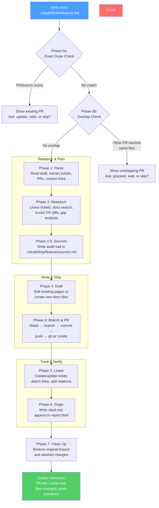
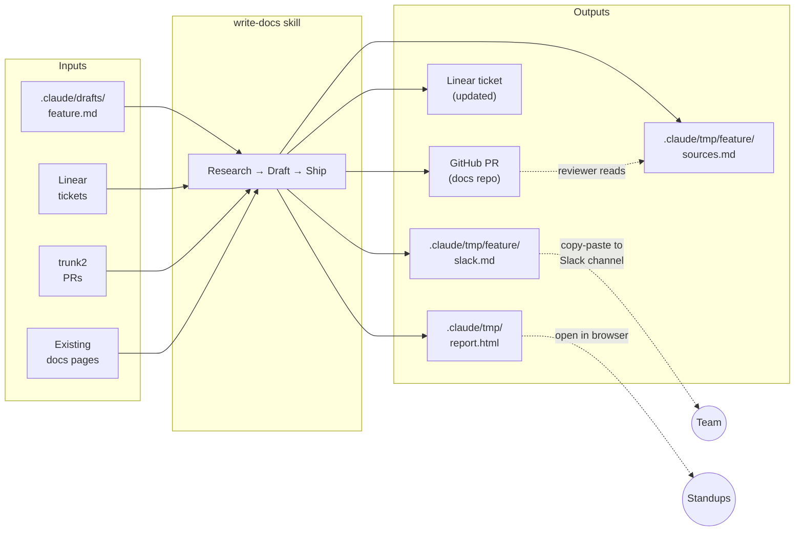

# write-docs skill

An end-to-end documentation pipeline that turns raw notes, Slack pastes, and PR references into reviewed docs PRs with full Linear tracking. Invoked as `/write-docs <input>`.

## Flow



### Input to output mapping



## What it does

Given a notes file (or PR numbers / Linear ticket IDs), the skill:

1. **Checks for duplicates and overlaps** — stops if a PR/branch already exists for this draft, or if another open PR already touches the same docs files
2. **Parses** the input to extract feature details, ticket IDs, PR URLs, and context links
3. **Researches** the topic across Linear, GitHub PRs, existing docs, and the GitBook MCP
4. **Drafts** documentation changes (new pages or edits to existing files)
5. **Ships** a branch, commit, and PR with a structured body
6. **Updates Linear** — description, status, attachments, related ticket links, and a review comment
7. **Stages outputs** — Slack announcement, sources audit, and HTML report card

## Inputs

| Input type        | Example                           | What happens                                                                  |
| ----------------- | --------------------------------- | ----------------------------------------------------------------------------- |
| Notes file        | `.claude/drafts/flag-as-flaky.md` | Primary mode. Reads the file, extracts all metadata, researches, writes docs. |
| trunk2 PR numbers | `3187 3177`                       | Reads PR details via `gh`, extracts Linear IDs from titles/branches.          |
| Linear ticket IDs | `TRUNK-17633`                     | Looks up ticket, finds related PRs and context.                               |
| Deploy tag        | `v126`                            | Documents features shipped in a specific release.                             |

Notes files follow the template at `.claude/drafts/TEMPLATE.md`. Key sections: Type, Linear Tickets, What Changed, GitHub PRs, Context Links, Target Docs, and freeform Context at the bottom.

## Outputs

Everything the skill produces falls into two categories: **committed work** (the PR) and **staged artifacts** (local files for downstream use).

### Committed: the docs PR

- Branch: `<git-username>/<kebab-case-topic>` (username from `git config user.name`, kebab-cased)
- PR title: `[TRUNK-XXXXX] Short descriptive title`
- PR body includes: summary, Linear links, context links, files changed, open questions, test plan
- One PR per notes file — never mixes unrelated changes

### Staged: `.claude/tmp/<draft-name>/`

All staged files are gitignored. Outputs are bundled under a directory matching the draft filename (e.g., `.claude/drafts/flag-as-flaky.md` → `.claude/tmp/flag-as-flaky/`).

#### `sources.md`

**Purpose:** Audit trail for reviewers to verify accuracy.

Contains every source consulted during research: Linear tickets (with URLs and status), GitHub PRs (with merge dates), existing docs files examined, context links from the notes, and related tickets discovered via search.

**Who uses it:** The PR reviewer. Lets them trace any claim in the docs back to its source without re-doing the research.

#### `slack.md`

**Purpose:** Pre-written Slack message for the team channel announcing the docs update. Copy-paste directly into Slack.

Uses Slack mrkdwn syntax (not Markdown) so formatting renders correctly when pasted: `*bold*` for bold, `<url|text>` for links, `•` for bullets. No conversion needed.

**Who uses it:** Whoever posts docs updates. Open file, select all, paste into Slack.

### `report.html` (cumulative, at `.claude/tmp/report.html`)

**Purpose:** Cumulative dashboard of all docs work processed through the pipeline.

Each run appends an HTML card with: PR link, Linear link, change type badge, changes summary, context links, related tickets, review focus areas, and open questions. Styled for quick scanning in a browser.

**Who uses it:** For tracking all in-flight docs work across multiple runs. Open in a browser to see everything at a glance. Also useful for standups and weekly reports.

### Linear updates

The skill also modifies state in Linear:

- **Ticket description** — overwritten with PR link, files changed, and context
- **Status** — set to "In Review"
- **Attachments** — context links (Slack, Slite, Loom) added with descriptive titles
- **Relations** — `relatedTo` links added for every related engineering ticket found during research
- **Comment** — PR link and open questions posted as a comment

If no docs ticket exists, one is created in the Docs Maintenance project with the `docs` label.

## Pipeline phases

```
Phase 0a: Dupe check    Check for existing PRs/branches from this draft
Phase 0b: Overlap check Check if other open PRs touch the same docs files
Phase 1: Parse          Read notes file, extract metadata
Phase 2: Research       Linear lookup, docs search, PR diffs, gap analysis
Phase 2.5: Sources      Write sources audit file
Phase 3: Draft          Write or edit documentation files
Phase 4: Branch/PR      Stash → branch → commit → push → gh pr create
Phase 5: Linear         Create/update ticket, attach links, add relations
Phase 6: Stage          Write Slack post, append to report.html
Phase 7: Clean up       Return to original branch, restore stash
```

## Batch processing

To process multiple notes files, run `/write-docs` on each file sequentially. Each gets its own branch, PR, Linear ticket, and output directory under `.claude/tmp/`. The skill handles git stash/restore between runs to avoid conflicts.

## Where redundancy might exist

If you're evaluating overlap with other repos or tools:

- **Slack posts** overlap with any existing docs announcement process — these are pre-written but not sent
- **Linear updates** overlap with manual ticket management — the skill automates what would otherwise be manual status/link/comment updates
- **Sources files** are unique to this pipeline — no other tool produces this audit trail
- **report.html** is unique to this pipeline — a local-only dashboard, not synced anywhere
