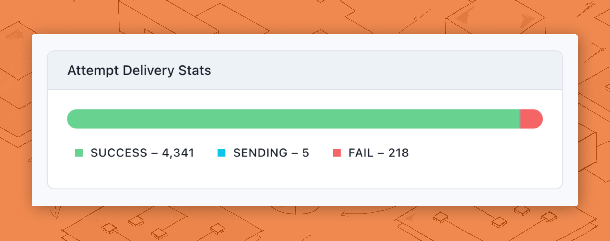
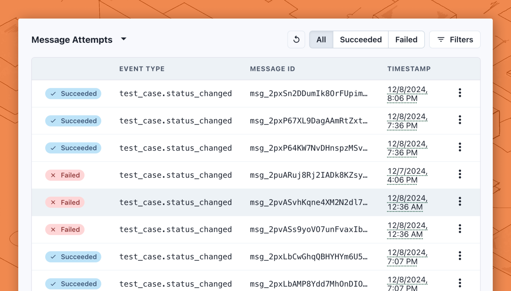

You can monitor the events and the webhook's delivery logs in the **Overview** tab of an endpoint configuration view.

You can see an overview of how many webhook deliveries have been attempted, how many are successful, how many are in flight, and how many fail in the **Attempt Delivery Status** modal.

<figure><figcaption></figcaption></figure>

You can see a list of past delivery attempts in the **Message Attempts** modal. You can filter this list by **Succeeded** and **Failed** status, and you can click on each message to see the **Message content**, response code, and error message of each attempt. You can learn more about [replaying messages](https://docs.svix.com/receiving/using-app-portal/replaying-messages) and [filtering logs](https://docs.svix.com/receiving/using-app-portal/filtering-logs) in the Svix docs.

<figure><figcaption></figcaption></figure>
