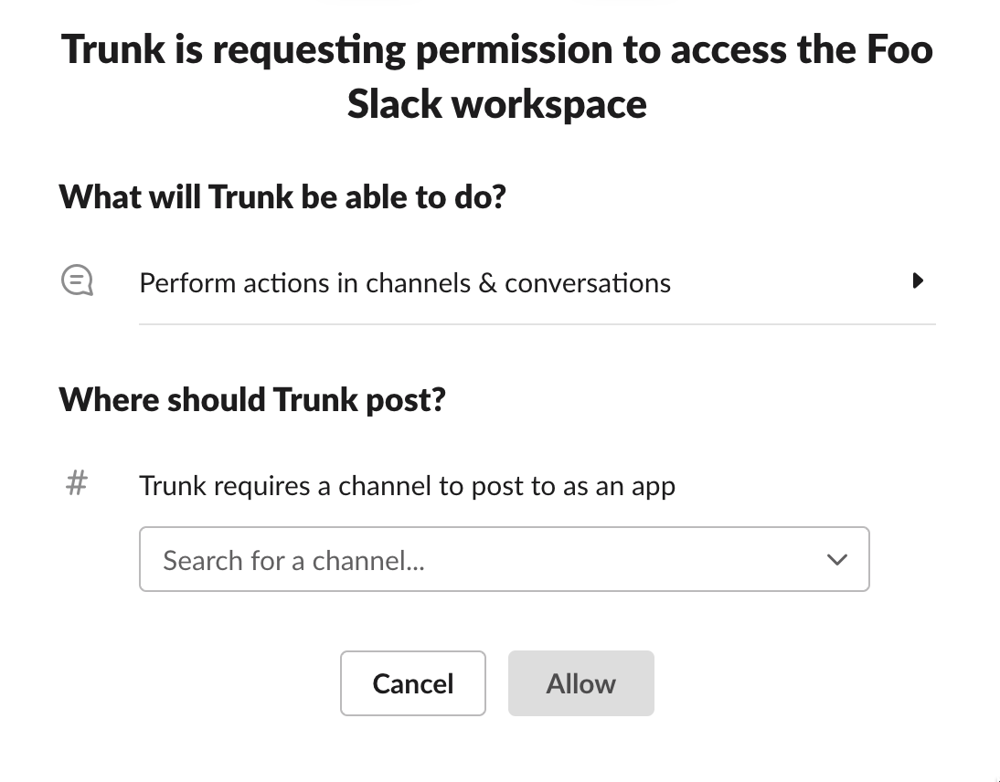
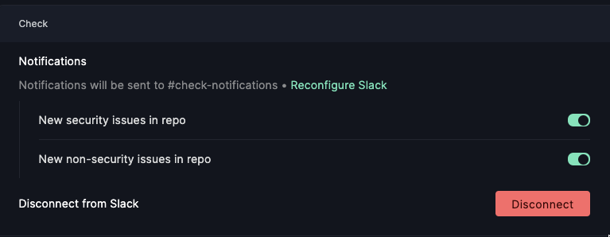

# Integration for Slack

With the Trunk app for Slack, you can easily get notifications from all of your trunk-enabled products. This includes notifications around security issues detected by `trunk check` and workflow notifications for your pull requests as they queue and land with `trunk merge`. In this guide, we'll cover how to connect Slack with Trunk on the repository and user level, as well as the different ways you can use Trunk in Slack.

## Add Trunk to your Slack Workspace (admin privileges required)

To receive notifications and/or interact with Trunk from Slack, an admin needs to add Trunk to your organization's Slack workspace. To do this:

1.  Navigate to [https://app.trunk.io](https://app.trunk.io). Select the repo you would like to Manage. Click "Settings" > "Connect"\\

    <figure><figcaption></figcaption></figure>
2. This will open a window where you can sign in to your Slack team.

<figure><figcaption></figcaption></figure>

3. Once you press "Allow," Trunk will connect to your Slack automatically and begin pushing updates to the channel you have selected.

## Set repo-level notification preferences

Now that you've connected your Slack account with Trunk, you will choose the type of notifications you want to receive from Trunk in Slack. You can manage your repository notifications under your repo settings.



<figure><figcaption>
Configure notifications for <code>trunk merge</code>
</figcaption></figure>



<figure><figcaption>
Configure notifications for <code>trunk check</code>
</figcaption></figure>



## Set your user-level notification preferences

To set your individual user Slack notifications go to Settings > Account > Connect

[Privacy Policy](https://trunk.io/privacy)
