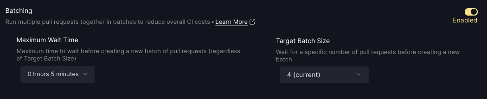

# Manage Members & Organizations

The Trunk App is available at [app.trunk.io](https://app.trunk.io/). This is where you can view the health of your repositories, browse issues detected by [Trunk Check](../check/#what-is-trunk-check), and manage your [Merge](../merge/) service.

## Creating a Trunk Organization 

_Trunk Organizations_ are how you organize your repositories and your collaborators on app.trunk.io. You'll need to create a Trunk Organization to get started with any of the Trunk services.

1. Create or log in to your Trunk account at [app.trunk.io](https://app.trunk.io/).
2. If you are creating a new account, you will be prompted to create an organization when you log\
   in. Otherwise, select your organization at the bottom left-hand corner, hover over\
   "Organization", and then click "Create Organization".
3. In the "Create New Organization" modal, enter the name and the URL you want for the organization. Names do not need to be unique, but the organization slug does. The slug and the name do not need to match. You can change the name at any time, but the slug cannot be updated.

## Adding your Github Repositories to your Trunk Organization (optional) 

1. Create or log in to your Trunk account at [app.trunk.io](https://app.trunk.io/).
2. Navigate to the organization to which you'd like to add your Github repositories using the\
   Organization selector UI in the top left-hand corner.
3. Click the "Connect to Github" button
   1. You'll be redirected to Github.com to install the trunk.io Github app. Click the organization\
      or account you'd like to connect with Trunk.
   2. Select all the repositories you'd like to be able to connect to Trunk.
   3. On a successful installation, you'll be redirected back to\
      [app.trunk.io](https://app.trunk.io/) and Trunk can import your Github repository\
      data.

## Adding Team Members 

Team members can be added automatically by setting the email domain, or by individually inviting team members with email invites.

### Setting Your Trunk Organization's Email Domain 

* Navigate to Settings → Team Members.
* Add your team's email domain. This will automatically add any existing and future Trunk users with an email in your domain to your Organization. This will not send invitations to any users to\
  confirm being added.&#x20;

<figure><figcaption></figcaption></figure>

### Adding teammates by email.

You can invite users individually by clicking the `+` button in the "Team Members" section.\
This will allow you to invite a set of members by specifying their email accounts. These users\
won't be automatically added to your Trunk Organization, instead they will receive an email to\
opt-in to the Organiation. These users must create a Trunk account to be able to accept the\
email invitation.

## SAML

Trunk does not support SAML at this time. If you are interested in SAML support please contact sales@trunk.io.
