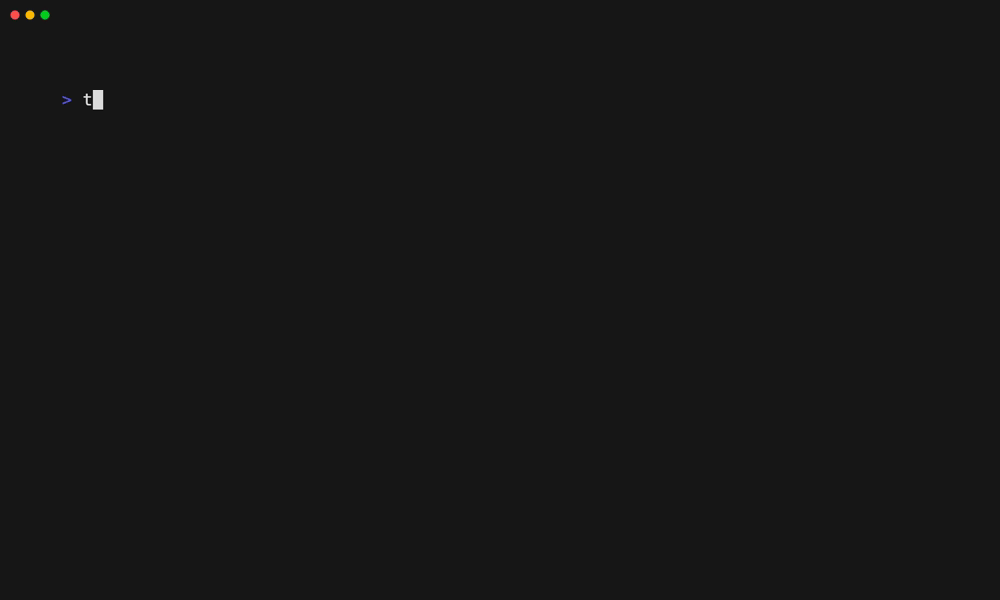

# Gitleaks

[**Gitleaks**](https://gitleaks.io/) is a linter for All.

You can enable the Gitleaks linter with:

```shell
trunk check enable gitleaks
```

## Auto Enabling

Gitleaks will be auto-enabled if any of its config files are present: *`.gitleaks.config`, `.gitleaks.toml`, `.gitleaksignore`*.

## Settings

Gitleaks supports the following config files:
* `.gitleaks.config`
* `.gitleaks.toml`
* `.gitleaksignore`

You can move these files to `.trunk/configs` and `trunk check` will still find them. See [Moving Linter Configs](..#moving-linter-configs) for more info.


## Usage Notes

Gitleaks v7 only works with Go 1.16, not Go 1.18 while Gitleaks v8 works with 1.18. We recommend using v8, but if you specifically need to use v7 you can override the go runtime version like so:

```yaml
yaruntimes:
  enabled:
    - go@1.16.7
```
Again, this is not recommended. Just use Gitleaks v8 or later with go 1.18 or later.


## Links

- [Gitleaks site](https://gitleaks.io/)
- Gitleaks Trunk Check [integration source](https://github.com/trunk-io/plugins/tree/main/linters/gitleaks)
- Trunk Check's [open source plugins repo](https://github.com/trunk-io/plugins/tree/main)
