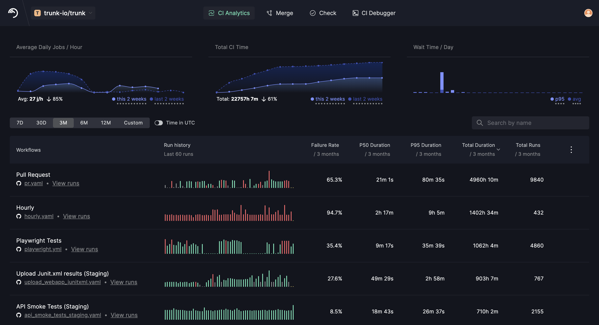
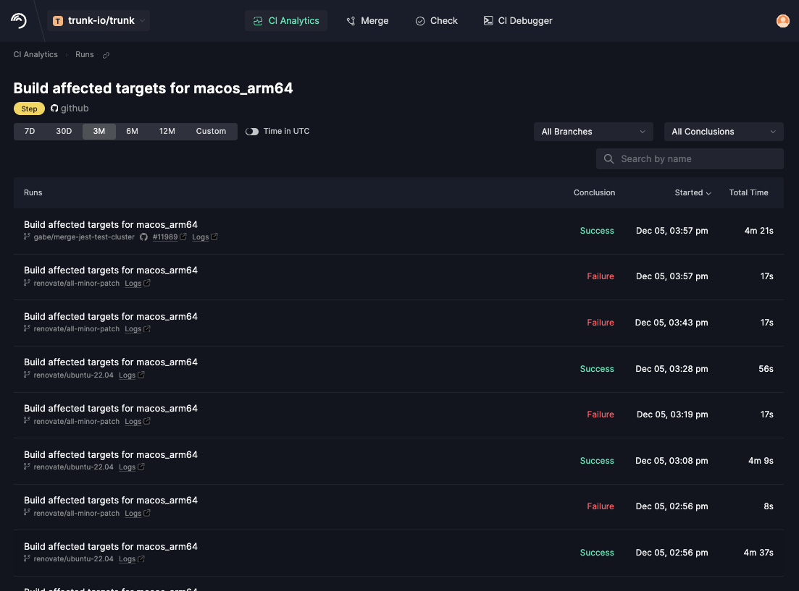

# Using the Analysis UI

When you first select a repo in CI Analytics, you will see the **Overview** screen which contains charts and tables to give you a high-level view of the state of your CI system. The charts show the aggregate _Average Daily Jobs per Hour_, _Total CI Time_, and _Wait Time per day_ over the selected time period. You can adjust the time period using the selector just below the first chart on the left.

<figure><figcaption>
CI Analytics Overview
</figcaption></figure>

The bottom half of the dashboard shows aggregate statistics for each of your CI workflows _over the selected time period_. The columns are as follows:

<table><thead><tr><th width="181">Column</th><th>Description</th></tr></thead><tbody><tr><td>Workflows</td><td>Name of the workflow, a link to the <code>yaml</code> file on GitHub defining the workflow, and a link to view all of the runs for that workflow.</td></tr><tr><td>Run history</td><td>Chart for the last 60 runs of the workflow. Hover over a bar in the chart to see details</td></tr><tr><td>Failure Rate</td><td>How often the workflow failed during the selected time period.</td></tr><tr><td>P50 Duration</td><td>Average (50th percentile) duration of the workflow during the selected time period. This shows the time of the <em>typical</em> run.</td></tr><tr><td>P95 Duration</td><td>95th percentile duration of the workflow during the selected time period. This shows the time of the <em>outlier</em> runs that took longer than usual.</td></tr><tr><td>Total Duration</td><td>Total amount of time these runs took all together, often correlated with your server costs.</td></tr><tr><td>Total Runs</td><td>Total number of runs performed (both successful and failed) during the selected time period.</td></tr></tbody></table>

### Filtering and sorting your data

Your data in CI Analytics is aggregated in the following hierarchy - Workflow -> Jobs -> Steps. At each level of the data hierarchy, you see an aggregation of the underlying runs that match your selected filter. At any time, you can dive into the underlying data by selecting `View runs` which will show the [**Runs View**](using-the-analysis-ui.md#runs-view) for that dataset. \
\
The set of runs that are being aggregated and presented can be filtered by the following criteria:\
\
**By Date**\
Work can be filtered by common ranges: 7 days, 14 days, 30 days, 3 months, 6 months, and any custom date range. Date filters can be applied in the date selector in the nav bar or by hovering over a data point in the chart and selecting `Zoom In`\
\
**By Branch Type**

<table data-header-hidden><thead><tr><th width="137">Branches</th><th>Description</th></tr></thead><tbody><tr><td>All</td><td>Shows work with any branch filtering</td></tr><tr><td>main</td><td>Work that is performed against your main or master branch.</td></tr><tr><td>merge</td><td>Work that is performed by a merge queue service (including trunk merge and GitHub's MergeQueue)</td></tr><tr><td>pull request</td><td>Work attributable to the testing of a pull request</td></tr><tr><td><a data-footnote-ref href="#user-content-fn-1">depe</a>ndabot</td><td>Work attributable to the testing of a PR created by Dependabot</td></tr><tr><td>renovate</td><td>Work attributable to the testing of a PR created by Renovsate</td></tr></tbody></table>

**By Conclusion**\
The conclusions filter allows you to look exclusively at work based on its reported termination state: success, failure, canceled, time out, skipped, etc... If you are trying to understand the performance of your CI tasks, you will likely want to filter by success. Failures can occur at any time, but the success path is a more reliable view of the expected runtime of your system.\
\
**By Name**\
You can filter your data by _name_ (workflow, job, step) in the search box at the bottom-right of the chart view.

### Exploring your data by Workflow / Job / Step

From the Analytics Overview, you can dive into the hierarchy of your CI data. At each level of the hierarchy, you will see aggregated performance information and can dive deeper into the contents. \
\
The top of the view shows a chart of aggregate statistics for the filtered data set. You can customize this view to bucketize this data by week/day/hour as applicable. Hovering over points in the chart will show details for that time slice. \
\
If you click on one of the data buckets or points on the graph, you can Zoom into that period of data or view the underlying runs.&#x20;

<figure><figcaption></figcaption></figure>


**Tags**: Aggregation at the job level for GitHub workflows will implicitly shard against the 'runs-on' field of the GitHub workflow. For example, if a job was running on`ubuntu-latest` and later switched to a different runner set - a unique row will be created for each distinct runs-on match. \
\
When there is a name collision with different underlying tags, the unique tag will be surfaced in the view. This makes it possible, for example, to compare a runner's impact on your system's performance.


### Runs View

<figure><figcaption>
Runs View
</figcaption></figure>

The **Runs View** allows you to explore the underlying data from an aggregated view. Each row represented a single execution, including its Start time, run time, waiting time, and conclusion. \
\
Where available, the rows will include the Pull Request associated with this work, the commit it ran against, links to the associated logs, and the specific machine that the job ran on.

[^1]: 
