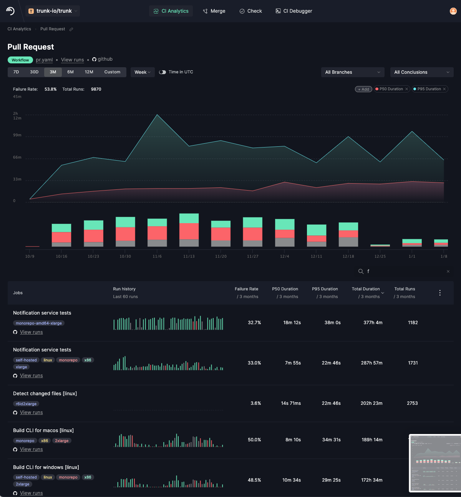
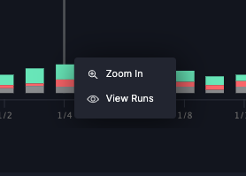
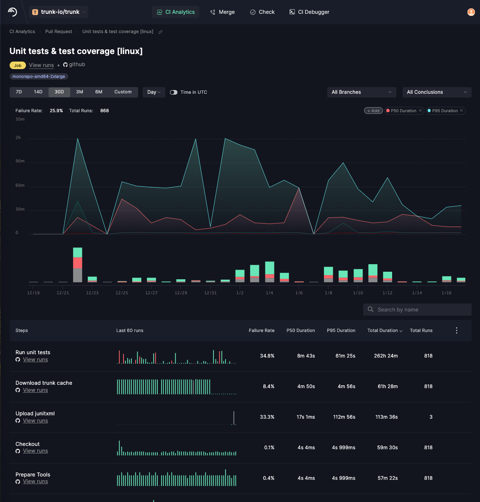

# Using the Analysis UI

When you first select a repo in CI Analytics you will see **Overview** screen which contains charts and tables to give you a high level view of the state of your CI system. The charts show the aggregate _Average Daily Jobs per Hour_, _Total CI Time_, and _Wait Time per day_ over the selected time period. You can adjust the time period using the selector just below the first chart on the left.

<figure><figcaption>
CI Analytics Overview
</figcaption></figure>

The bottom half of the dashboard shows aggregate statistics for each of your CI workflows _over the selected time period_. The columns are as follows:

| Column Name    | Description                                                                                                                                      |
| -------------- | ------------------------------------------------------------------------------------------------------------------------------------------------ |
| Workflows      | Name of the workflow, a link to the `yaml` file on GitHub defining the workflow, and a link to view all of the runs for that workflow.           |
| Run history    | Chart for the last 60 runs of the workflow. Hover over a bar in the chart to see details                                                         |
| Failure Rate   | How often the workflow failed during the selected time period.                                                                                   |
| P50 Duration   | Average (50th percentile) duration of the workflow during the selected time period. This shows the time of the _typical_ run.                    |
| P95 Duration   | 95th percentile duration of the workflow during the selected time period. This shows the time of the _outlier_ runs that took longer than usual. |
| Total Duration | Total amount of time these runs took all together, often correlated with your server costs.                                                      |
| Total Runs     | Total number of runs performed (both successful and failed) during the selected time period.                                                     |

You can sort the table by clicking on the column headers. You can filter the workflows by _workflow name_ using the search box on the bottom right side of charts.

You can click anywhere on a table row to navigate to the [**Workflow Details View**](using-the-analysis-ui.md#workflow-details-view) for that workflow. You can also click on the `View runs` link to navigate to the [**Runs View**](using-the-analysis-ui.md#runs-view) for that workflow.

### Workflow Details View

When you click on a workflow in the Overview screen you will see **Workflow Details View** for that particular workflow. &#x20;

<figure><figcaption>
Workflow Details View
</figcaption></figure>

The top of the Workflow Details View shows a chart of aggregate statistics for the selected time period. You can change the selected time period using the selector above the chart. You can filter by branch and conclusions using the dropdown menus. You can also hover over details in the bar chart to see details for that time slice.&#x20;

If you click on a bar in the chart you will see a popup menu to either zoom into the data or view the runs for that day.

&#x20;

The bottom of the Workflow Details View is a table of jobs making up the current workflow. You can click anywhere on a table row of a job to navigate the [**Job Details View**](using-the-analysis-ui.md#job-details-view) for that job. You can click the **View Runs** link to navigate to the [**Runs View**](using-the-analysis-ui.md#runs-view) for every run in that job. You can also sort and filter the jobs using the table headers and search field, the same as in the Overview screen.


**Tags**: When you declare a job inside of a GitHub workflow file you can choose which type of device to run it on using the [`runs-on` attribute of the job](https://docs.github.com/en/actions/using-workflows/workflow-syntax-for-github-actions#jobsjob\_idruns-on).  This attribute is propagated to the jobs and run views as _tags_ below the name of the job. This is useful, for example, for determining if the particular runner used is affecting your results.


### Job Details View

When you click on a job in the Workflow Details View you will navigate to the **Job Details View**. This shows statistics about all of the steps for the selected job.&#x20;

<figure><figcaption></figcaption></figure>

The charts are similar to the [Workflow Details View](using-the-analysis-ui.md#workflow-details-view), showing statistics about the conclusions and runtimes for runs in the selected time period.  The table shows the stats for each Step of the selected run. You can sort by clicking on the table headers and filter by name of the steps in the search box.&#x20;

Clicking on a table row will navigate you to the Step View for that step. Clicking on the **View runs** link will navigate you to the [**Runs View**](using-the-analysis-ui.md#runs-view) for that step.

### Runs View

<figure><figcaption>
Runs View
</figcaption></figure>

The **Runs View**  is a table showing the time, date, and status for each step of the selected job during the selected time period. Below the name of the step are links to see the PR that triggered the run and the logs for that run.  You can filter runs by _branch_ and _conclusion_ (whether it succeeded, failed, or other conclusion) using the drop down menus in the upper right of the screen, and search for runs using the search box.
