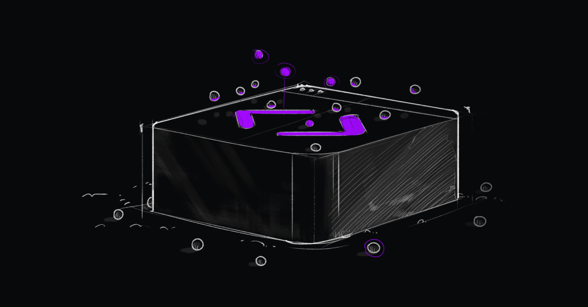

# Code Quality

<figure><figcaption></figcaption></figure>

Trunk Code Quality is a **metalinter** that lets you lint every language and every file in your project with a single tool using 100+ supported idiomatic code-checking tools, such as ESLint, Prettier, Ruff, and more for every language and project.&#x20;

Trunk Code Quality is trusted by popular open-source projects like [**ESLint**](https://eslint.org/) to improve their developer experience. [Learn more about how ESLint leverages Code Quality in their repos](https://trunk.io/blog/improving-linting-experience-in-eslint-s-open-source-repo-with-trunk-code-quality).


#### Trunk Code Quality is free for Open-Source.

Maintaining consistency in open-source repos is hard. That's why Trunk Code Quality is free for repos like [ESLint](https://github.com/eslint/eslint), which leverages Code Quality to overcome linting challenges in their repos. [Learn more about pricing](https://trunk.io/pricing)


### What is Code Quality?

<table data-card-size="large" data-view="cards"><thead><tr><th></th><th></th><th data-hidden></th><th data-hidden data-card-target data-type="content-ref"></th></tr></thead><tbody><tr><td><strong>Overview</strong></td><td>A tour of Code Quality, what it does, its key features, and its components.</td><td></td><td><a href="overview/">overview</a></td></tr><tr><td><strong>How does it work?</strong></td><td>How Code Quality works under the hood to level up your linting experience.</td><td></td><td><a href="overview/how-does-it-work.md">how-does-it-work.md</a></td></tr><tr><td><strong>Why Code Quality?</strong></td><td>What makes Trunk Code Quality different from other metalinters.</td><td></td><td><a href="overview/why-code-quality.md">why-code-quality.md</a></td></tr><tr><td><strong>Supported Linters</strong></td><td>Browse the 100+ supported static analysis tools to lint, format, and secure your projects.</td><td></td><td><a href="linters/supported/">supported</a></td></tr></tbody></table>

### How do I get started?

<table data-view="cards"><thead><tr><th></th><th></th><th></th><th data-hidden data-card-target data-type="content-ref"></th></tr></thead><tbody><tr><td><strong>Trunk CLI</strong></td><td>Initialize Code Quality in your projects using the Trunk CLI.</td><td></td><td><a href="setup-and-installation/initialize-trunk.md">initialize-trunk.md</a></td></tr><tr><td><strong>IDE Integration</strong></td><td>Initialize Code Quality in your projects using a VSCode extension.</td><td></td><td><a href="ide-integration/">ide-integration</a></td></tr><tr><td><strong>Web App</strong></td><td>Setup Code Quality to run on PRs and report nightly with the Trunk Web App</td><td></td><td><a href="https://app.trunk.io/login?intent=check">https://app.trunk.io/login?intent=check</a></td></tr></tbody></table>
