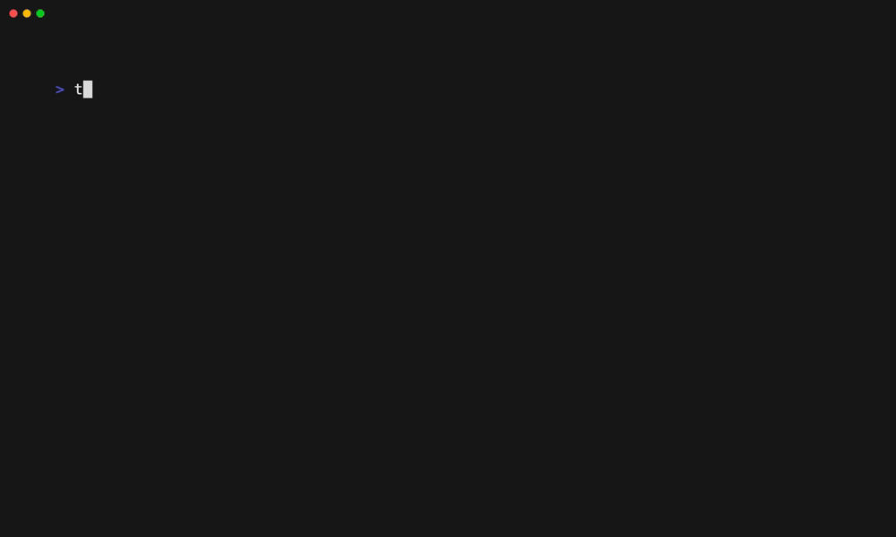

# ShellCheck

[**ShellCheck**](https://www.shellcheck.net/) is a linter for Bash.

You can enable the ShellCheck linter with:

```shell
trunk check enable shellcheck
```



## Auto Enabling

ShellCheck will be auto-enabled if any _Shell_ files are present.

## Settings

ShellCheck supports the following config files:

* `.shellcheckrc`
* `shellcheckrc`

You can move these files to `.trunk/configs` and `trunk check` will still find them. See [Moving Linter Configs](broken-reference) for more info. Trunk Code Quality provides a default `.shellcheckrc` if your project does not already have one.

## Links

* [ShellCheck site](https://www.shellcheck.net/)
* ShellCheck Trunk Code Quality [integration source](https://github.com/trunk-io/plugins/tree/main/linters/shellcheck)
* Trunk Code Quality's [open source plugins repo](https://github.com/trunk-io/plugins/tree/main)
