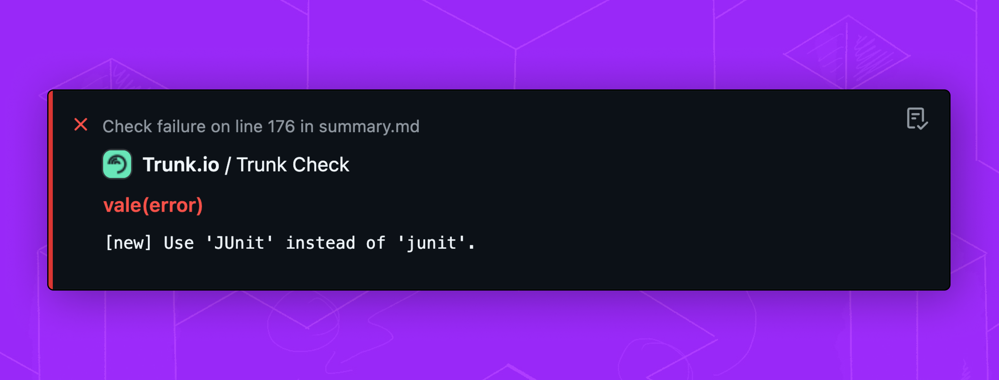

# Prevent New Issues

Trunk operates in **hold-the-line** mode by default. This Trunk will run linters only on the **files that have changed** according to Git, by comparing it to the appropriate upstream branch.

If you're not using `main` or `master` as the base branch, make sure it's specified in `.trunk/trunk.yaml`.

```yaml
version: 0.1
cli:
  version: 1.22.2
repo:
  # specify the base branch for hold-the-line
  trunk_branch: develop
```

### Prevent Issues On Commits

Code Quality can automatically run formatters on each commit to new formatting from appearing in your commit history. Code Quality uses a Git hook to automate this process. Formatting changes will automatically be applied to what you commit.

<pre class="language-shell"><code class="lang-shell"><strong>trunk actions enable trunk-fmt-pre-commit
</strong></code></pre>

This enables a [Git hook](../../cli/getting-started/actions/git-hooks.md) managed by Trunk which is defined in the `trunk.yaml` config file. When other developers pull the updated `trunk.yaml` file, they will automatically have this Git hook enabled to run `trunk fmt` on each commit.

### Prevent Issues Before Push

Code Quality can automatically run linters and formatters on each commit to new formatting from appearing in your commit history. Code Quality uses a Git hook to automate this process. This will flag lint issues so they never make it into your PRs.

```bash
trunk actions enable trunk-check-pre-push
```

This enables a [Git hook](../../cli/getting-started/actions/git-hooks.md) managed by Trunk which is defined in the `trunk.yaml` config file. When other developers pull the updated `trunk.yaml` file, they will automatically have this Git hook enabled to run `trunk check` before each push.

### Prevent Issues on PRs

Trunk Code Quality can work in CI to check for problems when a new pull request is opened.

#### GitHub Actions Workflows

If you're already running linters on your PRs, you can replace your lint step with the [Trunk Code Quality action](https://github.com/trunk-io/trunk-action) step. For example:

```yaml
name: Linter
on:
  push:
    branches: main
  pull_request:
    branches: main
jobs:
  test:
    runs-on: ubuntu-latest
    steps:
      - uses: actions/checkout@v4
      # ... other setup steps
      - name: Trunk Check
        uses: trunk-io/trunk-action@v1
        with:
          post-annotations: true 
      # ... other CI steps
```

This step will automatically run Trunk Code Quality to reveal problems found when comparing the branch to `main`.&#x20;

When `post-annotations` is set to `true` Code Quality will also **annotate** the PR with comments for where lint issues are found.

<figure><figcaption><p>Example of inline annotations</p></figcaption></figure>

#### Manual Configuration and Non-GitHub CI

If you want to run the `trunk check` command directly in your workflow, or you're not using GitHub, you can run the following command:

```sh
trunk check --ci
```

If you setup Trunk with `npm` and added trunk commands to your `package.json` like mentioned in [initialize-trunk.md](initialize-trunk.md "mention"), you can run the following command:

```bash
npm run lint --ci
```

If you committed Trunk Launcher into your project, you can run:

```
./trunk check --ci
```

Here's an example GitHub Action Workflow and `pnpm`:

```yaml
name: CI
on:
  push:
    branches: main
  pull_request:
    branches: main

jobs:
  Lint:
    runs-on: ubuntu-latest
    steps:
      - uses: actions/checkout@v4
      - uses: pnpm/action-setup@v2
        with:
          version: 8.6.3
          run_install: true
      - run: pnpm run lint
      - run: pnpm run lint --ci
```
