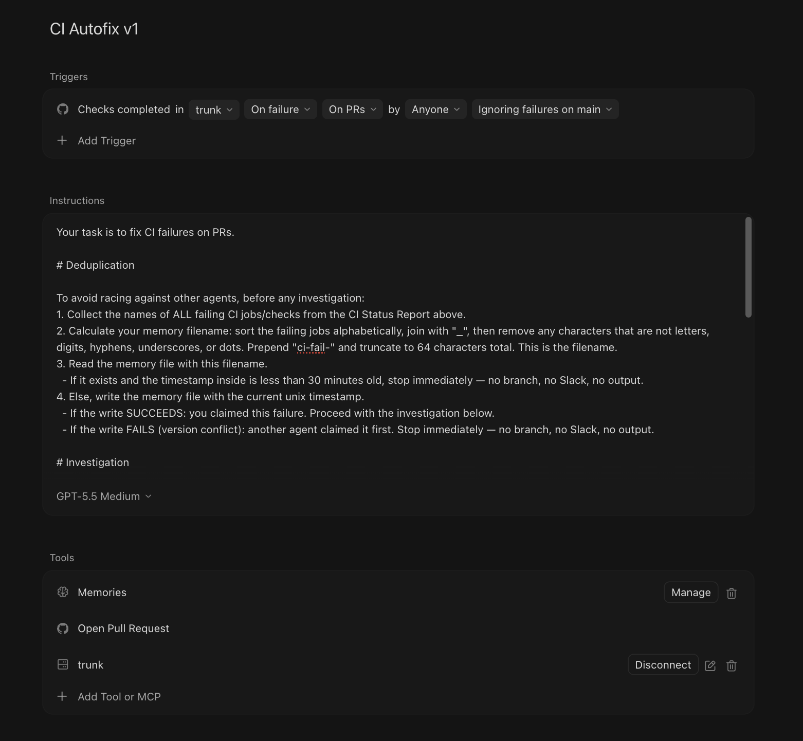

# Autofix CI Failures

Trunk can return targeted information about CI failures, enabling AI agents and automation tools to analyze and fix issues automatically.

### Prerequisites

To use the Autofix CI Failures feature, you'll need to have:

- Your repository set up to [upload test results to Trunk](./get-started/README.md)

### Cursor CI Autofix

You can set up a [Cursor Automation](https://cursor.com/automations) to automatically fix CI failures by connecting to Trunk's CI failure investigation data via MCP. This is an extension of the Cursor `CI Autofix` template.

<figure><figcaption></figcaption></figure>

Set up the Trunk MCP using [Bearer Authentication](./use-mcp-server/configuration/bearer-auth.md).

<details>

<summary>Recommended Cursor Automation Prompt</summary>

```json
{
  "name": "CI Autofix v1",
  "description": "Detect CI failures on main and automatically open PRs",
  "triggers": [
    {
      "git": {
        "ciCompleted": {
          "repos": [
            "https://github.com/<repo>"
          ],
          "condition": 1,
          "ignoreBaseFailures": true
        }
      }
    }
  ],
  "actions": [
    {
      "gitPr": {}
    },
    {
      "mcp": {
        "server": {
          "name": "trunk"
        }
      }
    }
  ],
  "prompts": [
    {
      "prompt": "Your task is to fix CI failures on PRs.\n\n# Deduplication\n\nTo avoid racing against other agents, before any investigation:\n1. Collect the names of ALL failing CI jobs/checks from the CI Status Report above.\n2. Calculate your memory filename: sort the failing jobs alphabetically, join with \"_\", then remove any characters that are not letters, digits, hyphens, underscores, or dots. Prepend \"ci-fail-\" and truncate to 64 characters total. This is the filename.\n3. Read the memory file with this filename.\n  - If it exists and the timestamp inside is less than 30 minutes old, stop immediately — no branch, no Slack, no output.\n4. Else, write the memory file with the current unix timestamp.\n  - If the write SUCCEEDS: you claimed this failure. Proceed with the investigation below.\n  - If the write FAILS (version conflict): another agent claimed it first. Stop immediately — no branch, no Slack, no output.\n\n# Investigation\n\nRoot cause the CI failure. Call investigate-ci-failure on the trunk MCP in order to get information about the failing test by passing in the workflow URL. Use that to identify which tests to fix. Look at the errot output returned by this tool. ONLY IF you need additional information, look at the CI run's logs.\n\n- If the CI failure is due to a bug introduced on that commit, create a new PR that fixes the bug. The PR should be stacked on the PR with the failure. Modify/ensure the base branch of the PR you create is the branch of the PR you are fixing.\n- If the CI failure is due to a flaky test, create a new PR that skips that test.\n- If you are not confident in either of these outcomes, then do nothing.\n\n# Output\n\nOutput your results in the following format:\n**CI Autofix Automation**\n\n**Failure logs**: <link to failing CI job>\n**Broken by**: <link to PR> (cc @prAuthor)\n**Reason**: <1-2 sentence explanation of why CI broke>\n**Fixed by**: <1-2 sentence explanation of what fixed it>\n\nMake sure to push the PR but don't include a PR link in your output — the system will generate that for you."
    }
  ],
  "memoryEnabled": true,
  "scope": "team_editable_user",
  "templateId": "ci-autofix"
}
```

</details>

We recommend the following conventions:
- Version your Automation names for more clarity (e.g., "CI Autofix v1")
- Refine the prompt to avoid scanning GitHub logs in order to save time and tokens
- Be specific about your repository's conventions and common failure patterns


Currently Cursor will create a pull request with a base of `main`. You will need to adjust the pull request base if you want to merge the fix into your PR.


### Claude Code Routines


**Coming soon.** Set up Claude Routines to autofix CI failures

