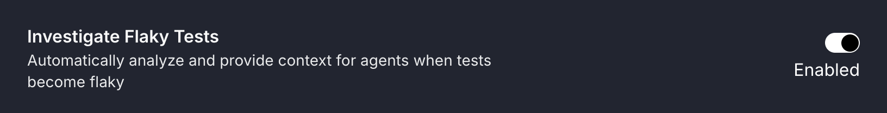
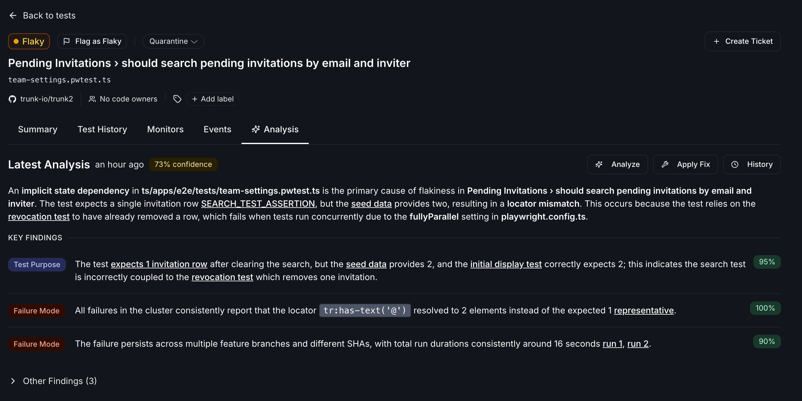
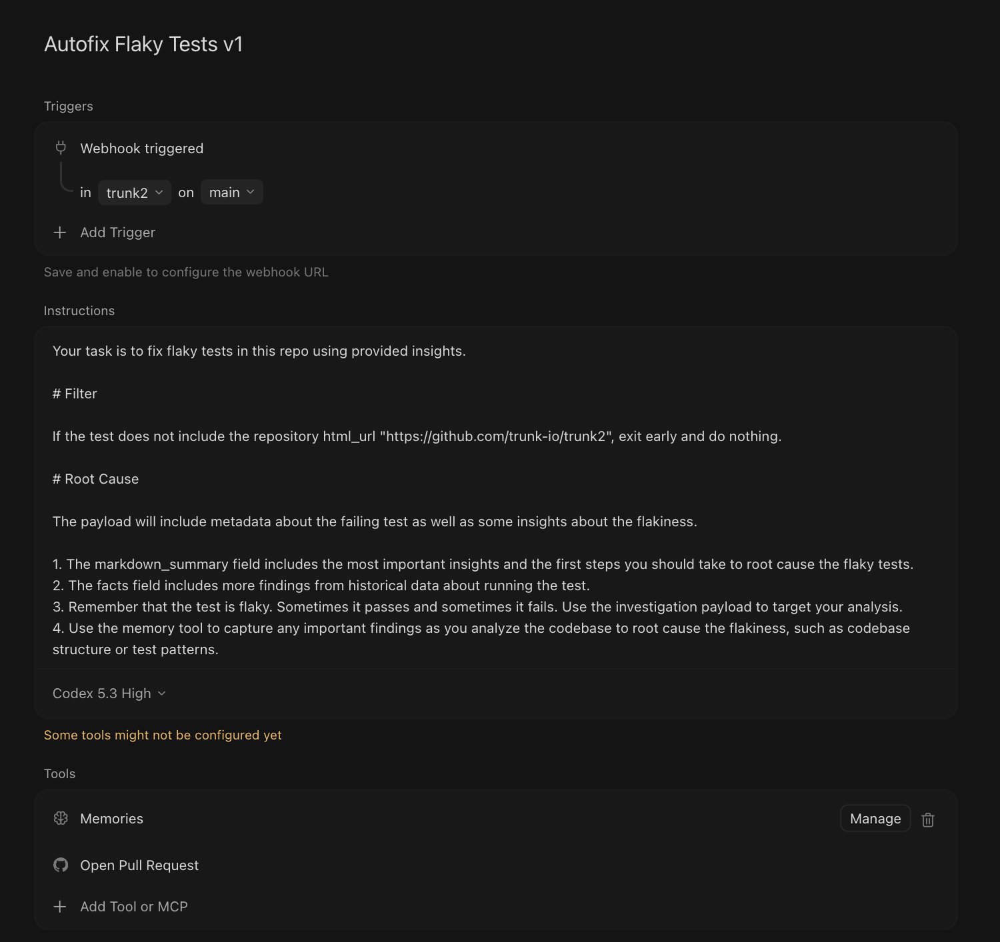

# Autofix Flaky Tests

Trunk can automatically investigate flaky tests in your codebase and raise fix pull requests with suggested solutions.

### Prerequisites

To use the Autofix Flaky Tests feature, you'll need:

1. Beta access via waitlist (reach out to us on [Slack](https://slack.trunk.io))
2. The "Investigate Flaky Tests" setting enabled in your workspace

<figure><figcaption></figcaption></figure>

### Auto-Investigate Flaky Tests

Once enabled, Trunk automatically monitors your test runs and detects flaky tests (tests that pass and fail inconsistently). When a flaky test is detected, Trunk analyzes the failure patterns and git history of the test to provide a number of insights.

<figure><figcaption></figcaption></figure>

Flaky tests can also be analyzed manually via the UI and via the [MCP server](./use-mcp-server/mcp-tool-reference/fix-flaky-test.md).

### Autofix with Cursor Automations

Whenever an investigation is completed, Trunk will emit a [webhook](./webhooks/README.md) for `test_case.investigation_completed`. Enable webhooks via [Svix](./webhooks/README.md).

You can then set up a [Cursor Automation](https://cursor.com/automations) to trigger when webhooks are received.

<figure><figcaption></figcaption></figure>

<details>

<summary>Recommend Cursor Automation Config</summary>

```json
{
  "name": "Autofix Flaky Tests v1",
  "triggers": [
    {
      "webhook": {}
    }
  ],
  "actions": [],
  "prompts": [
    {
      "prompt": "Your task is to fix flaky tests in this repo using provided insights.\n\n# Filter\n\nIf the test does not include the repository html_url \"https://github.com/<repo>\", exit early and do nothing.\n\n# Root Cause\n\nThe payload will include metadata about the failing test as well as some insights about the flakiness.\n\n1. The markdown_summary field includes the most important insights and the first steps you should take to root cause the flaky tests.\n2. The facts field includes more findings from historical data about running the test.\n3. Remember that the test is flaky. Sometimes it passes and sometimes it fails. Use the investigation payload to target your analysis.\n4. Use the memory tool to capture any important findings as you analyze the codebase to root cause the flakiness, such as codebase structure or test patterns.\n\n## Antipatterns\n\n1. Identify the root cause of the flakiness of the test. Do not simply increase the test's timeout or change the assertion to be more generic.\n2. Do not attempt to fix flakiness in other tests, limit your analysis to this single test.\n3. Do not add new tests, fix the flaky test in the payload.\n4. If the test is not present on your stable branch, exit early.\n5. When modifying end to end tests, do not wait on internal API calls to resolve. Focus on the page state and what the end user sees.\n6. There may be additional reasons for test flakiness, such as nondeterministic seed data, noisy neighbors, or test order issues. Conduct a deep analysis for necessary evidence, do not terminate your analysis early.\n\n## Output\n\n1. Once you have identified the root cause of the test's flakiness, open a pull request to fix the PR.\n2. Title the Pull Request: \"[Cursor Fix Flaky Test]: <Description of Fix>\".\n3. Include 1 short paragraph about the fix and the supporting evidence in the pull request body. Include links to relevant files/pages that were relevant from the webhook payload and its facts.\n4. In a collapsible summary of the PR description, include the entire webhook payload you received."
    }
  ],
  "memoryEnabled": true,
  "scope": "private",
  "gitConfig": {
    "repo": "https://github.com/<repo>",
    "repos": [
      "https://github.com/<repo>"
    ],
    "branch": "main"
  }
}
```

</details>

We recommend the following conventions:
- Version your Automation names for more clarity.
- Configure the Svix endpoint with the Cursor Bearer token.
- Webhooks are configured for your entire organization, so you will need to use [Svix transformations](https://docs.svix.com/transformations) or filter out events that are not for your intended repository.
- Be specific about conventions and antipatterns for your repository. You will need to refine the Automation prompt to suit your needs.
- If your CI setup allows it, prompt Cursor to run the tests to verify them.

### What's next?

- Continue to monitor your tests to confirm the flaky test fixes are effective
- Investigations can be triggered and applied via [MCP](./use-mcp-server/mcp-tool-reference/fix-flaky-test.md)
- Set up Claude routines to autofix flaky tests (Coming Soon!)
