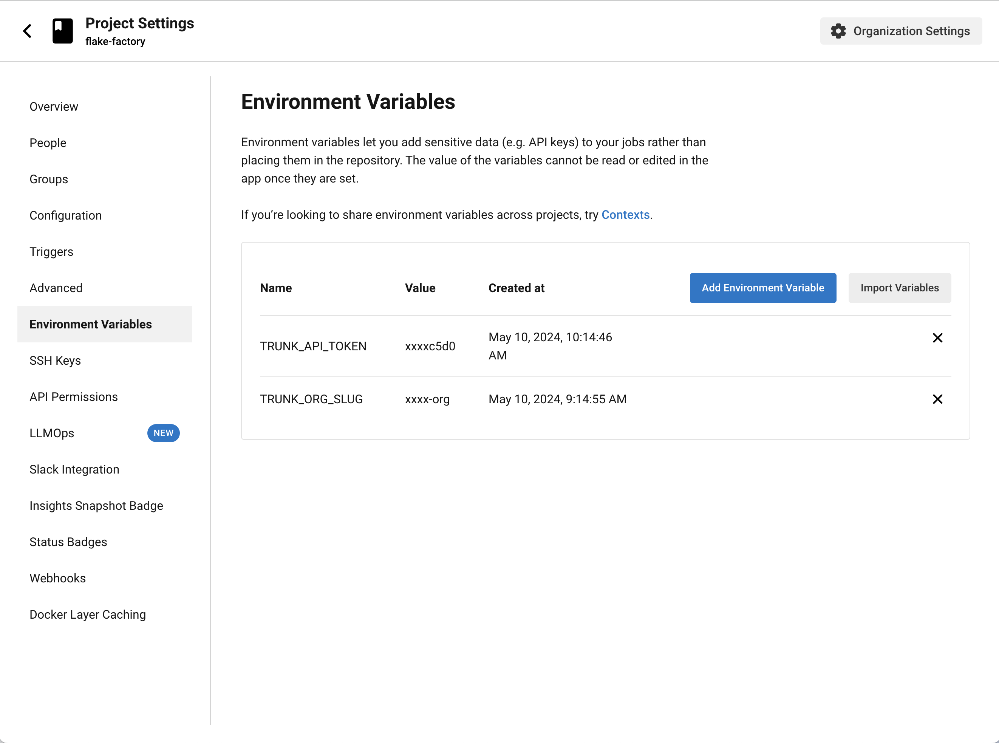

# CircleCI

## Getting Started

You can use the analytics test uploader within your [CircleCI](https://circleci.com/) workflows to upload and analyze your test results.


The Trunk Flaky Tests Uploader currently only supports Linux x64 and macOS for Intel and Arm. If you have another use case, please get in touch with support at [https://slack.trunk.io](https://slack.trunk.io/). For the best results, you'll need to validate that your test invocation doesn't use cached test results and doesn't automatically retry failing tests.


### Create a CircleCI Workflow

Create a CircleCI workflow (or modify an existing one) to run the tests that you want to monitor. The workflow should produce a test report in [**JUnit XML**](https://github.com/testmoapp/junitxml) format. Most testing frameworks support XML output. See [Testing Framework Configuration](../frameworks/) for guides for common testing frameworks. Make sure that your test invocation doesn't use cached test results, and doesn't automatically retry failing tests.

### Find Organization Slug and Token

Next you will need your Trunk **organization slug** and **token.** Navigate to [app.trunk.io](http://app.trunk.io). Once logged in navigate to **Settings -> Manage -> Organization**. Copy your organization slug. You can find your Trunk token by navigating to **Settings → Manage Organization → Organization API** Token and clicking "View." Copy this token. Make sure you are getting your _organization token_, not your project/repo token.



### Set Project Environment Variables

In your CircleCI project settings under **Environment Variables**, create new variables for your Trunk org as `TRUNK_ORG_SLUG` and the api token as `TRUNK_API_TOKEN`.

<figure><figcaption><p>CircleCI Project Settings</p></figcaption></figure>

### Add Uploader to Testing Workflow

Now update your CircleCI workflow to download and run the test uploader binary after you've run your tests. Here is an example of a NodeJS project using JUnit tests.

You can upload test results to Flaky Tests with
the [`trunk-analytics-uploader`](https://github.com/trunk-io/analytics-uploader) by running it in a stage after
your tests are complete. There are five different OS/arch builds of the uploader in the latest release.
Pick the one you need for your testing platform and be sure to download the release on every CI run.
**Do not bake the CLI into a container or VM.** This ensures your CI runs are always using the latest build.

Right click and copy the appropriate link from this table.

| CPU Architecture    | Link                                                                                                                                                   |
|---------------------|--------------------------------------------------------------------------------------------------------------------------------------------------------|
| macOS Intel         | [x68_64-apple-darwin](https://github.com/trunk-io/analytics-cli/releases/latest/download/trunk-analytics-cli-x86_64-apple-darwin.tar.gz)               |
| macOS Apple Silicon | [aarch64-apple-darwin](https://github.com/trunk-io/analytics-cli/releases/latest/download/trunk-analytics-cli-aarch64-apple-darwin.tar.gz)             |
| Arm64 Linux         | [aarch64-unknown-linux-musl](https://github.com/trunk-io/analytics-cli/releases/latest/download/trunk-analytics-cli-aarch64-unknown-linux-musl.tar.gz) |
| Intel Linux (musl)  | [x86_64-unknown-linux-gnu](https://github.com/trunk-io/analytics-cli/releases/latest/download/trunk-analytics-cli-x86_64-unknown-linux-gnu.tar.gz)     |
| Intel Linux (gnu)   | [x86_64-unknown-linux-musl](https://github.com/trunk-io/analytics-cli/releases/latest/download/trunk-analytics-cli-x86_64-unknown-linux-musl.tar.gz)   |


```yaml
version: 2.1
orbs:
  node: circleci/node@5
  python: circleci/python@2
jobs:
  test-node:
    # Install node dependencies and run tests
    executor: node/default
    steps:
      - checkout
      - node/install-packages:
          cache-path: ~/project/node_modules
          override-ci-command: npm install
      - run:
          name: Run tests with Jest
          command: |
            ./node_modules/.bin/jest --config=javascript/tests/jest/jest.config.json javascript/tests/jest/**/*.js
      - run:
          name: Upload test results to Trunk
          when: always
          command: |
            curl -fsSL --retry 3 "UPLOADER_LINK" -o ./trunk-analytics-uploader
            chmod +x ./trunk-analytics-uploader
            ./trunk-analytics-uploader upload --junit-paths "tests/jest/jest_junit_test.xml" --org-url-slug ${TRUNK_ORG_SLUG} --token ${TRUNK_API_TOKEN}


```

In the config about we have added a second `run` step fo the `test-node` job. This step downloads the latest release of the `trunk-analytics-uploader`, makes it executable, then runs it to upload the test output xml file. The TRUNK\_ORG\_SLUG and TRUNK\_API\_TOKEN variables are filled in at runtime by the CircleCI environment variables set earlier. Note that the `when` property is set to `always` because it should run whether or not the actual tests in the previous `run` step succeed.

***

If you're interested in better understanding this binary or want to contribute to it, you can find the open source repo [here](https://github.com/trunk-io/analytics-cli).
