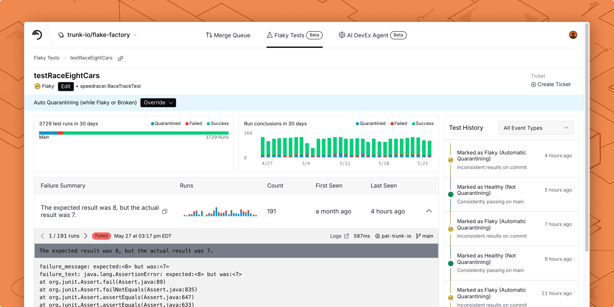
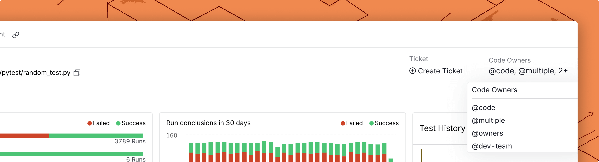
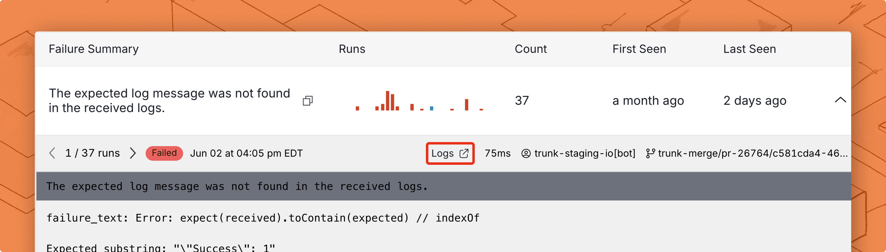
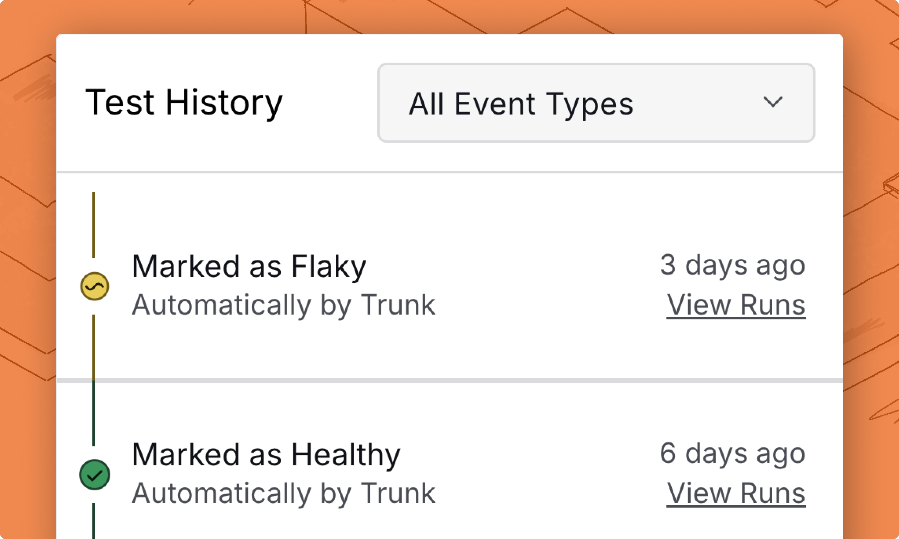

# Dashboard

Trunk Flaky Tests detect flaky tests by analyzing test results. The health of your tests is displayed in the Flaky Tests dashboard.

### Key repository metrics

<figure><picture><source srcset="../.gitbook/assets/key-metrics-dark.png" media="(prefers-color-scheme: dark)"></picture><figcaption>
Key repo metrics
</figcaption></figure>

Trunk Flaky Test provides key repo metrics based on the detected health status of your tests. You'll find metrics for the following information at the top of the Flaky Test dashboard.

<table><thead><tr><th width="209">Metric</th><th>Description</th></tr></thead><tbody><tr><td>Flaky tests</td><td>Number of flaky test cases in your repo.</td></tr><tr><td>Broken tests</td><td>Number of broken test cases in your repo.</td></tr><tr><td>PRs blocked by failed tests</td><td>PRs that have been blocked by failed tests in CI.</td></tr></tbody></table>

These numbers are important for understanding the overall health of your repo’s tests, how flaky and broken tests impact your developer productivity, and the developer hours saved from quarantining tests. You can also view the trends in these numbers in the trend charts.

The trend charts display the New Test Cases added by day, as well as Test Transitions and Quarantined Runs. Test Transitions represent the number of tests that have transitioned to a particular status on a particular day, excluding new test cases (which default to a status of Healthy). If a bar shows 5 Healthy, 10 Flaky on a single day, that indicates 5 tests transitioned to Healthy, and 10 tests transitioned to Flaky on that day. Quarantined Runs represents the number of runs of quarantined tests by day.

### Tests cases overview

<figure><picture><source srcset="../.gitbook/assets/flaky-tests-overview-table-v2-dark.png" media="(prefers-color-scheme: dark)"></picture><figcaption></figcaption></figure>

You can view a table of all your test cases and their current status in Trunk Flaky Tests.

Filters can also be set on the table to narrow test results down by test status, quarantine setting, ticket status, or by the name, file, or suite name of the test case.

The table is sorted by default by the number of PRs impacted by the case, which is the best way to measure the impact of a flaky test. You can click on each test case to view [the test case’s details](dashboard.md#test-case-details).

<table><thead><tr><th width="188">Column</th><th>Description</th></tr></thead><tbody><tr><td>Tests</td><td>The variant, file path, and name of the test case.</td></tr><tr><td>Status</td><td>The health status of the test case.</td></tr><tr><td>Failure Rate</td><td>The percentage of CI runs failed due to this broken or flaky test case.</td></tr><tr><td>PRs Impacted</td><td>The number of PRs that have been affected by this test case failing in CI.</td></tr><tr><td>Last Run</td><td>The most recent timestamp for an upload test run.</td></tr></tbody></table>


Test Deletion & History

* Inactive tests disappear from the dashboard automatically after 30 days and are fully removed after 45 days. Tests cannot be manually deleted.
* Changing test identifiers (e.g., adding file paths) creates new test entries — merging with old history isn’t supported.
* To reduce noise, mark old or unused tests as Healthy while waiting for them to expire.


### Test case details

<figure><picture><source srcset="../.gitbook/assets/flaky-tests-failure-details-dark.png" media="(prefers-color-scheme: dark)"></picture><figcaption></figcaption></figure>

You can _click_ on any of the test cases listed on the Flaky Test dashboard to access the test case’s details. On a test's details page, you can find:

* The test's current status
* Visualizations and a timeline detailing the test's health history
* A table of unique failure types for this test

This is in addition to information like ticket status and the current codeowner.

### **Code owners**

If you have a codeowners file configured in your repos, you will see who owns each flaky test in the test details view. We support code owners for [GitHub](https://docs.gitlab.com/ee/user/project/codeowners/) and [GitLab](https://docs.gitlab.com/ee/user/project/codeowners/) repos.

<figure><picture><source srcset="../.gitbook/assets/details-code-owners-dark.png" media="(prefers-color-scheme: dark)"></picture><figcaption>
You can find the code owners of each test on the top right of the test details screen.
</figcaption></figure>

This information will also be provided when creating a ticket with the [Jira integration](ticketing-integrations/jira-integration.md) or [webhooks](webhooks/).

### **Failure types**

<figure><picture><source srcset="../.gitbook/assets/unique-failure-reason-dark.png" media="(prefers-color-scheme: dark)"></picture><figcaption></figcaption></figure>

The Failure Types table shows the history of past test runs grouped by unique failure types.

The Failure Type is a summary of the stack trace of the test run. You can click on the failure type to see a list of test runs labeled by branch, PR, Author, CI Job link, duration, and time.

### Failure details

You can click on any of these test runs to see the detailed stack trace:

<figure><picture><source srcset="../.gitbook/assets/run-details-dark.png" media="(prefers-color-scheme: dark)"></picture><figcaption></figcaption></figure>

You can flip through the stack traces of similar failures across different test runs by clicking the left and right arrow buttons. You can also see other similar failures on this and other tests.

#### Go to the CI job logs

If you want to see full logging of the original CI job for an individual test failure, you can click **Logs** in the expanded failure details panel to go to the job's page in your CI provider.

<figure><picture><source srcset="../.gitbook/assets/failure-logs-dark.png" media="(prefers-color-scheme: dark)"></picture><figcaption></figcaption></figure>

### **Test history**

<figure><picture><source srcset="../.gitbook/assets/test-history-dark.png" media="(prefers-color-scheme: dark)"></picture><figcaption></figcaption></figure>

Tests may transition between flaky, broken, and healthy states multiple times over their lifetime. You can see previous changes in the detected health status of a test in Test History, as well as an explanation for why it was detected to have a new state.

The timeline displays both engine-generated status changes and [manual status overrides](detection.md#override-test-status) together in chronological order. Engine-generated transitions show the rule that triggered the change, while manual overrides display the description provided by the user who set the status.
