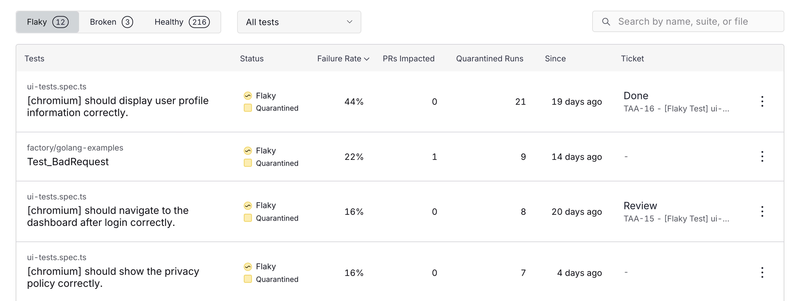
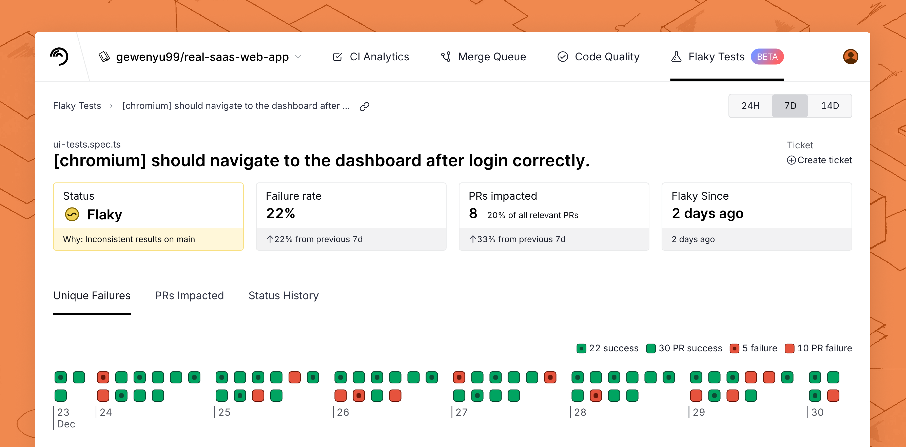

# Dashboard

Trunk Flaky Tests detect flaky tests by analyzing test results. The health of your tests is displayed in the Flaky Tests dashboard.

### Key Repo Metrics

<figure><picture><source srcset="../.gitbook/assets/key-metrics-dark.png" media="(prefers-color-scheme: dark)"></picture><figcaption>
Key repo metrics
</figcaption></figure>

Trunk Flaky Test provides key repo metrics based on the detected health status of your tests. You'll find metrics for the following information at the top of the Flaky Test dashboard.

<table><thead><tr><th width="209">Metric</th><th>Description</th></tr></thead><tbody><tr><td>Flaky tests</td><td>Number of flaky test cases in your repo.</td></tr><tr><td>Broken tests</td><td>Number of broken test cases in your repo.</td></tr><tr><td>PRs blocked by failed tests</td><td>PRs that have been blocked by failed tests in CI.</td></tr><tr><td>PRs rescued by quarantining</td><td>This figure is available if you have <a href="quarantining.md#enable-quarantining">quarantining enabled</a>. This shows the PRs with CI jobs containing quarantined flaky tests that would have failed if all flaky tests had not been quarantined.</td></tr><tr><td>Engineering hours saved</td><td>Estimated engineering hours saved based on the study <a href="https://ics.uci.edu/~gmark/chi08-mark.pdf">The Cost of Interrupted Work</a>, where each context switch to debug a flaky test costs 23 minutes of focused productivity.</td></tr></tbody></table>

These numbers are important for understanding the overall health of your repo’s tests, how flaky and broken tests impact your developer productivity, and the developer hours saved from quarantining tests. You can also view the trends in these numbers in the trend charts.

### Tests Cases Overview

<figure><picture><source srcset="../.gitbook/assets/dashboard-test-list-dark.png" media="(prefers-color-scheme: dark)"></picture><figcaption></figcaption></figure>

You can view a table of all your test cases and their current status in Trunk Flaky Tests. There are three different tables for tests labeled Flaky, Broken, and Healthy. \

The table is sorted by default by the number of PRs impacted by the case, which is the best way to measure the impact of a flaky test. You can click on each test case to view [the test case’s details](dashboard.md#test-case-details).

<table><thead><tr><th width="188">Column</th><th>Description</th></tr></thead><tbody><tr><td>Tests</td><td>The file path and name of the test case.</td></tr><tr><td>Status</td><td>The health status of the test case.</td></tr><tr><td>Failure Rate</td><td>The percentage of CI runs failed due to this broken or flaky test case.</td></tr><tr><td>PRs Impacted</td><td>The number of PRs that have been affected by this test case failing in CI.</td></tr><tr><td>Quarantined Runs</td><td>The number of times CI has been run after quarantining this test case. Only visible if quarantining is enabled.</td></tr><tr><td>Since</td><td>How long this test has been labeled with its current status.</td></tr><tr><td>Ticket</td><td>If a ticket has been created in your issue tracker integration, it will show the status of the ticket.</td></tr></tbody></table>

### Test Case Details

<figure><picture><source srcset="../.gitbook/assets/flaky-tests-details-dark.png" media="(prefers-color-scheme: dark)"></picture><figcaption></figcaption></figure>

You can click on any of the test cases listed on the Flaky Test dashboard to access the test case’s details. In the details, you can find summary metrics at the top of the page, which covers the following information.

<table><thead><tr><th width="297">Metric</th><th>Description</th></tr></thead><tbody><tr><td>Status</td><td>The current status of this test. Can be Flaky or Broken.</td></tr><tr><td>Failure rate</td><td>Describes the failure rate of this test case and the % change period over period.</td></tr><tr><td>PRs impacted by test</td><td>Describes the number of PRs affected by failures from this test case, the percent of PRs impact, and % change period over period. <strong>PRs with all failures quarantined</strong> do not affect this number.  </td></tr><tr><td>PRs rescued by quarantining</td><td>If quarantining is enabled, describes the number of PRs with CI jobs containing quarantined flaky tests that would have failed, but were rescued by quarantining flaky failures. Also covers estimated engineer hours saved by quarantining flaky tests and unblocking PRs, as well as % change period over period.</td></tr><tr><td>Ticket Status</td><td>If a ticket was created using the Ticket Creation feature, this reflects the ID and status of the created ticket. You can click the ID to be redirected to your ticket.</td></tr></tbody></table>

### **Code Owners**

If you have a code owners file configured in your repos, you'll be able to see who owns each flaky test in the test details view. We support code owners for [GitHub](https://docs.gitlab.com/ee/user/project/codeowners/) and [GitLabs](https://docs.gitlab.com/ee/user/project/codeowners/) repos.

<figure><picture><source srcset="../.gitbook/assets/details-code-owners-dark.png" media="(prefers-color-scheme: dark)"></picture><figcaption>
You can find the code owners of each test on the top right of the test details screen.
</figcaption></figure>

This information will also be provided when creating a ticket with the [Jira integration](jira-integration.md) or [webhooks](webhooks/).

### **Unique Failure Reasons**

<figure><picture><source srcset="../.gitbook/assets/unique-failure-reason-dark.png" media="(prefers-color-scheme: dark)"></picture><figcaption></figcaption></figure>

Unique Failures show a history of all past runs for this test case over the selected time period with a list of unique failure types. You can click a failure type to see them highlighted in the timeline.

The Failure Type is a summary of the stack trace of the test run. You can click on the failure type to see a list of test runs labeled by branch, PR, Author, CI Job link, commit hash, duration, and time.&#x20;

You can click on any of these test runs to see the detailed stack trace:

<figure><picture><source srcset="../.gitbook/assets/test-run-detail-dark.png" media="(prefers-color-scheme: dark)"></picture><figcaption></figcaption></figure>

You can flip through the stack traces of similar failures across different test runs by clicking the left and right arrow buttons. You can also see other similar failures on this and other tests.

### **PRs Impacted**

<figure><picture><source srcset="../.gitbook/assets/prs-impacted-dark (1).png" media="(prefers-color-scheme: dark)"></picture><figcaption></figcaption></figure>

You can see a list of PRs impacted by failures for this test case. Each entry has links to the PR, and the CI jobs impacted.&#x20;

### **Status History**

<figure><picture><source srcset="../.gitbook/assets/status-history-dark.png" media="(prefers-color-scheme: dark)"></picture><figcaption></figcaption></figure>

Tests may transition between flaky, broken, and healthy states multiple times over their lifetime. You can see previous changes in the detected health status of a test under Status History, as well as an explanation for why it was detected to have a new state.
