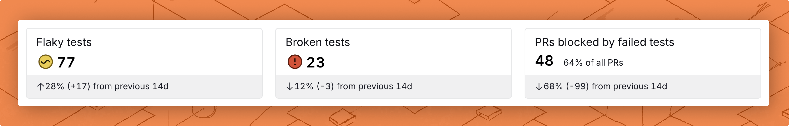
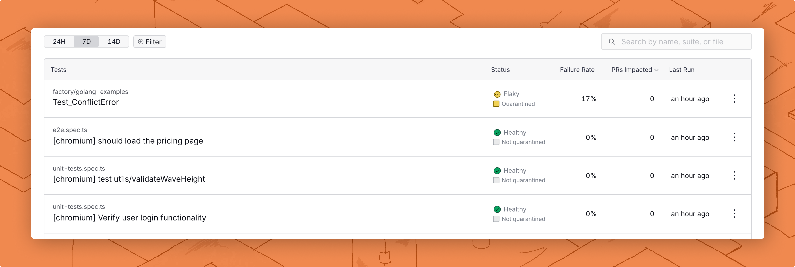
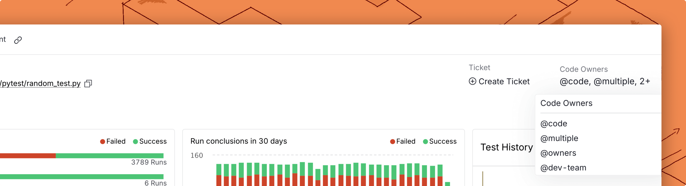
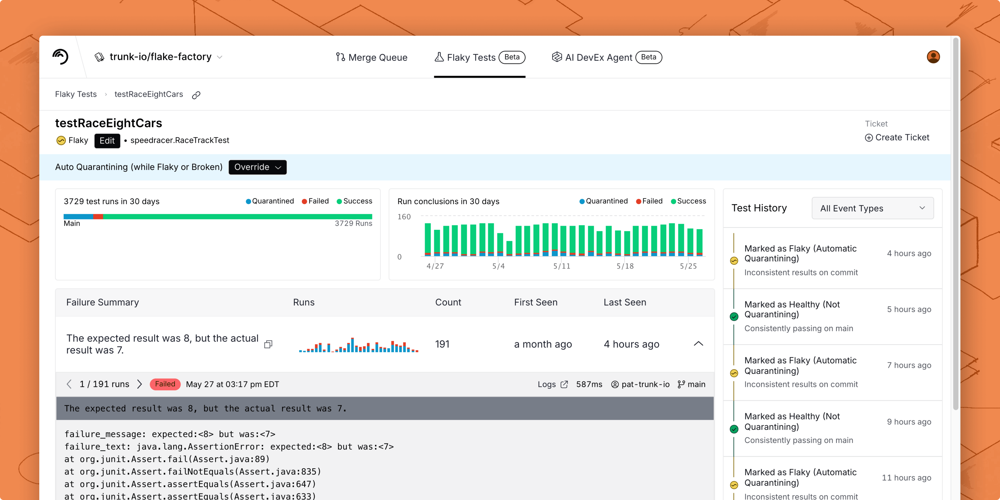
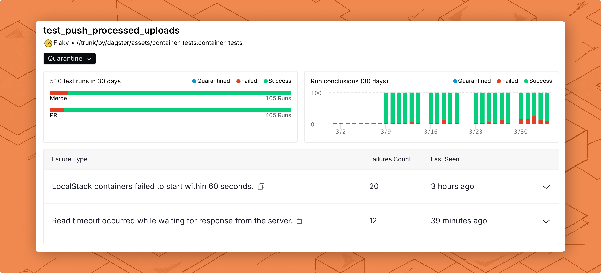
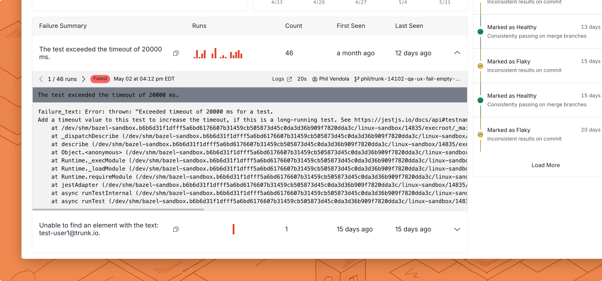
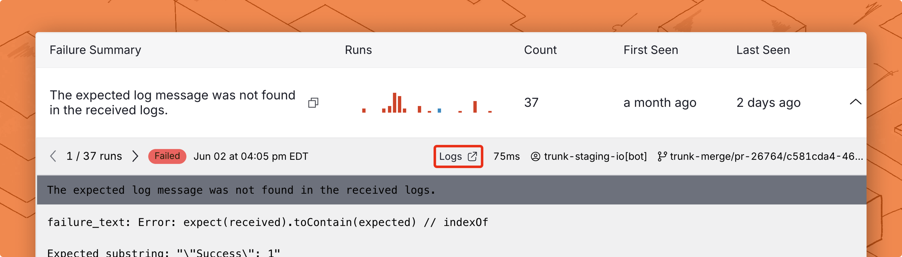
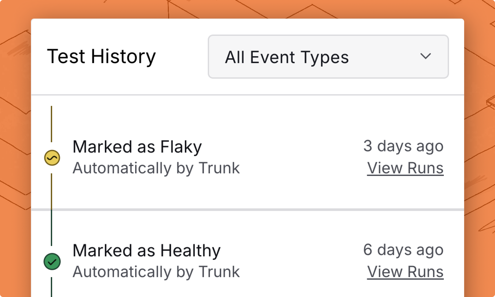

# Dashboard

Trunk Flaky Tests detect flaky tests by analyzing test results. The health of your tests is displayed in the Flaky Tests dashboard.

### Key repository metrics

<figure><picture><source srcset="../.gitbook/assets/key-metrics-dark.png" media="(prefers-color-scheme: dark)"></picture><figcaption>
Key repo metrics
</figcaption></figure>

Trunk Flaky Test provides key repo metrics based on the detected health status of your tests. You'll find metrics for the following information at the top of the Flaky Test dashboard.

<table><thead><tr><th width="209">Metric</th><th>Description</th></tr></thead><tbody><tr><td>Flaky tests</td><td>Number of flaky test cases in your repo.</td></tr><tr><td>Broken tests</td><td>Number of broken test cases in your repo.</td></tr><tr><td>PRs blocked by failed tests</td><td>PRs that have been blocked by failed tests in CI.</td></tr></tbody></table>

These numbers are important for understanding the overall health of your repo’s tests, how flaky and broken tests impact your developer productivity, and the developer hours saved from quarantining tests. You can also view the trends in these numbers in the trend charts.

The trend charts display the New Test Cases added by day, as well as Test Transitions and Quarantined Runs. Test Transitions represent the number of tests that have transitioned to a particular status on a particular day, excluding new test cases (which default to a status of Healthy). If a bar shows 5 Healthy, 10 Flaky on a single day, that indicates 5 tests transitioned to Healthy, and 10 tests transitioned to Flaky on that day. Quarantined Runs represents the number of runs of quarantined tests by day.

### Tests cases overview

<figure><picture><source srcset="../.gitbook/assets/flaky-tests-overview-table-v2-dark.png" media="(prefers-color-scheme: dark)"></picture><figcaption></figcaption></figure>

You can view a table of all your test cases and their current status in Trunk Flaky Tests.

Filters can also be set on the table to narrow test results down by test status, quarantine setting, ticket status, or by the name, file, or suite name of the test case.

The table is sorted by default by the number of PRs impacted by the case, which is the best way to measure the impact of a flaky test. You can click on each test case to view [the test case’s details](dashboard.md#test-case-details).

<table><thead><tr><th width="188">Column</th><th>Description</th></tr></thead><tbody><tr><td>Tests</td><td>The variant, file path, and name of the test case.</td></tr><tr><td>Status</td><td>The health status of the test case.</td></tr><tr><td>Failure Rate</td><td>The percentage of CI runs failed due to this broken or flaky test case.</td></tr><tr><td>PRs Impacted</td><td>The number of PRs that have been affected by this test case failing in CI.</td></tr><tr><td>Last Run</td><td>The most recent timestamp for an upload test run.</td></tr></tbody></table>


Test Deletion & History

* Inactive tests disappear from the dashboard automatically after 30 days and are fully removed after 45 days. Tests cannot be manually deleted.
* Changing test identifiers (e.g., adding file paths) creates new test entries — merging with old history isn’t supported.
* To reduce noise, mark old or unused tests as Healthy while waiting for them to expire.


### Test case details

You can _click_ on any of the test cases listed on the Flaky Test dashboard to access the test case’s details. The test details page uses a tabbed layout with the following tabs:

* **Summary** — Run result charts and failure types grouped by unique failure reason.
* **Test History** — A searchable, paginated table of every individual test run with filtering and a detail panel.
* **Monitors** — Detection monitors configured for this test (visible when the detection engine is enabled).
* **Events** — Detection events and status changes for this test (visible when the detection engine is enabled).

In addition to the tabbed content, the test details page shows the test’s current status, ticket status, and codeowner information.

### **Code owners**

If you have a codeowners file configured in your repos, you will see who owns each flaky test in the test details view. We support code owners for [GitHub](https://docs.github.com/en/repositories/managing-your-repositorys-settings-and-features/customizing-your-repository/about-code-owners) and [GitLab](https://docs.gitlab.com/ee/user/project/codeowners/) repos.

<figure><picture><source srcset="../.gitbook/assets/details-code-owners-dark.png" media="(prefers-color-scheme: dark)"></picture><figcaption>
You can find the code owners of each test on the top right of the test details screen.
</figcaption></figure>

This information will also be provided when creating a ticket with the [Jira integration](ticketing-integrations/jira-integration.md) or [webhooks](webhooks/).

### Summary tab

<figure><picture><source srcset="../.gitbook/assets/flaky-tests-failure-details-dark.png" media="(prefers-color-scheme: dark)"></picture><figcaption></figcaption></figure>

The Summary tab shows an overview of the test’s recent run results and groups past failures by unique failure type.

#### **Failure types**

<figure><picture><source srcset="../.gitbook/assets/unique-failure-reason-dark.png" media="(prefers-color-scheme: dark)"></picture><figcaption></figcaption></figure>

The Failure Types table shows the history of past test runs grouped by unique failure types.

The Failure Type is a summary of the stack trace of the test run. You can click on the failure type to see a list of test runs labeled by branch, PR, Author, CI Job link, duration, and time.

#### Failure details

You can click on any of these test runs to see the detailed stack trace:

<figure><picture><source srcset="../.gitbook/assets/run-details-dark.png" media="(prefers-color-scheme: dark)"></picture><figcaption></figcaption></figure>

You can flip through the stack traces of similar failures across different test runs by clicking the left and right arrow buttons. You can also see other similar failures on this and other tests.

##### Go to the CI job logs

If you want to see full logging of the original CI job for an individual test failure, you can click **Logs** in the expanded failure details panel to go to the job’s page in your CI provider.

<figure><picture><source srcset="../.gitbook/assets/failure-logs-dark.png" media="(prefers-color-scheme: dark)"></picture><figcaption></figcaption></figure>

### Test History tab

The Test History tab gives you full visibility into every individual run of a test. Use it to investigate patterns across branches, find specific failing runs, and drill into error details.

#### Daily runs chart

A stacked bar chart at the top of the tab shows daily test run counts broken down by result:

* **Green** — Pass
* **Red** — Fail
* **Blue** — Quarantined
* **Gray** — Skipped

You can click and drag on the chart to select a date range, which filters the table below to only show runs from the selected days. Click the **Reset** button or the clear icon on the chart to remove the date range selection.

#### Filters

A filter bar below the chart lets you narrow down the runs table:

<table><thead><tr><th width="188">Filter</th><th>Description</th></tr></thead><tbody><tr><td>Result</td><td>Toggle between <strong>All</strong>, <strong>Pass</strong>, <strong>Fail</strong>, and <strong>Quarantined</strong> to show only runs with a specific outcome.</td></tr><tr><td>SHA</td><td>Filter by commit hash. Matches runs whose SHA starts with the entered text.</td></tr><tr><td>Branch</td><td>Filter by branch name. Matches runs on branches containing the entered text.</td></tr></tbody></table>

All filters combine using AND logic, so you can use them together to find specific runs. For example, select **Fail** and enter a branch name to see all failures on that branch. Click the **Reset** button to clear all active filters.

Filter state is saved in the URL, so you can share or bookmark a filtered view.

#### Runs table

The runs table displays a paginated list of individual test runs (25 per page) with the following columns:

<table><thead><tr><th width="188">Column</th><th>Description</th></tr></thead><tbody><tr><td>Timestamp</td><td>When the test ran, displayed in UTC.</td></tr><tr><td>Duration</td><td>How long the test took to execute.</td></tr><tr><td>Branch</td><td>The branch context. Shows "Mergequeue testing #NNN" for merge queue runs, "#NNN" for pull request runs, or the branch name for other runs.</td></tr><tr><td>Commit</td><td>The first 7 characters of the commit SHA.</td></tr></tbody></table>

Each row has a colored left border indicating the result: green for pass, red for fail, blue for quarantined, and orange for error.

#### Run detail panel

Click any row in the runs table to open a detail panel on the right side of the page. The panel shows:

* **Run header** — Timestamp, result badge, and duration.
* **Source control** — Links to the commit, pull request, and branch.
* **Error details** — For failed or errored runs, the error message and stack trace.

### Status history

<figure><picture><source srcset="../.gitbook/assets/test-history-dark.png" media="(prefers-color-scheme: dark)"></picture><figcaption></figcaption></figure>

Tests may transition between flaky, broken, and healthy states multiple times over their lifetime. You can see previous changes in the detected health status of a test, as well as an explanation for why it was detected to have a new state.
