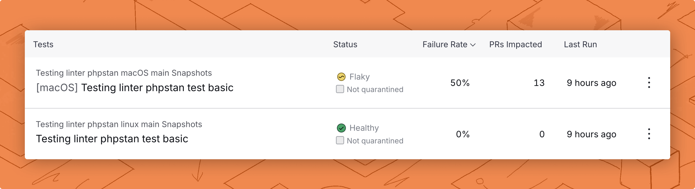
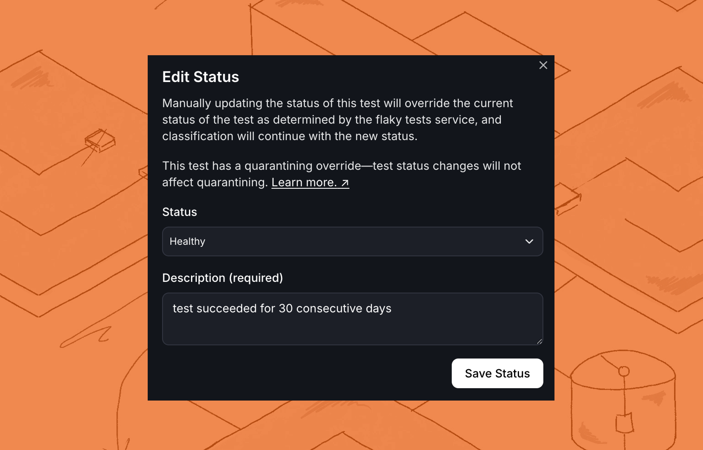

# Flaky test detection

Trunk detects flaky tests by analyzing test results uploaded from your CI jobs. This page covers how flaky tests are detected and how they're labeled after Trunk receives uploaded test results.

<figure><picture><source srcset="../.gitbook/assets/unique-failure-reason-dark.png" media="(prefers-color-scheme: dark)"></picture><figcaption></figcaption></figure>

Trunk Flaky Tests detects flaky tests by analyzing test results. The health of your tests is displayed in the Flaky Tests dashboard. This page covers how flaky tests are detected and how to analyze your test suite’s health using the dashboard.

You can learn more about how tests are uploaded to Trunk before they're labeled in the [Get Started docs](get-started/). You can learn more about how detection results are displayed in the [Dashboard docs](dashboard.md).


Trunk typically requires 10+ runs per test on CI to start accurately detecting flaky tests. For example, detecting a flaky test that fails 25% of the time takes 9 runs to achieve 90% confidence in having seen it flake. Depending on the repository’s velocity, this could take hours or days.


Trunk detects flaky tests by analyzing the test results uploaded from your CI jobs. Each new upload is processed and compared with historical test results to detect flaky tests. Trunk emphasizes each result differently depending on which branch it's run on.\
\
**This is an asynchronous process, and it may take up to an hour for an upload's results to be reflected in** [**the dashboard**](get-started/#id-4.-confirm-your-configuration-analyze-your-dashboard)**.**

<figure><picture><source srcset="../.gitbook/assets/data-uploads-dark.png" media="(prefers-color-scheme: dark)"></picture><figcaption><p>The uploads tab contains results received from past CI jobs.</p></figcaption></figure>

### How Trunk detects flakiness

Trunk analyzes test failures based on the context in which they are run. A test failing on `main` has a different impact on flake detection than a test failing on a pull request. After tests are uploaded to Trunk, they're analyzed based on different rules depending on which branch they were run on.


Uploading all test results from your repository will result in the fastest and most accurate detection. Trunk relies on test results from `main`, pull requests, and (if you use one) merge queues.


### Stable branches

Trunk detects flaky tests with the assumption that automated tests should be passing before being merged into stable branches like `main`. This means failures on `main` are unexpected and indicate flakiness or a broken test.


Stable branches are sometimes referred to as _protected_ or _default_ branches.


Flaky Tests will use `main` as a stable branch by default. You can override the default selection and set a custom stable branch, for example, `master` or `develop`.

#### Overriding stable branch defaults

It is important to set your stable branch correctly to ensure fast and accurate detection of flaky tests.

Flaky Test users with the administrator role can update the current stable branch in the repository settings:

1. Click on your profile and open **Settings.**
2. Click on your repository in the left nav.
3. Update the **Override Default Stable Branch** setting with the name of your stable branch.


Changing the stable branch will not rebuild your test history, a stable branch change will only be applied to new test runs.

Flaky Tests will require additional CI runs on the updated stable branch to detect test flakes.


#### Pull requests

Flaky tests are only detected on pull requests (PRs) when a test produces different results on the same git commit. This often occurs when a PR is opened, the tests initially fail, and then pass when re-run.

Tests failing on different git commits in PRs are not used as a signal of flakiness. This is because code changes in PRs can lead to expected test failures that will be fixed before the PR is merged.

#### Merge queue

Merge queues use temporary branches to test changes again before merging into `main`. Failures on merge queue branches are unexpected and are used as a signal when detecting flaky tests. Trunk currently auto-detects merge queue CI jobs from Trunk Merge Queues, GitHub Merge Queues, GitLab Merge Trains, and Graphite Merge Queues.

#### Examples

To help illustrate the implications of these rules, consider the following scenarios.

* Scenario 1: A test fails on a CI job run on the `main` branch, which is a protected branch. It will be marked as **flaky** because we expect PRs to pass automated tests before being merged, which means its results are inconsistent. If it continues to fail consistently on `main`, it will be marked as broken.
* Scenario 2: A test fails on a PR branch. A new commit is pushed, which fixes the test. Later, another commit breaks the test again, and it fails consistently for the next 3 commits and fails on reruns. It is **not marked flaky or broken** because it's displaying consistent behavior on the same commit, and it's failing on a development/PR branch, which is expected to fail and be fixed during development to catch regressions.
* Scenario 3: A test fails on a PR. A developer reruns the tests, and they pass. This test will be marked as **flaky** because it demonstrates inconsistent results on the same commit, which means it's flaky because the results changed without code changes.


Expect test results for individual PRs to be up-to-date for [PR Test Summaries](github-pull-request-comments.md) within 15 minutes post-upload and all other metrics to be up-to-date within an hour.


### Use variants to track environment-specific flakes

If you run the same tests across different environments or architectures, you can use variants to separate these runs into distinct test cases. This allows Flaky Tests to detect environment-specific flakes.

For example, a test for a mobile app might be flaky on iOS but stable on Android. Using variants, Flaky Tests can isolate flakes on the iOS variant instead of marking the test as flaky across all environments.

You can specify a variant during upload using the [`--variant` option](uploader.md#full-command-reference):


```
./trunk flakytests upload --junit-paths "test_output.xml" \
   --org-url-slug <TRUNK_ORG_SLUG> \
   --token $TRUNK_API_TOKEN \
   --variant ios
```


Variant names are displayed in brackets next to test names in your dashboard:

<figure><picture><source srcset="../.gitbook/assets/variants-dark-border.png" media="(prefers-color-scheme: dark)"></picture><figcaption><p>The same test, but the first is a macOS variant.</p></figcaption></figure>

### Test status

Trunk classifies all tests into one of three categories based on the history of each test:

<table><thead><tr><th width="178">Test Status</th><th>Description</th></tr></thead><tbody><tr><td>Flaky</td><td>This test is not deterministic. Given the same inputs, the test will occasionally produce different outputs. This means you <strong>cannot trust the results</strong> of these tests.</td></tr><tr><td>Broken</td><td>This test is reproducible but is always failing. These tests that always fail are not useful and should be fixed.</td></tr><tr><td>Healthy</td><td>This test is reproducible. Given the same inputs, the test will produce the same outputs.</td></tr></tbody></table>

### Override test status

If Trunk's automated detection does not reflect the current state of a test, you can manually override its status. This is useful when a test is stuck in a status that no longer matches its actual behavior, for example, a test that is marked as Flaky but has been passing consistently and should be Healthy.

To override a test's status, use the pencil dropdown on the **Tests** tab. Tests can be manually set to **Healthy** or **Flaky**.

<figure><figcaption></figcaption></figure>

When you override a test's status, you will be prompted to provide a description explaining the reason for the change. This description is displayed alongside the status change in the test's [status history timeline](dashboard.md#test-history).


Be sure to include a meaningful description when overriding the test status to help your team track any issues.


#### How manual overrides interact with detection

A manual override resets the starting point for Trunk's detection rules engine. After a manual override, the rules engine begins classifying the test from that point forward using only new test run data. Any test runs that occurred before the override are not factored into future classification.

This means the rules engine can change the status again after a manual override if new test results warrant it. Manual overrides do not lock a test into a particular status permanently. Specifically:

* **Overriding to Healthy:** If you mark a test as Healthy and it experiences a flaky failure shortly after, the rules engine will transition it back to Flaky once it observes sufficient evidence. This is the most common use case: correcting a test that is stuck in Flaky despite consistent recent successes.
* **Overriding to Flaky:** If you mark a test as Flaky and it then accumulates enough passing runs, the rules engine will transition it back to Healthy based on its normal classification rules.


Manual overrides are best suited for correcting tests that are stuck in an outdated status. They are not designed to permanently override or bypass the rules engine. If the test's behavior does not match the status you set, the rules engine will reclassify it.


### Next steps

If you have not set up your CI jobs to upload results to Trunk, follow the [Get Started docs](get-started/) to start uploading test results to Trunk.

If you're curious about why certain tests are labeled as flaky, you can visit each test's status history. [Learn more about Status History.](dashboard.md#status-history)

<figure><picture><source srcset="../.gitbook/assets/test-history-dark.png" media="(prefers-color-scheme: dark)"></picture><figcaption></figcaption></figure>
