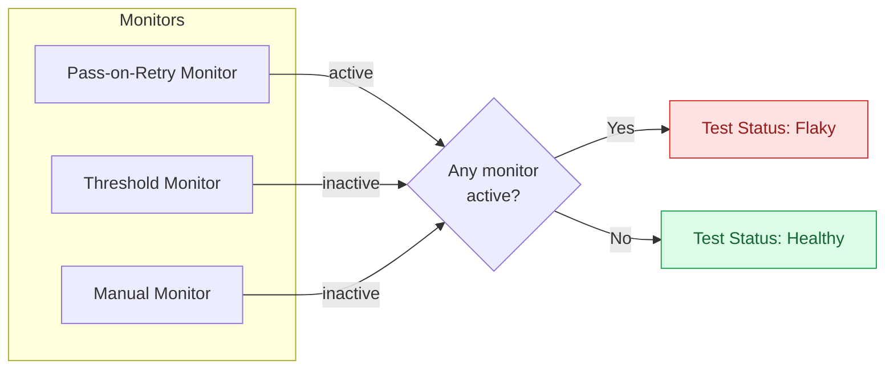
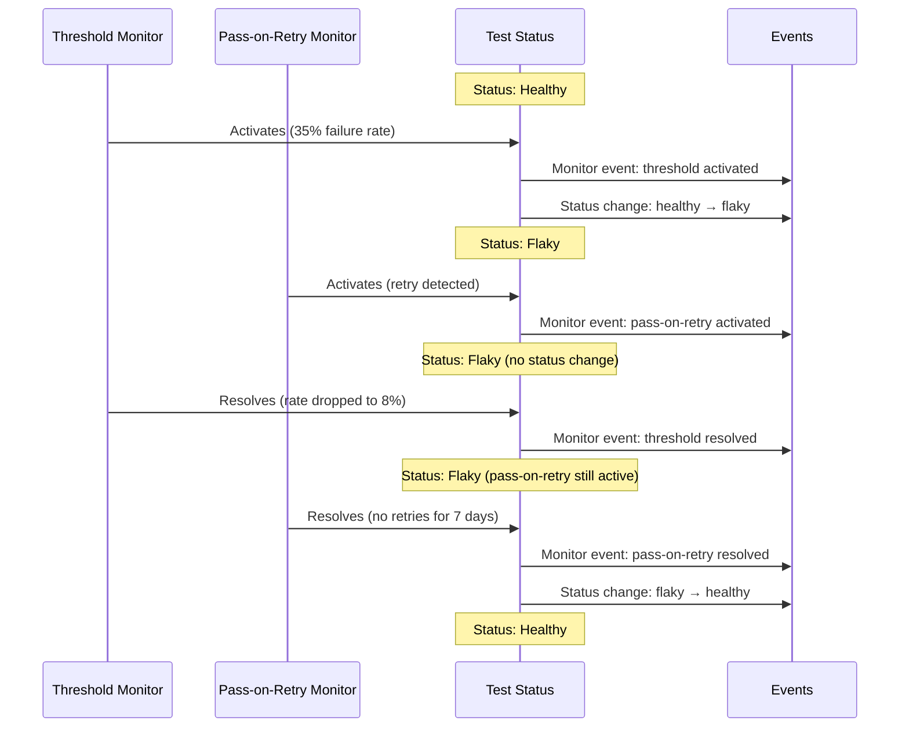

# Flake Detection

Flake Detection automatically identifies flaky tests in your test suite by monitoring test behavior over time. Instead of a single set of built-in detection rules, Trunk uses **monitors**, independent detectors that each watch for a specific flakiness pattern. When any monitor flags a test, it's marked as flaky. When all monitors agree the test has recovered, it returns to healthy.

## How monitors work

Each monitor independently observes your test runs and tracks two states per test: **active** (flaky behavior detected) or **inactive** (no flaky behavior). A test's overall status is determined by combining all of its monitors:

- A test is **flaky** if one or more monitors are active for it.
- A test is **healthy** only when all monitors are inactive.

This means monitors are additive. A test stays flaky until every monitor that flagged it has independently resolved. If a threshold monitor detects high failure rates and a pass-on-retry monitor detects retries on the same test, both conditions must clear before the test is marked healthy.

### Disabling or deleting a monitor

When you disable or delete a monitor, it is immediately set to **resolved** for every test case in the repo. This triggers a status re-evaluation for all affected tests. If the disabled monitor was the only active monitor for a test, that test transitions from flaky to healthy. If other monitors are still active, the test remains flaky.

For example, if you have a threshold monitor and a pass-on-retry monitor, and you disable the threshold monitor, any test that was flagged by both monitors will remain flaky (because pass-on-retry is still active). But a test that was only flagged by the threshold monitor will become healthy.

## Monitor types

| Monitor | What it detects | Plan availability | Default state |
|---|---|---|---|
| [**Pass-on-Retry**](pass-on-retry-monitor.md) | A test fails then passes on the same commit (retry after failure) | Team and above | Enabled |
| [**Threshold**](threshold-monitor.md) | Failure rate exceeds a configured percentage over a time window | Paid plans | Disabled |
| [**Manual**](manual-monitor.md) | User explicitly marks a test as flaky | All plans | Always available |

You can run multiple monitors simultaneously. For example, you might use pass-on-retry to catch classic retry-based flakiness while also running threshold monitors scoped to different branches to catch elevated failure rates where they matter most.

## Branch-aware detection

Tests often behave differently depending on where they run. Failures on `main` are usually unexpected and signal flakiness. Failures on PR branches may be expected during active development. Merge queue failures are suspicious because the code has already passed PR checks.

Rather than applying a single set of branch rules automatically, Trunk gives you control over how detection treats different branches through **branch scoping** on threshold monitors. You can create separate monitors with different thresholds and windows for your stable branch, PR branches, and merge queue branches. See [Threshold Monitor: Recommended configurations](threshold-monitor.md#recommended-configurations) for specific guidance.

Pass-on-retry detection is branch-agnostic. It flags any test that fails and passes on the same commit, regardless of which branch the test ran on.

## Muting monitors

You can temporarily mute a monitor for a specific test case. A muted monitor continues to run and record detections, but it won't contribute to the test's flaky status until the mute expires.

This is useful when you know a test is flaky but want to suppress the signal temporarily, for example while a fix is in progress or during a known infrastructure issue. Unlike marking a test as healthy with the manual monitor, muting preserves the detection history and automatically re-enables itself after the mute period.

### How muting works

You can mute a monitor from the test case view in the Trunk app. When muting, you choose a duration:

| Duration |
|---|
| 1 hour |
| 4 hours |
| 24 hours |
| 7 days |
| 30 days |

While muted, the monitor is excluded from the test's status calculation. If the muted monitor was the only active monitor, the test transitions from flaky to healthy for the duration of the mute. When the mute expires, the monitor is automatically included in the next status evaluation. If it's still active, the test will be flagged as flaky again.

You can also unmute a monitor early from the test case view.

<!-- SCREENSHOT: Mute button and duration picker on the test case monitor list.
Show the test case detail page with a monitor's mute button visible,
and ideally the duration picker dropdown open. -->


You can only mute a monitor that has already detected flaky behavior for a test. If a monitor has never been active for a test, the mute option is disabled. Manual monitors cannot be muted.


### When to mute vs. other options

| Situation | Recommended action |
|---|---|
| Fix is in progress and you want to suppress noise temporarily | **Mute** the monitor for a few days |
| Test is flaky but no automated monitor has caught it | Use the [**manual monitor**](manual-monitor.md) to mark it as flaky |
| You want to stop a monitor from evaluating a test permanently | Adjust the monitor's branch scope or thresholds instead |
| You want to suppress all flaky signals for a test | Mute each active monitor individually, or address the root cause |

## Events

Monitors produce two kinds of events:

**Monitor events** are emitted every time a monitor activates or resolves for a specific test. These give you a detailed audit trail of what each monitor observed. Use these for logging, debugging, or understanding why a test was flagged.

**Status change events** are emitted only when a test's overall status transitions between flaky and healthy. These are the events that matter for notifications. You'll typically want to alert on status changes rather than individual monitor events, since a single monitor resolving doesn't necessarily mean the test is healthy.

Both event types are available via webhooks. See [Webhooks](../webhooks/) for configuration and payload details.

## Variants

If you run the same tests across different environments or architectures, you can use [variants](../uploader.md) to separate these runs into distinct test cases. This lets monitors detect environment-specific flakes. For example, a test might be flaky on iOS but stable on Android. Using variants, monitors isolate flakes on the iOS variant instead of marking the test as flaky across all environments. See the [Trunk Analytics CLI docs](../uploader.md) for details on how to upload with variants.
