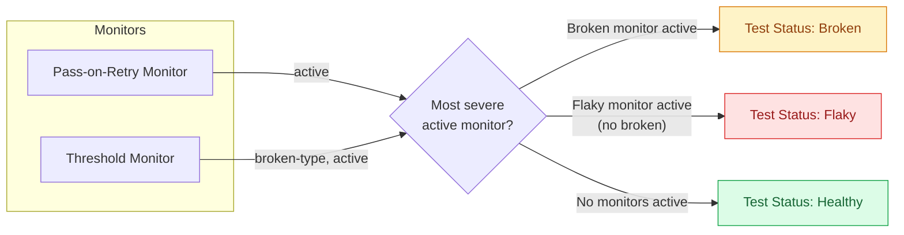
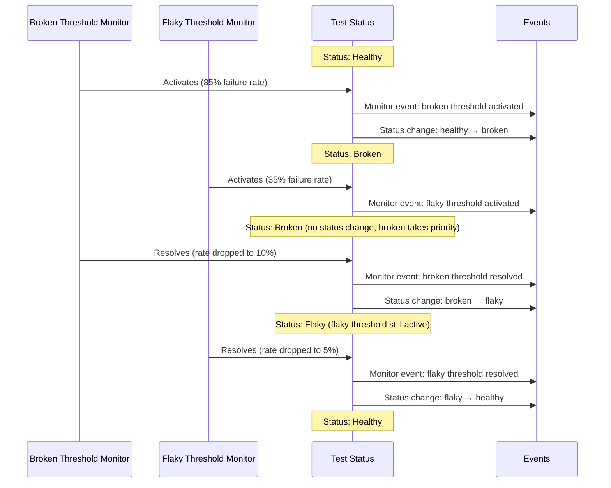

# Flake Detection

Flake Detection automatically identifies problematic tests in your test suite by monitoring test behavior over time. Instead of a single set of built-in detection rules, Trunk uses **monitors**, independent detectors that each watch for a specific pattern. When any monitor flags a test, it's marked as flaky or broken. When all monitors agree the test has recovered, it returns to healthy.

## How Monitors Work

Each monitor independently observes your test runs and tracks two states per test: **active** (problematic behavior detected) or **inactive** (no problematic behavior). A test's overall status is determined by combining all of its monitors, with the most severe status winning:

| Priority | Status | Condition |
|----------|--------|-----------|
| Highest | **Broken** | Any enabled broken-type threshold monitor is active for this test |
| Middle | **Flaky** | Any enabled flaky-type monitor (threshold, pass-on-retry, or manual) is active |
| Lowest | **Healthy** | No active monitors |

If a test triggers both a broken monitor and a flaky monitor simultaneously, it shows as **Broken**. When the broken monitor resolves (e.g., you fix the regression and the failure rate drops), the test transitions to **Flaky** if a flaky monitor is still active, or to **Healthy** if no monitors remain active.

A test stays in its detected state until every relevant monitor that flagged it has independently resolved.

### Status Transitions

```
HEALTHY → BROKEN    Broken monitor activates
HEALTHY → FLAKY     Flaky monitor activates

BROKEN  → FLAKY     All broken monitors resolve, but a flaky monitor is still active
BROKEN  → HEALTHY   All broken monitors resolve, no flaky monitors active

FLAKY   → BROKEN    Broken monitor activates while flaky monitors are also active
FLAKY   → HEALTHY   All flaky monitors resolve
```

### Disabling or Deleting a Monitor

When you disable or delete a monitor, it is immediately set to **resolved** for every test case in the repo. This triggers a status re-evaluation for all affected tests. If the disabled monitor was the only active monitor for a test, that test transitions to healthy. If other monitors are still active, the test remains in the most severe active state.

For example, if you have a broken threshold monitor and a flaky pass-on-retry monitor, and you disable the broken monitor, any test that was only flagged by the broken monitor will become healthy. A test flagged by both will transition from broken to flaky (because pass-on-retry is still active).



## Monitor Types

| Monitor | What it detects | Detection type | Plan availability | Default state |
|---|---|---|---|---|
| [**Pass-on-Retry**](pass-on-retry-monitor.md) | A test fails then passes on the same commit (retry after failure) | Flaky | Team and above | Enabled |
| [**Threshold**](threshold-monitor.md) | Failure rate exceeds a configured percentage over a time window | Flaky or Broken | Paid plans | Disabled |

You can run multiple monitors simultaneously. For example, you might use pass-on-retry to catch classic retry-based flakiness while also running threshold monitors scoped to different branches. A common pattern is to pair a broken-type threshold monitor (catching consistently failing tests) with a flaky-type threshold monitor (catching intermittently failing tests). See [Threshold Monitor: Recommended Configurations](threshold-monitor.md#recommended-configurations) for details.

If you need to manually flag a test that automated monitors haven't caught, use [Flag as Flaky](flag-as-flaky.md) from the test detail page.

## Branch-Aware Detection

Tests often behave differently depending on where they run. Failures on `main` are usually unexpected and signal flakiness. Failures on PR branches may be expected during active development. Merge queue failures are suspicious because the code has already passed PR checks.

Rather than applying a single set of branch rules automatically, Trunk gives you control over how detection treats different branches through **branch scoping** on threshold monitors. You can create separate monitors with different thresholds and windows for your stable branch, PR branches, and merge queue branches. See [Threshold Monitor: Recommended configurations](threshold-monitor.md#recommended-configurations) for specific guidance.

Pass-on-retry detection is branch-agnostic. It flags any test that fails and passes on the same commit, regardless of which branch the test ran on.

## Muting Monitors

You can temporarily mute a monitor for a specific test case. A muted monitor continues to run and record detections, but it won't contribute to the test's flaky status until the mute expires.

This is useful when you know a test is flaky but want to suppress the signal temporarily, for example while a fix is in progress or during a known infrastructure issue. Unlike [Flag as Flaky](flag-as-flaky.md), which is a persistent user override, muting preserves the detection history and automatically re-enables itself after the mute period.

### How Muting Works

You can mute a monitor from the test case view in the Trunk app. When muting, you choose a duration:

| Duration |
|---|
| 1 hour |
| 4 hours |
| 24 hours |
| 7 days |
| 30 days |

While muted, the monitor is excluded from the test's status calculation. If the muted monitor was the only active monitor, the test transitions from flaky to healthy for the duration of the mute. When the mute expires, the monitor is automatically included in the next status evaluation. If it's still active, the test will be flagged as flaky again.

You can also unmute a monitor early from the test case view.

<!-- SCREENSHOT: Mute button and duration picker on the test case monitor list.
Show the test case detail page with a monitor's mute button visible,
and ideally the duration picker dropdown open. -->


You can only mute a monitor that has already detected flaky behavior for a test. If a monitor has never been active for a test, the mute option is disabled.


### When to Mute vs. Other Options

| Situation | Recommended action |
|---|---|
| Fix is in progress and you want to suppress noise temporarily | **Mute** the monitor for a few days |
| Test is flaky but no automated monitor has caught it | Use [**Flag as Flaky**](flag-as-flaky.md) to mark it as flaky |
| You want to stop a monitor from evaluating a test permanently | Adjust the monitor's branch scope or thresholds instead |
| You want to suppress all flaky signals for a test | Mute each active monitor individually, or address the root cause |

## Events

Monitors produce two kinds of events:

**Monitor events** are emitted every time a monitor activates or resolves for a specific test. These give you a detailed audit trail of what each monitor observed. Use these for logging, debugging, or understanding why a test was flagged.

**Status change events** (`v2.test_case.status_changed`) are emitted only when a test's overall status transitions between Healthy, Flaky, and Broken. These are the events that matter for notifications. You'll typically want to alert on status changes rather than individual monitor events, since a single monitor resolving doesn't necessarily mean the test is healthy.



Both event types are available via webhooks. The `v2.test_case.status_changed` payload includes `previous_status` and `new_status` fields which can be any of: `HEALTHY`, `FLAKY`, `BROKEN`. If you have an existing webhook consumer that only handles `HEALTHY` and `FLAKY`, update it to handle `BROKEN` as well. See [Webhooks](../webhooks/) for configuration and payload details.

## Variants

If you run the same tests across different environments or architectures, you can use [variants](../uploader.md) to separate these runs into distinct test cases. This lets monitors detect environment-specific flakes. For example, a test might be flaky on iOS but stable on Android. Using variants, monitors isolate flakes on the iOS variant instead of marking the test as flaky across all environments. See the [Trunk Analytics CLI docs](../uploader.md) for details on how to upload with variants.
