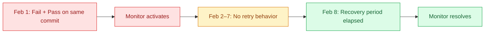

# Pass-on-Retry Monitor

The pass-on-retry monitor detects the most common flakiness pattern: a test fails, is retried, and passes on the same commit. This indicates the failure wasn't caused by a code change and that the test is unreliable.

This monitor is branch-agnostic. It evaluates all test runs regardless of which branch they ran on.

## How it works

The monitor continuously scans your test runs looking for commits where a test has both a failure and a success. When it finds one, the test is flagged as flaky.

Once flagged, the test remains flaky until no pass-on-retry behavior has been observed for a configurable recovery period. This prevents tests from bouncing between flaky and healthy if they only fail intermittently.

### Example

Your CI retries failed tests automatically. On commit `abc123`:

1. `test_login` fails on the first attempt
2. `test_login` passes on retry

The monitor detects that `test_login` had both a failure and success on the same commit and flags it as flaky.

Seven days later (assuming default settings), if `test_login` hasn't exhibited any more retry behavior, the monitor resolves and the test returns to healthy.

## Configuration

<!-- SCREENSHOT: Pass-on-Retry monitor configuration panel.
Show the monitor settings UI with the enabled toggle and recovery days
slider/input. Capture a state where the monitor is enabled with the
default 7-day recovery period visible. -->

| Setting | Description | Default |
|---|---|---|
| **Enabled** | Whether the monitor is active | On |
| **Recovery days** | Days without pass-on-retry behavior before a test is resolved as healthy. Range: 1 to 15 days. | 7 |

### What recovery days controls

A shorter recovery period (e.g., 1 to 3 days) returns tests to healthy quickly, which is useful if you fix flaky tests promptly and want fast feedback. A longer recovery period (e.g., 10 to 15 days) is more conservative. It keeps tests flagged longer to account for flaky behavior that only surfaces occasionally.

## When detection happens

Pass-on-retry detection runs continuously as new test results arrive. A failure and its corresponding retry don't need to arrive at exactly the same time. The monitor looks back up to 7 days to match failures with later retries.

Resolution is evaluated daily. If a test hasn't shown pass-on-retry behavior within the recovery window, it resolves on the next daily check.

## Muting

You can temporarily mute the pass-on-retry monitor for a specific test case. See [Muting monitors](README.md#muting-monitors) for details.

## Edge cases

**Failure without a retry yet:** If a test fails but hasn't been retried, no detection occurs. If the retry arrives later (even hours or days later on the same commit), the monitor will pick it up.

**Multiple retries on one commit:** If a test fails and is retried several times on the same commit, the monitor treats it as a single detection for that commit.
