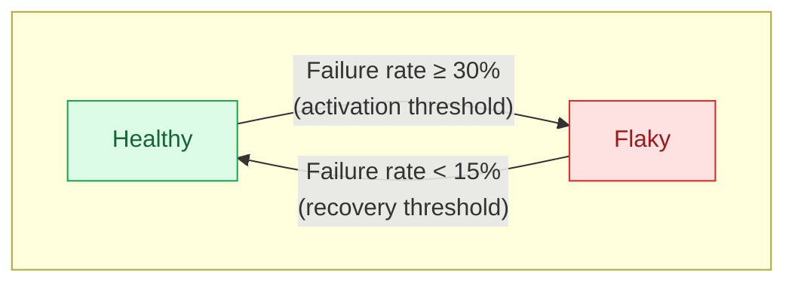

# Threshold Monitor

The threshold monitor detects flaky tests based on failure rate over a rolling time window. Unlike pass-on-retry, which looks for a specific pattern on a single commit, the threshold monitor identifies tests that fail too often over a period of time, even if no individual failure looks like a retry.

You can create multiple threshold monitors with different configurations. This is how you tailor detection to different branches, test volumes, and sensitivity levels.

## How It Works

The monitor periodically calculates the failure rate for each test within a time window you define. If the rate meets or exceeds your activation threshold and the test has enough runs to be statistically meaningful, the test is flagged as flaky.

### Example

You configure a threshold monitor with:
- Activation threshold: 30%
- Window: 6 hours
- Minimum sample size: 50 runs
- Branches: `main`

Over the last 6 hours, `test_checkout` ran 120 times on `main` and failed 42 times (35% failure rate). Since 35% exceeds the 30% threshold and 120 runs exceeds the 50-run minimum, the test is flagged as flaky.

Meanwhile, `test_signup` ran 8 times with 3 failures (37.5%). Even though the failure rate is above 30%, the test is **not** flagged because it hasn't reached the 50-run minimum sample size. The monitor needs enough data before making a call.

## Configuration

<!-- SCREENSHOT: Threshold monitor creation form.
Show the full creation form with all fields visible: name, activation
threshold, recovery threshold, window duration, minimum sample size,
stale timeout, and branch scope. Capture it with realistic example
values filled in (e.g., "Main branch flake detector", 30% activation,
15% recovery, 6 hour window, 50 min sample, main branch). -->

### Activation Threshold

The failure rate that triggers detection, expressed as a percentage. A test is flagged when its failure rate meets or exceeds this value within the time window.

Setting this lower (e.g., 10%) catches more flaky tests but may produce false positives for tests that occasionally have legitimate failures. Setting it higher (e.g., 50%) is more conservative and only flags tests that fail frequently.

### Recovery Threshold

The failure rate a test must drop below to be resolved as healthy. If not set, it defaults to the activation threshold, meaning a test resolves as soon as its failure rate drops below the activation level.

Setting this lower than the activation threshold creates a buffer that prevents tests from bouncing between flaky and healthy. For example, if you activate at 30% and recover at 15%, a test flagged at 30% must improve to below 15% before it's marked healthy again. A test hovering at 20% failure rate stays flagged rather than flipping back and forth.

The gap between activation (30%) and recovery (15%) is the buffer zone. A test with a failure rate in this range keeps its current status: a healthy test won't be flagged, but a test already flagged as flaky won't be resolved either.

### Window Duration

The rolling time window (in minutes) over which failure rate is calculated. Only test runs within this window are considered.

A shorter window (e.g., 60 minutes) reacts quickly to recent failures but may miss patterns that play out over longer periods. A longer window (e.g., 24 hours) smooths out short-term spikes and gives a more stable picture, but takes longer to detect new flakiness and longer to resolve.

### Minimum Sample Size

The minimum number of test runs required within the time window before the monitor will evaluate a test. Tests with fewer runs are skipped entirely. They won't be flagged or resolved until enough data accumulates.

This prevents the monitor from making decisions on insufficient data. A test that ran 3 times with 2 failures is a 66% failure rate, but that's not enough data to be confident. Setting a reasonable minimum (e.g., 20 to 50 runs) ensures the failure rate is meaningful.

The right minimum depends on your test volume. If your tests run hundreds of times per day, a minimum of 50 to 100 is reasonable. If tests only run a few times per day, you may need a lower minimum, but keep in mind that lower minimums mean less statistical confidence.

### Stale Timeout

How long (in minutes) a flagged test can go without any runs before it's automatically resolved as stale. This clears out tests that have been deleted, renamed, or are no longer part of your test suite.

When not set, flagged tests remain flaky indefinitely until they run enough times to recover through the normal threshold check. Setting a stale timeout (e.g., 1440 minutes / 24 hours) ensures abandoned tests don't clutter your flaky test list.

A test resolved as stale is simply no longer being tracked by this monitor. If the test starts running again and exceeds the activation threshold, it will be re-flagged.

### Branch Scope

Which branches the monitor evaluates. You can specify up to 10 branch patterns. Only test runs on matching branches are included in the failure rate calculation.

#### Branch Pattern Syntax

Branch patterns use glob-style matching with two special characters:

| Character | Meaning | Regex equivalent |
|---|---|---|
| `*` | Zero or more of any character, including `/` | `.*` |
| `?` | Exactly one of any character | `.` |

All other characters are matched literally. Special regex characters (like `.`, `+`, `(`, `)`, `[`, `]`) are treated as literal characters in patterns, not as regex operators. You don't need to escape them.


Unlike some glob implementations, `*` matches across `/` separators. The pattern `feature/*` matches both `feature/login` and `feature/api/auth`.


#### Pattern Examples

| Pattern | Matches | Does not match |
|---|---|---|
| `main` | `main` | `main-v2`, `maint` |
| `feature/*` | `feature/login`, `feature/api/auth` | `feature` (no trailing path), `features/x` |
| `release-?.?.?` | `release-1.2.3` | `release-10.2.3` (10 is two characters), `release-1.2` |
| `*-hotfix` | `prod-hotfix`, `release/v1-hotfix` | `hotfix`, `hotfix-1` |
| `*` | All branches | |

A pattern with no special characters matches that exact branch name only. For example, `main` matches the branch named `main` and nothing else.

#### Stable Branch Patterns

For your main or stable branch, use the exact branch name:

| Your stable branch | Pattern |
|---|---|
| `main` | `main` |
| `master` | `master` |
| `develop` | `develop` |

#### Merge Queue Branch Patterns

If you use a merge queue, your queue creates temporary branches to test changes before merging. Each merge queue product uses a different branch naming convention:

| Merge queue | Branch pattern | Example branches matched |
|---|---|---|
| Trunk Merge Queue | `trunk-merge/*` | `trunk-merge/main/1`, `trunk-merge/main/2` |
| GitHub Merge Queue | `gh-readonly-queue/*` | `gh-readonly-queue/main/pr-123-abc` |
| Graphite Merge Queue | `graphite-merge/*` | `graphite-merge/main/1` |

GitLab Merge Trains run on the target branch directly rather than creating separate branches. To monitor merge train runs, scope your monitor to the target branch (e.g., `main`).

#### Tips for Branch Scoping

- You can add up to **10 patterns** per monitor. A test run is included if its branch matches any of the patterns.
- Since patterns can't express "everything except a branch," a practical approach is to create **separate monitors**: one scoped to `main` with strict settings, and another scoped to your PR branch naming patterns (e.g., `feature/*`, `fix/*`) with more lenient settings.
- `**` is treated as two consecutive `*` wildcards, which is functionally identical to a single `*`. There is no special multi-segment matching behavior.

<!-- SCREENSHOT: Branch scope configuration.
Show the branch pattern input with a few patterns entered (e.g.,
`main` and `release/*`), ideally showing the tag/chip-style UI for
each pattern. -->

## Resolution Behavior

A flagged test resolves in one of two ways:

**Healthy recovery:** The test's failure rate drops below the recovery threshold (or activation threshold, if no recovery threshold is set) and it still has enough runs to meet the minimum sample size. This means the test is actively running and has improved.

**Stale recovery:** If a stale timeout is configured and the test has no runs on matching branches within that period, it resolves as stale. This is an automatic cleanup mechanism, not an indication that the test has improved.

Tests that are still running but haven't accumulated enough runs to meet the minimum sample size remain in their current state. They won't be resolved until there's enough data to make a determination.

## Muting

You can temporarily mute a threshold monitor for a specific test case. See [Muting monitors](README.md#muting-monitors) for details.

## Recommended configurations

Tests behave differently depending on where they run. Failures on `main` are usually unexpected and worth catching aggressively. Failures on PR branches may be noise during active development. Merge queue failures are suspicious because the code has already passed PR checks. Here are some starting points for setting up monitors that reflect these differences.

### Main Branch: Catch Flakiness Early

Failures on your stable branch are a strong signal. Tests should be passing before code is merged, so failures here are unexpected and likely indicate flakiness.

| Setting | Suggested value | Why |
|---|---|---|
| Activation threshold | 10 to 20% | Low threshold catches subtle flakiness early |
| Recovery threshold | 5 to 10% | Requires clear improvement before resolving |
| Window | 6 to 24 hours | Long enough to accumulate data, short enough to catch new issues |
| Min sample size | 20 to 50 | Depends on how often your tests run on main |
| Branches | `main` (or `master`, `develop`, etc.) | Use the exact name of your stable branch |

### Pull Requests: Flag Severe Flakiness Only

PR branches see a lot of churn. Tests fail for legitimate reasons during development, so you want a higher bar before flagging something as flaky here. Focus on tests that are failing at a rate that clearly isn't caused by code changes.

| Setting | Suggested value | Why |
|---|---|---|
| Activation threshold | 40 to 60% | High threshold avoids false positives from expected PR failures |
| Recovery threshold | 20 to 30% | Wide buffer prevents flapping |
| Window | 12 to 24 hours | Longer window smooths out short-lived development failures |
| Min sample size | 30 to 100 | Higher minimum avoids flagging tests that only ran a few times on PRs |
| Branches | `feature/*`, `fix/*`, `dependabot/*` | Match your team's PR branch naming conventions |

Since branch patterns can't express "everything except main," create one monitor scoped to `main` with strict settings and a second monitor scoped to your PR branch naming patterns with more lenient settings.

### Merge Queue: Strict Monitoring

Merge queue branches test code that has already passed PR checks. Failures here are suspicious. If you use a merge queue, consider a dedicated monitor with settings similar to or stricter than your main branch monitor.

| Setting | Suggested value | Why |
|---|---|---|
| Activation threshold | 10 to 15% | Low threshold, failures here are unexpected |
| Recovery threshold | 5% | Strict recovery |
| Window | 6 to 12 hours | Shorter window for faster detection |
| Min sample size | 10 to 20 | Merge queues may have fewer total test runs |
| Branches | `trunk-merge/*` or `gh-readonly-queue/*` | Use the pattern for your merge queue provider (see table above) |

### Other Patterns

- **Release branches:** A monitor scoped to `release/*` with strict thresholds catches flakiness before it ships.
- **Nightly or scheduled builds:** If you run comprehensive test suites on a schedule, a monitor with a longer window and higher minimum sample size can catch slow-burn flakiness that doesn't show up in faster CI runs.

<!-- SCREENSHOT: Monitor overview page with multiple threshold monitors.
Show the monitors list/card view with two or three configured threshold
monitors visible (e.g., "Main branch - strict", "PR branches - lenient",
"Merge queue"), displaying their key settings at a glance (threshold,
window, branch scope). Include the pass-on-retry monitor card as well
to show the full picture. -->
