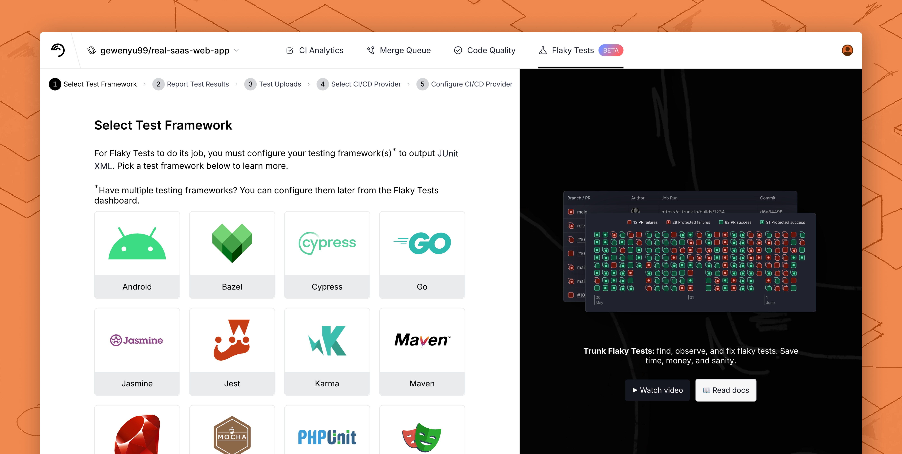
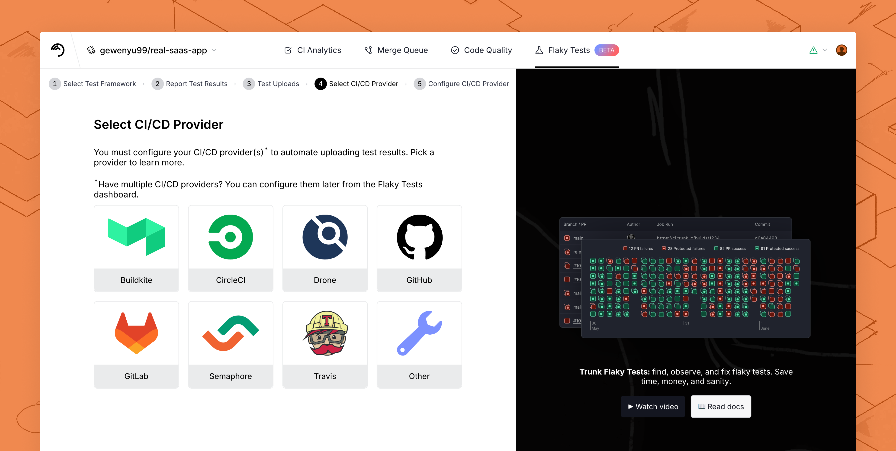

# Get Started

### Introduction

Trunk Flaky Tests works by changing all of your CI jobs that run tests to upload their test results to Trunk. This setup looks slightly different depending on which CI system and test framework(s) you use, but we have guides for all the popular systems.

If you prefer to see an example onboarding flow, watch a video here:



### 1. Sign up for [app.trunk.io](https://app.trunk.io/login/?intent=flaky+tests)

You must [create an account ](https://app.trunk.io/login?intent=flaky%20tests)and Trunk organization to complete the steps below.

### 2. Configure your test framework to output compatible test results

For Trunk to start detecting flaky tests, it needs to ingest the results from all of your CI test runs. To get started, configure your test framework (Jest, Pytest, JUnit, etc.) to output results. You'll do this only for CI jobs, _not_ for running tests locally.

<figure><picture><source srcset="../../.gitbook/assets/add-test-framework-step-1-dark.png" media="(prefers-color-scheme: dark)"></picture><figcaption>
Step 1 of the in-app onboarding wizard
</figcaption></figure>

You can follow along using the in-app onboarding wizard or read about it in our docs.



### 3. Configure your CI jobs to upload test results to Trunk

After you've set your test framework to output test results, you're ready to update your CI jobs to upload test results to Trunk.

<figure><picture><source srcset="../../.gitbook/assets/add-test-framework-step-4-dark.png" media="(prefers-color-scheme: dark)"></picture><figcaption>
Step 4 of the in-app onboarding wizard
</figcaption></figure>

You can follow along using the in-app onboarding wizard or read about it in our docs.



Once you've updated your CI configuration to upload to Trunk, run a test job and ensure it completes without errors.

### 4. Confirm your configuration, analyze your dashboard

In [app.trunk.io](https://app.trunk.io/login/?intent=flaky+tests), select the repo you've just updated and navigate to **Flaky Tests** > **Uploads**. Confirm that you see the upload(s) from the previous step.

<figure><picture><source srcset="../../.gitbook/assets/uploads-dark.png" media="(prefers-color-scheme: dark)"></picture><figcaption>
The uploads tab
</figcaption></figure>

Trunk needs to ingest a large amount of test data from a variety of pull request branches and protected branches (like `main` or `master`) before it can start accurately detecting flaky tests. This may happen quickly if you have a very high-velocity repo and run test jobs hundreds of times a day.

Once you've confirmed data is flowing properly into Trunk, let data accumulate for several days and check back to analyze the results. We'll also email you when your first flaky test is detected.

You can learn more about how Trunk detects flaky tests in our documentation:



### 5. Enable test summary comments on PRs

Flaky Tests can post comments on GitHub pull requests to provide a summary of all the tests run on this PR, across multiple CI jobs or even CI systems, as well as whether those failures are due to flakiness, the history of the failures of that test, and more.

To enable PR Comments, see our documentation:



### 6. (Optional) Enable Quarantining

Quarantining is an advanced feature that allows your CI test jobs to pass even if a flaky test is failing on them. This eliminates the pain developers feel from dealing with flaky tests.

To enable Quarantining, see our documentation:


