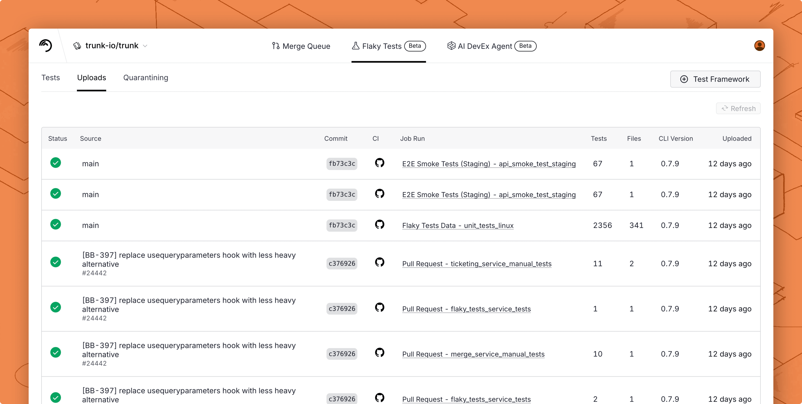

# Cypress

You can automatically [detect and manage flaky tests](../../detection/) in your Cypress projects by integrating with Trunk. This document explains how to configure Cypress to output JUnit XML reports that can be uploaded to Trunk for analysis.

### Checklist

By the end of this guide, you should achieve the following before proceeding to the [next steps](cypress.md#next-step) to configure your CI provider.

* [ ] Generate a compatible test report
* [ ] Configure the report file path or glob
* [ ] Disable retries for better detection accuracy
* [ ] Test uploads locally

After correctly generating reports following the above steps, you'll be ready to move on to the next steps to [configure uploads in CI](../ci-providers/).

### Generating Reports

Cypress has a built-in Mocha JUnit reporter which outputs XML test reports. However, the built-in reporter does not include file paths in test case elements, which means Trunk cannot match tests to code owners or enable file-based filtering in the dashboard.

#### Recommended: Use cypress-junit-plugin for file paths

For full functionality including code owner detection and file-based search, use the [`cypress-junit-plugin`](https://github.com/saucelabs/cypress-junit-plugin) reporter. It outputs test cases with the correct nested structure and file path attributes that Trunk expects.

Install the plugin:

```bash
npm install --save-dev @saucelabs/cypress-junit-plugin
```

Update your Cypress config:


```javascript
const { defineConfig } = require('cypress')

module.exports = defineConfig({
  reporter: '@saucelabs/cypress-junit-plugin',
  reporterOptions: {
    mochaFile: './junit.xml',
  },
})
```


#### Alternative: Built-in Mocha reporter

If you don't need file path matching or code owner detection, you can use the built-in reporter. Uploads will still work, but you will see warnings about missing file paths and won't be able to search by file in the dashboard.


```javascript
const { defineConfig } = require('cypress')

module.exports = defineConfig({
  reporter: 'junit',
  reporterOptions: {
    mochaFile: './junit.xml',
    toConsole: true,
  },
})
```



The built-in Mocha JUnit reporter places the `file` attribute on `<testsuite>` elements but not on individual `<testcase>` elements. Trunk requires file paths on test cases for code owner matching. If you see warnings like "report has test cases with missing file or filepath", switch to the `cypress-junit-plugin` above.


#### Report File Path

The JUnit report location is specified by the `mochaFile` property in your Cypress config. In the above example, the file will be at `./junit.xml`.

#### Disable Retries

You need to disable automatic retries if you previously enabled them. Retries compromise the accurate detection of flaky tests.

You can disable retries by setting `retries: 0` in your Cypress config file.


```javascript
module.exports = defineConfig({
  retries: 0,
})
```


### Try It Locally

#### **The Validate Command**



```bash
SKU="trunk-analytics-cli-x86_64-unknown-linux.tar.gz"
curl -fL --retry 3 \
  "https://github.com/trunk-io/analytics-cli/releases/latest/download/${SKU}" \
  | tar -xz

chmod +x trunk-analytics-cli
./trunk-analytics-cli validate --junit-paths "./junit.xml"
```



```bash
SKU="trunk-analytics-cli-aarch64-unknown-linux.tar.gz"
curl -fL --retry 3 \
  "https://github.com/trunk-io/analytics-cli/releases/latest/download/${SKU}" \
  | tar -xz

chmod +x trunk-analytics-cli
./trunk-analytics-cli validate --junit-paths "./junit.xml"
```



```bash
SKU="trunk-analytics-cli-aarch64-apple-darwin.tar.gz"
curl -fL --retry 3 \
  "https://github.com/trunk-io/analytics-cli/releases/latest/download/${SKU}" \
  | tar -xz

chmod +x trunk-analytics-cli
./trunk-analytics-cli validate --junit-paths "./junit.xml"
```



```bash
SKU="trunk-analytics-cli-x86_64-apple-darwin.tar.gz"
curl -fL --retry 3 \
  "https://github.com/trunk-io/analytics-cli/releases/latest/download/${SKU}" \
  | tar -xz

chmod +x trunk-analytics-cli
./trunk-analytics-cli validate --junit-paths "./junit.xml"
```



#### Test Upload

Before modifying your CI jobs to automatically upload test results to Trunk, try uploading a single test run manually.

You make an upload to Trunk using the following command:

```sh
./trunk-analytics-cli upload --junit-paths "./junit.xml" \
    --org-url-slug <TRUNK_ORG_SLUG> \
    --token <TRUNK_ORG_TOKEN>
```

You can find your Trunk organization slug and token in the settings or by following these [instructions](https://docs.trunk.io/flaky-tests/get-started/ci-providers/otherci#id-1.-store-a-trunk_token-secret-in-your-ci-system). After your upload, you can verify that Trunk has received and processed it successfully in the **Uploads** tab. Warnings will be displayed if the report has issues.

<figure><picture><source srcset="../../../.gitbook/assets/data-uploads-dark.png" media="(prefers-color-scheme: dark)"></picture><figcaption></figcaption></figure>

## Next Step

Configure your CI to upload test runs to Trunk. Find the guides for your CI framework below:

<table data-view="cards" data-full-width="false"><thead><tr><th></th><th data-hidden></th><th data-hidden data-card-target data-type="content-ref"></th><th data-hidden data-card-cover data-type="files"></th></tr></thead><tbody><tr><td><strong>Azure DevOps Pipelines</strong></td><td></td><td><a href="../ci-providers/azure-devops-pipelines.md">azure-devops-pipelines.md</a></td><td><a href="../../../.gitbook/assets/azure.png">azure.png</a></td></tr><tr><td><strong>BitBucket Pipelines</strong></td><td></td><td><a href="../ci-providers/bitbucket-pipelines.md">bitbucket-pipelines.md</a></td><td><a href="../../../.gitbook/assets/bitbucket.png">bitbucket.png</a></td></tr><tr><td><strong>BuildKite</strong></td><td></td><td><a href="../ci-providers/buildkite.md">buildkite.md</a></td><td><a href="../../../.gitbook/assets/buildkite.png">buildkite.png</a></td></tr><tr><td><strong>CircleCI</strong></td><td></td><td><a href="../ci-providers/circleci.md">circleci.md</a></td><td><a href="../../../.gitbook/assets/circle-ci.png">circle-ci.png</a></td></tr><tr><td><strong>Drone CI</strong></td><td></td><td><a href="../ci-providers/droneci.md">droneci.md</a></td><td><a href="../../../.gitbook/assets/drone.png">drone.png</a></td></tr><tr><td><strong>GitHub Actions</strong></td><td></td><td><a href="../ci-providers/github-actions.md">github-actions.md</a></td><td><a href="../../../.gitbook/assets/github.png">github.png</a></td></tr><tr><td><strong>Gitlab</strong></td><td></td><td><a href="../ci-providers/gitlab.md">gitlab.md</a></td><td><a href="../../../.gitbook/assets/gitlab.png">gitlab.png</a></td></tr><tr><td><strong>Jenkins</strong></td><td></td><td><a href="../ci-providers/jenkins.md">jenkins.md</a></td><td><a href="../../../.gitbook/assets/jenkins.png">jenkins.png</a></td></tr><tr><td><strong>Semaphore</strong></td><td></td><td><a href="../ci-providers/semaphoreci.md">semaphoreci.md</a></td><td><a href="../../../.gitbook/assets/semaphore.png">semaphore.png</a></td></tr><tr><td><strong>TeamCity</strong></td><td></td><td><a href="broken-reference/">broken-reference</a></td><td><a href="../../../.gitbook/assets/teamcity.png">teamcity.png</a></td></tr><tr><td><strong>Travis CI</strong></td><td></td><td><a href="../ci-providers/travisci.md">travisci.md</a></td><td><a href="../../../.gitbook/assets/travis.png">travis.png</a></td></tr><tr><td><strong>Other CI Providers</strong></td><td></td><td><a href="../ci-providers/otherci.md">otherci.md</a></td><td><a href="../../../.gitbook/assets/other.png">other.png</a></td></tr></tbody></table>
