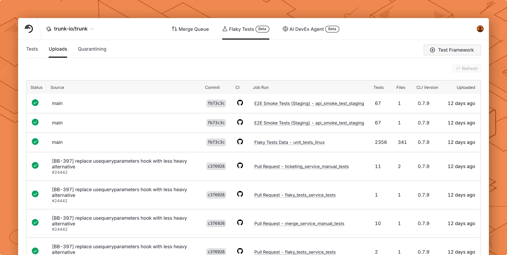

# Maven

You can automatically [detect and manage flaky tests](../../detection.md) in your Maven projects by integrating with Trunk. This document explains how to configure Maven to output JUnit XML reports that can be uploaded to Trunk for analysis.

### Checklist

By the end of this guide, you should achieve the following before proceeding to the [next steps](maven.md#next-step) to configure your CI provider.

* [ ] Generate a compatible test report
* [ ] Configure the report file path or glob
* [ ] Disable retries for better detection accuracy
* [ ] Test uploads locally

After correctly generating reports following the above steps, you'll be ready to move on to the next steps to [configure uploads in CI](../ci-providers/).

### Generating Reports

Maven uses the `maven-surefire-plugin` by default to output JUnit XML reports, which is Trunk compatible. You can configure the plugin in your project's `pom.xml`.

#### Report File Path

You can change the report file path by configuring the `maven-surefire-plugin` plugin in your `pom.xml` file:


```xml
<project>
    <build>
        <plugins>
            <plugin>
                <groupId>org.apache.maven.plugins</groupId>
                <artifactId>maven-surefire-plugin</artifactId>
                <version>3.2.2</version>
                <configuration>
                    <reportsDirectory>${project.build.directory}/junit/</reportsDirectory>
                </configuration>
            </plugin>
        </plugins>
    </build>
</project>
```


The example above will output JUnit XML reports that can be located with the `/target/junit/*.xml` glob.

#### Using Kotlin and Kotest

If you have a Kotlin project and are using the Kotest test framework, you also need to include `kotest-extensions-junitxml` in your project's `pom.xml`. This allows Kotest to generate JUnit XML reports.


```xml
<dependency>
    <groupId>io.kotest</groupId>
    <artifactId>kotest-extensions-junitxml-jvm</artifactId>
    <version>5.9.0</version>
    <scope>test</scope>
</dependency>
```


#### Disable Retries

You need to disable automatic retries if you previously enabled them. Retries compromise the accurate detection of flaky tests. You should disable retries for accurate detection and use the [Quarantining](../../quarantining.md) feature to stop flaky tests from failing your CI jobs.

Maven uses the `maven-surefire-plugin` to run tests, which allows you to control the test retry behavior. You can disable retries by specifying 0 retries:

```
mvn -Dsurefire.rerunFailingTestsCount=0 test
```

### Try It Locally

#### The Validate Command

You can validate your test reports using the [Trunk CLI](../../uploader.md). If you don't have it installed already, you can install and run the `validate` command like this:



```bash
SKU="trunk-analytics-cli-x86_64-unknown-linux.tar.gz"
curl -fL --retry 3 \
  "https://github.com/trunk-io/analytics-cli/releases/latest/download/${SKU}" \
  | tar -xz

chmod +x trunk-analytics-cli
./trunk-analytics-cli validate --junit-paths "./app/junit-reports/*.xml"
```



```bash
SKU="trunk-analytics-cli-aarch64-unknown-linux.tar.gz"
curl -fL --retry 3 \
  "https://github.com/trunk-io/analytics-cli/releases/latest/download/${SKU}" \
  | tar -xz

chmod +x trunk-analytics-cli
./trunk-analytics-cli validate --junit-paths "./app/junit-reports/*.xml"
```



```bash
SKU="trunk-analytics-cli-aarch64-apple-darwin.tar.gz"
curl -fL --retry 3 \
  "https://github.com/trunk-io/analytics-cli/releases/latest/download/${SKU}" \
  | tar -xz

chmod +x trunk-analytics-cli
./trunk-analytics-cli validate --junit-paths "./app/junit-reports/*.xml"
```



```bash
SKU="trunk-analytics-cli-x86_64-apple-darwin.tar.gz"
curl -fL --retry 3 \
  "https://github.com/trunk-io/analytics-cli/releases/latest/download/${SKU}" \
  | tar -xz

chmod +x trunk-analytics-cli
./trunk-analytics-cli validate --junit-paths "./app/junit-reports/*.xml"
```



**This will not upload anything to Trunk**. To improve detection accuracy, you should **address all errors and warnings** before proceeding to the next steps.

#### Test Upload

Before modifying your CI jobs to automatically upload test results to Trunk, try uploading a single test run manually.

You make an upload to Trunk using the following command:

```sh
./trunk-analytics-cli upload --junit-paths "./app/junit-reports/*.xml" \
    --org-url-slug <TRUNK_ORG_SLUG> \
    --token <TRUNK_ORG_TOKEN>
```

You can find your Trunk organization slug and token in the settings or by following these [instructions](https://docs.trunk.io/flaky-tests/get-started/ci-providers/otherci#id-1.-store-a-trunk_token-secret-in-your-ci-system). After your upload, you can verify that Trunk has received and processed it successfully in the **Uploads** tab. Warnings will be displayed if the report has issues.

<figure><picture><source srcset="../../../.gitbook/assets/data-uploads-dark.png" media="(prefers-color-scheme: dark)"></picture><figcaption></figcaption></figure>

### Next Steps

Configure your CI to upload test runs to Trunk. Find the guides for your CI framework below:


