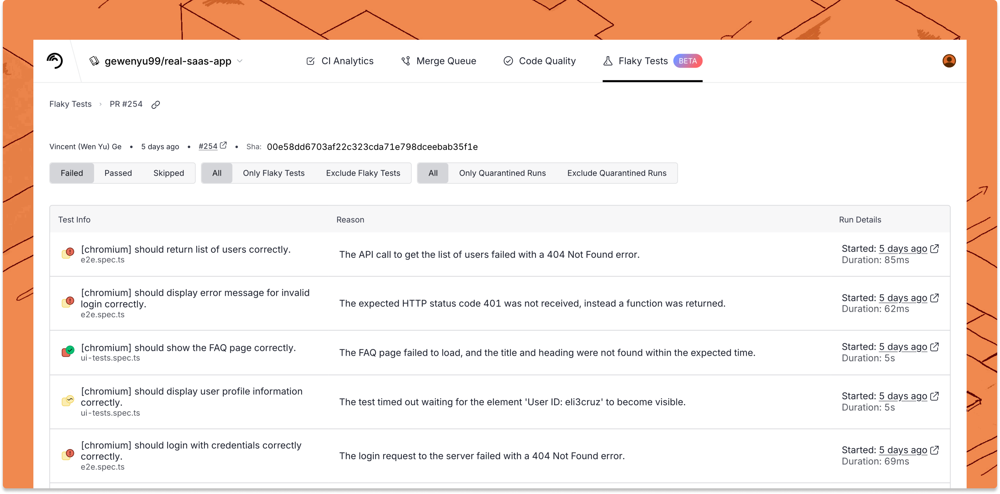

# PR Comments

## Overview

Flaky Tests can post comments on GitHub pull requests to provide a summary of all the tests run on this PR, across multiple CI jobs or even CI systems, as well as whether those failures are due to flakiness, the history of the failures of that test, and more.

<figure><picture><source srcset="../.gitbook/assets/github-comment-dark.png" media="(prefers-color-scheme: dark)"></picture><figcaption></figcaption></figure>

Each GitHub comment has a full summary report, containing all tests that passed, failed, flaked, skipped, and quarantined on this PR.

<figure><picture><source srcset="../.gitbook/assets/pr-test-summary (1).png" media="(prefers-color-scheme: dark)"></picture><figcaption></figcaption></figure>

Each test case also contains the full stack trace attached when opened. You can also click on the **Job run** link which will take you to the full CI logs.

<figure><picture><source srcset="../.gitbook/assets/app.trunk-staging.io_totally-real-saas_flaky-tests_test_6675ee1f-49c5-5400-a6e1-96292a9307ec_status_repo=gewenyu99%2Freal-saas-app&#x26;intervalDays=14 (4).png" media="(prefers-color-scheme: dark)"></picture><figcaption></figcaption></figure>

## Configuration

If you have the [Trunk GitHub App installed](https://docs.trunk.io/administration/github-app-permissions) and are [uploading JUnit XML](get-started/frameworks/) test results on pull requests, expect to start seeing comments on your Pull Requests soon. If you prefer not to use the Trunk GitHub App you can still set up comments on your Pull Requests by providing Trunk with a GitHub access token.

Without Trunk GitHub App

It's recommended that the Trunk GitHub App be used to manage GitHub comments. If you need to generate comments without the Trunk GitHub app, you can do so with a service account and an API token.

1. Create a dedicated GitHub SVC account (Service Account) with access to the repositories in your GitHub Organization that Flaky Tests will comment on e.g., `trunk-analytics-user`.
2. On [github.com](https://github.com/), for `trunk-analytics-user` (or whichever user you wish to use), generate a [_Personal access token_](https://docs.github.com/en/authentication/keeping-your-account-and-data-secure/managing-your-personal-access-tokens) by navigating to **Settings** > **Developer settings** > **Personal access token** > **Fine-grained tokens** > **Generate new token**.
3. Name the new token something memorable. ex: `trunk-flaky-tests-token`.
4. The expiry time is up to you - however long you wish to try out Flaky Tests comments/how often you are willing to rotate the token. For a longer-term solution, consider installing the Trunk GitHub App.
5. The resource owner should be the GitHub Organization or user that owns the appropriate repositories. ([see note about GitHub Org Ownership settings](github-pull-request-comments.md#github-org-ownership))
6. Select the repositories you wish to enable comments on.
7. **Permissions** - you must enable **Issues (Read and write)** and **Pull requests (Read and write)**. Note: It is expected that metadata permissions automatically change.
8.  If everything looks good, scroll down to double check that your Overview for permissions looks something like the image below. If so, create the token.

    <figure><figcaption></figcaption></figure>
9. Once the token is generated, go back to the Trunk App ([app.trunk.io](https://app.trunk.io/login/?intent=flaky+tests) ) > click on your profile > **Settings** > **Manage** (under _Organization_) > **Organization GitHub Token** and enter the copied token into the text field, then finally press **Submit**.

You should see comments posted by your service account on your next PR.

#### GitHub Org Ownership

If you wish to set the resource owner to be a GitHub Organization, you should double check that this is allowed by navigating to your **GitHub Organization** > **Settings** > **Personal access tokens** > **Settings**. Make sure under "_Fine-grained personal access tokens_", you have _"Allow access via fine-grained personal access tokens"_ selected.

Once the token is created, the Organization admin may need to approve the request for the token. This can be done by going to **Github Organization** > **Settings** > **Personal access tokens** > **Pending requests**. To confirm that the token was set, you should be able to see it under **Active tokens**.

## Disable commenting

Pull Request comments are enabled by default. If you wish to disable the comments, you can do so by navigating to the Trunk App > click on your profile > **Settings** > **RepoName**. Scroll down to Test **Analytics** then toggle the **Summary Flaky Tests Reports** setting.

## Troubleshooting

At any point, feel free to reach out to our team [through Slack](https://slack.trunk.io).
