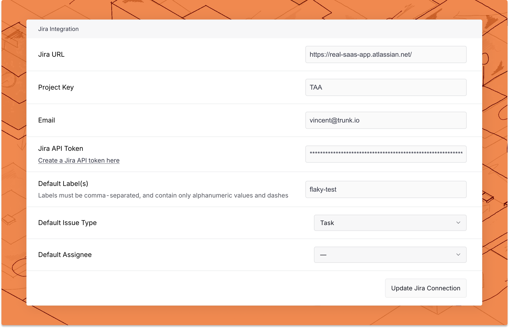
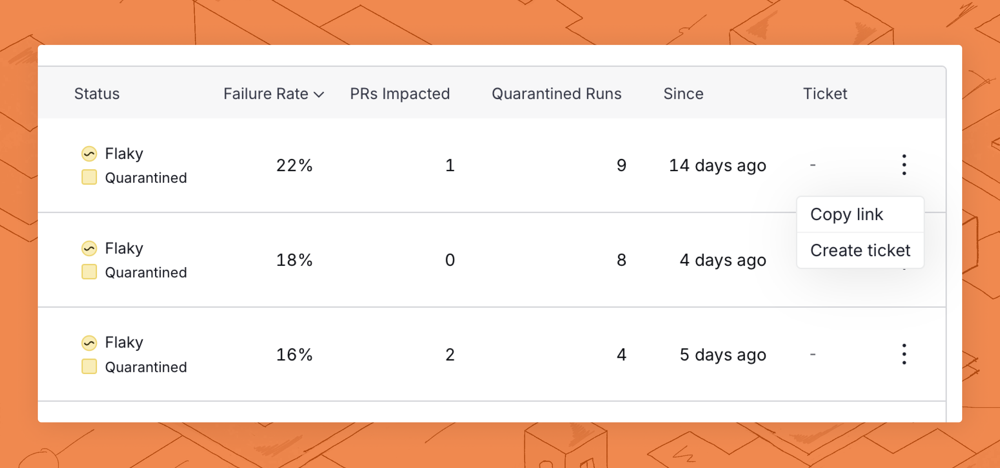

# Jira Integration

When Trunk Flaky Tests [detects a broken or flaky test](detection.md), you can create an automatically generated ticket for your team to pick up and fix the test. Currently, Ticket Creation only supports integrations with Jira, but the automatically generated ticket content is formatted in Markdown and can be copied to other platforms like Asana, Linear, or GitHub issues.



### Connecting to Jira

<figure><picture><source srcset="../.gitbook/assets/jira-connect-form-dark.png" media="(prefers-color-scheme: dark)"></picture><figcaption></figcaption></figure>

To connect a Jira Cloud project, navigate to Settings > Repositories > Jira Cloud. Then complete the form and click Connect to Jira Cloud with the following information.

<table data-header-hidden data-full-width="false"><thead><tr><th width="176"></th><th width="266"></th><th></th></tr></thead><tbody><tr><td>Field Name</td><td>Description</td><td>Examples</td></tr><tr><td>Jira URL</td><td>The URL to your Jira Cloud project.</td><td><code>https://trunk-io.atlassian.net</code></td></tr><tr><td>Project Key</td><td>The project key for your Jira project.</td><td><code>KAN</code></td></tr><tr><td>Email</td><td>The email associated with your Jira API token.</td><td><code>johndoe@example.com</code></td></tr><tr><td>Jira API token</td><td><a href="https://id.atlassian.com/manage-profile/security/api-tokens">Create your Jira API token here.</a></td><td><code>ATATT*****19FNY5Q</code></td></tr><tr><td>Default label(s) for new tickets</td><td>Labels applied to new Jira tickets created through Trunk Flaky Tests</td><td><code>flaky-test, debt</code></td></tr></tbody></table>

After connecting to Jira, you can specify a default issue type for new tickets and a default assignee for the new tickets.&#x20;

### Ticket Content

Trunk Flaky Tests automatically generates tickets complete with a title and description. If you’re connected to a project management software like Jira, there are further options to assign default labels or assignees.

The ticket description contains the following information:

* Identifier of the test
* Since when the test has been labeled flaky
* The last time this test has failed
* The impact when run on PRs
* The impact when run on branches
* Quarantine status
* Most common failure reasons
* Code owners according to the [CODEOWNERS](https://docs.github.com/en/repositories/managing-your-repositorys-settings-and-features/customizing-your-repository/about-code-owners) file in your repository

### Create a New Ticket&#x20;

You can create a new ticket for any test listed in Trunk Flaky Tests.&#x20;

You can create a new ticket on the Flaky Test dashboard by clicking on the options menu for any test cases listed.

<figure><picture><source srcset="../.gitbook/assets/create-ticket-button-dark.png" media="(prefers-color-scheme: dark)"></picture><figcaption></figcaption></figure>

You can also find a Create Ticket button in the top left corner of the [test case details ](detection.md#test-case-details)screen as well.

<figure><picture><source srcset="../.gitbook/assets/create-ticket-button-details-page-dark.png" media="(prefers-color-scheme: dark)"></picture><figcaption></figcaption></figure>

Before you create the ticket, you will have a preview of the title and description of the ticket.

<figure><picture><source srcset="../.gitbook/assets/jira-ticket-creation-dark.png" media="(prefers-color-scheme: dark)"></picture><figcaption></figcaption></figure>

#### Create with Jira

If you are connected to Jira, you can click the **Create Jira Ticket** button at the end of the modal, which will automatically create a ticket with the configured labels and assignees.

#### Create Manually

If you have not set up an integration, Trunk Flaky Tests will still generate a ticket title and description so you can copy and paste the details into your project management software.
