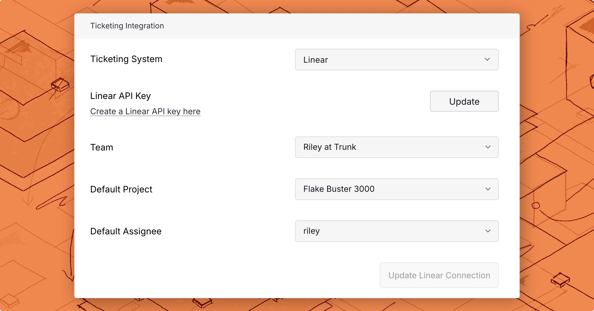

# Linear integration

When Trunk Flaky Tests [detects a flaky test](../../detection/README.md), you can create an automatically generated Linear ticket for your team to pick up and fix the test.

Webhook payloads will also contain ticket information when a ticket is created with the integration or when [existing tickets are linked](linear-integration.md#link-an-existing-ticket).

### Connecting to Linear

<figure><picture><source srcset="../../../.gitbook/assets/linear-integration-dark.png" media="(prefers-color-scheme: dark)"></picture><figcaption></figcaption></figure>

To connect a Linear project:

1. Navigate to **Settings** > **Repositories** > **Ticketing Integration.**
2. Select **Linear** as your Ticketing System.
3. Add a [Linear API key](linear-integration.md#api-token-permissions)
4. Select a Team and **Connect to Linear**.

After connecting, you can configure field defaults that pre-populate every new ticket created from the dashboard.

#### API Key permissions

The following project permissions must be granted to your Linear API key so Trunk can read, create, and assign tickets automatically:

* _Read_
* _Create issues_

Selecting _Full Access_ will also grant the required permissions.

### Field defaults

Once a team is selected, the configuration form shows the following optional fields — all scoped to that team:

| Field | Description |
|---|---|
| **Priority** | Default priority (Urgent, High, Medium, Low) |
| **Labels** | One or more team or workspace labels |
| **Estimate** | Story point estimate, using the team's configured estimate type (fibonacci, t-shirt, etc.) |
| **Project** | Default Linear project for new tickets |
| **Assignee** | Default assignee, from the team's members |

Changing the team clears all field defaults and reloads the available options for the new team.

### Create a new ticket

You can create a new ticket for any test listed in Flaky Tests.

There are 2 ways to create a new ticket in the Flaky Tests dashboard:

* Click on the options menu for any test case on the repo overview dashboard

<figure><picture><source srcset="../../../.gitbook/assets/create-ticket-button-dark.png" media="(prefers-color-scheme: dark)"></picture><figcaption></figcaption></figure>

* Use the **Create ticket** button in the top left corner of the [test case details](../../dashboard.md#test-case-details) page.

Before you create the ticket, you get a preview of the title and description. Any field defaults configured in settings will pre-populate in the creation modal, and you can adjust them before submitting.

<figure><picture><source srcset="../../../.gitbook/assets/jira-ticket-creation-dark.png" media="(prefers-color-scheme: dark)"></picture><figcaption></figcaption></figure>

If you are connected to Linear, click the **Create Linear Ticket** button at the end of the modal to create the ticket with the configured team, field defaults, and assignees.

You can use [Flaky Tests webhooks](../../webhooks/linear-integration.md) to automate ticket creation, or if you need more control over how tickets are created in Linear. The ticketing integration is not required when using webhooks.

### Link an existing ticket

If you already have a Linear ticket for a flaky test, you can link it directly from the test case details page without creating a new one.

1. Open the test case details page.
2. Click **Link Ticket** in the top left corner.
3. Paste the Linear ticket URL or ID and click **Link**.

Trunk imports the ticket's title, status, and assignee and displays them on the test details page. Linked tickets also appear in webhook payloads.

You can also link tickets programmatically using the [Link Ticket to Test Case API](../../reference/api-reference.md#post-flaky-tests-link-ticket-to-test-case).
