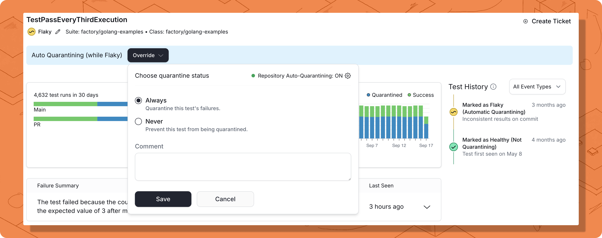
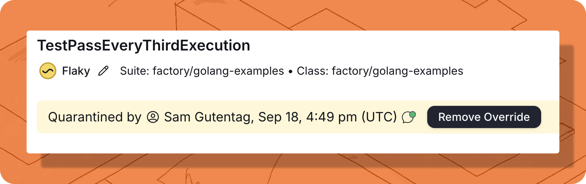
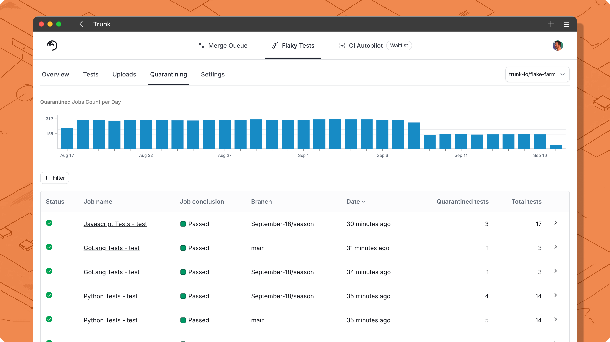
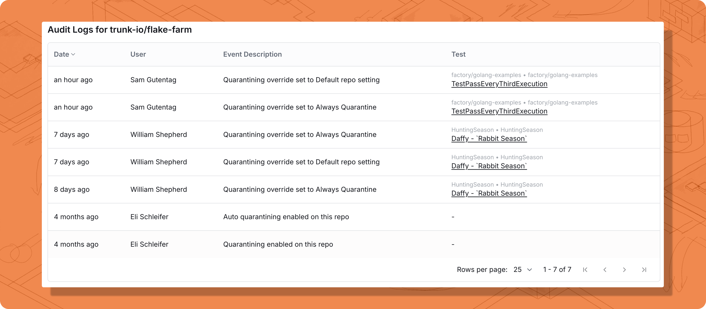

# Quarantining

<figure><figcaption></figcaption></figure>

**Quarantining** isolates known flaky tests to prevent them from blocking CI jobs while continuing to run and track their results. The system identifies flaky tests at runtime and overrides their exit codes when they fail, allowing your CI pipeline to pass without requiring code changes to disable problematic tests.

**Why use quarantining:** It acts as a crucial stopgap, minimizing the disruption from known flaky tests while your team works on fixing them. By quarantining flaky tests, you unblock critical CI pipelines—**especially your merge queue**—and regain development velocity without losing visibility, as these tests continue to run and upload results. This constant stream of data allows you to prioritize fixing the worst offenders based on their ongoing impact.

### What does "Quarantined" mean?

A quarantined test continues running in CI and uploading results to Trunk Flaky Tests, but its failures won't block your pipeline. The [Trunk Analytics CLI](uploader.md) checks with Trunk's backend to determine if failed tests are quarantined, then overrides the exit code for those failures. When all failures in a CI job come from quarantined tests, the entire job passes.

**Why this matters:** You maintain complete test coverage and historical data while preventing known problematic tests from disrupting your development cycle.

### **How tests get quarantined**

Tests can be quarantined through two methods:

1. **Manual Quarantine** - You explicitly select specific tests using override settings
2. **Auto-Quarantine** (when enabled) - Tests already flagged by [Trunk's flaky detection](detection.md) are automatically quarantined

Tests are auto-quarantined only if detected as flaky or manually marked as flaky. For [manually quarantined tests](quarantining.md#overriding-individual-tests), all failures are quarantined regardless of test state.

### Enable quarantining


Toggling the **Enable Test Quarantining** switch makes quarantining possible but does not quarantine any tests on its own.

A test failure will only be ignored by CI if the test is already manually quarantined, or if the test has previously been identified as flaky and the Auto-Quarantine option is enabled.

Actively quarantining tests will significantly change CI results, as failures from quarantined tests no longer cause builds to fail. [Learn more about the effects of quarantining](quarantining.md#whats-affected).


With quarantining enabled, the Analytics Uploader will compare failed test cases against known flaky tests. If a test is known to be flaky, it will be quarantined. If all failed tests are quarantined, the exit code of the test command will be overridden to return 0 and the CI job will pass.

#### Quarantining settings

To enable quarantining, navigate to **Settings** > **Repositories** > repository > **Flaky Tests** > toggle **on** **Enable Test Quarantining**.

<figure><figcaption></figcaption></figure>

Here's what each of these options does when enabled:

<table><thead><tr><th width="256">Setting</th><th>Description</th></tr></thead><tbody><tr><td>Enable Test Quarantining</td><td>This primary toggle activates the quarantining feature set, unlocking both manual override options and the ability to enable auto-quarantining. For any quarantining to work, the <a href="quarantining.md#updates-in-ci">necessary configurations</a> must also be made in your CI pipeline.</td></tr><tr><td>Auto-Quarantine Flaky Tests</td><td>When enabled, any test already identified by Trunk as "flaky" will be automatically quarantined. This saves you from having to manually quarantine each flaky test as it's discovered.</td></tr><tr><td></td><td></td></tr></tbody></table>

### **Quarantining with Sharded or Parallelized Tests**

There are two options for handling quarantining.

**Option 1: Wrapping each test invocation**

Wrap each command and specify its JUnit output path. Trunk captures the exit code and automatically uploads results.

**Example**

```bash
# run test 1
trunk flakytests test --org-url-slug=[org] --token=[token] --junit-paths=test1_output/*.xml -- npm run test1
# run test 2
trunk flakytests test --org-url-slug=[org] --token=[token] --junit-paths=test2_output/*.xml -- npm run test2
```

**Option 2: Handling quarantining during upload**

For complex setups where Trunk can’t wrap test commands, run tests first and let the upload step be the final gate. When quarantining is enabled, the upload inspects the provided JUnit results and decides whether to return exit code `0` or `1` based on the outcomes.

**Advanced: Handling build errors outside test runs**

To handle build issues that occur outside test runs, use the --test-process-exit-code option. This provides a fallback exit code if the upload runs without detecting any Junit results.

**Example**

```sh
./trunk-analytics-cli test --junit-paths "test_output.xml" \
   --org-url-slug <TRUNK_ORG_SLUG> \
   --token $TRUNK_API_TOKEN \
   --junit-paths="**/results/*.xml" \
   --test-process-exit-code=1
   <YOUR_TEST_COMMAND>
```

The CLI only recognizes tests defined in JUnit. If multiple test executions occur and one fails due to a build error, Flaky Tests won’t detect it and will assume the exit code came from test failures. If those failures are quarantined, the job may incorrectly be reported as successful. To prevent this:

* Upload results for each test execution separately, or
* Generate a JUnit that records build errors.

### Updates in CI

If you're using the provided [GitHub Actions workflow](get-started/ci-providers/) to upload test results to Flaky Test, you can quarantine flaky tests by wrapping the test command or as a follow-up step.

If you're using the Trunk CLI directly or other CI providers, check the instructions in the **Using The Trunk CLI Directly** tab.



Using the Trunk Analytics Uploader Action in your GitHub Actions Workflow files, may need modifications to your workflow files to support quarantining.

If you upload your test results as a second step after you run your tests, **you need to add** `continue-on-error: true` **on your test step so your CI** job will continue even on failures.

Here's an example file.

<pre class="language-yaml" data-line-numbers><code class="lang-yaml"><strong>name: Run Tests And Upload Results
</strong>on:
  workflow_dispatch:
jobs:
  upload-test-results:
    runs-on: ubuntu-latest
    timeout-minutes: 60
    steps:   
<strong>    - name: Run Tests
</strong>      id: unit_tests
      shell: bash
      run: &#x3C;COMMAND TO RUN TESTS>
      continue-on-error: true
        
    - name: Upload test results
      if: always()
      uses: trunk-io/analytics-uploader@v1
      with:
        junit-paths: &#x3C;TEST OUTPUT PATH>
        org-slug: my-trunk-org-slug
        token: ${{ secrets.TRUNK_API_TOKEN }}
</code></pre>

If you want to run the test command and upload in a single step, the test command must be **run via the Analytics Uploader** through the `run: <COMMAND TO RUN TESTS>` parameter.

This will override the response code of the test command. Make sure to set `continue-on-error: false` so un-quarantined tests are blocking.


```yaml
name: Run Tests And Upload Results
on:
  workflow_dispatch:
jobs:
  upload-test-results:
    runs-on: ubuntu-latest
    timeout-minutes: 60
    steps:
      - name: Checkout
        uses: actions/checkout@v3

      - name: Run tests and upload results
        uses: trunk-io/analytics-uploader@v1
        with:
          junit-paths: <TEST OUTPUT PATH>
          run: <COMMAND TO RUN TESTS>
          token: ${{ secrets.TRUNK_API_TOKEN }}
          org-slug: my-trunk-org-slug
```




**Using Flaky Tests as a separate step**

If you upload your test results as a second step after you run your tests, you need to ensure your test step **continues on errors** so the upload step that's run after can quarantine failed tests. When quarantining is enabled, the `flakytests upload` command will **return an error** if there are unquarantined failures and return a status code 0 if all tests are quarantined.

```bash
<run my tests> || true # doesn't fail job on failure
|
    ./trunk-analytics-cli upload \
        --org-url-slug $TRUNK_ORG_SLUG \
        --token $TRUNK_API_TOKEN \
        --junit-paths $JUNIT_PATH
```

**Using Flaky Tests as a single step**

You can also wrap the test command with the Trunk CLI. When wrapping the command with the Trunk CLI, if there are unquarantined tests, the command will return an error. If there are no unquarantined tests, the command will return a status code 0.


```bash
./trunk-analytics-cli test \
    --org-url-slug <TRUNK_ORG_SLUG> \
    --token $TRUNK_API_TOKEN \
    --junit-paths $JUNIT_PATH \
    --allow-empty-test-results \
    <Test Command>
```




### Overriding individual tests

If you have tests that should never be quarantined or should always be quarantined regardless of their current health status, you can do this by overriding individual tests.

<figure><figcaption><p>overriding</p></figcaption></figure>

You can manually control a test's quarantine status from its details page.

* To set an override: Click the **Quarantine** (or **Override**) button, then select either Always Quarantine or Never Quarantine.
* To remove an override: Click the **Remove Override** button.

When a manual override is active, a banner shows who set it and when.

<table><thead><tr><th width="244">Setting</th><th>Behavior</th></tr></thead><tbody><tr><td>Always Quarantine</td><td>Quarantine a test failure even if the health status is healthy.</td></tr><tr><td>Never Quarantine</td><td>Never quarantine failures, even if the health status is flaky, and auto-quarantining is enabled for the repo.</td></tr></tbody></table>

<figure><figcaption></figcaption></figure>

To review a history of all quarantine changes on a test, use the **Quarantine Events** filter within the **Test History** section. This will show every override, setting change, and comment, along with the author and timestamp for each entry.

### Tracking quarantined jobs in the dashboard

Once quarantining is active, the **Quarantining** tab provides a central hub for monitoring its impact and effectiveness. This tab serves as a complete audit log of every CI job saved by the feature, allowing you to:

* **Visualize Trends:** A 30-day chart shows the number of jobs quarantined per day.
* **Inspect Individual Jobs:** A detailed table lists every quarantined job. Click any entry to see the specific tests that were quarantined.
* **Isolate Critical Workflows:** Use the filter to see how quarantining impacts specific branches, such as preventing flaky failures in your Merge Queue.
* **Measure ROI:** Use the data to quantify the number of builds saved and developer time reclaimed for your organization.

<figure><figcaption></figcaption></figure>

### Audit logs

Trunk provides audit logs for all setting changes and overwrites for individual tests. You can access the audit log by navigating to **Settings** > **Repositories** **>** repository **>** **Flaky Tests** > **Audit logs** under the Enable Test Quarantining heading.

<figure><figcaption></figcaption></figure>

### Quarantining API and webhooks

For advanced use cases, you can interact with quarantining features programmatically.

* API: Use the [Flaky Tests API](flaky-tests.md) to fetch a list of all currently quarantined tests in your project.
* Webhooks: Subscribe to the `test_case.quarantining_setting_changed` event to trigger automated workflows whenever a test's quarantine override is modified. Learn more about [Webhooks](https://www.svix.com/event-types/us/org_2eQPL41Ew5XSHxiXZIamIUIXg8H/#test_case.status_changed).


### Service Availability and Graceful Degradation

Trunk Analytics CLI is designed to fail safe when our quarantine service is unavailable. Read more at [Quarantine Service Availability](quarantine-service-availability.md)

