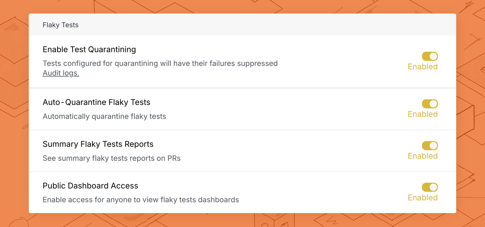

# Quarantining

<figure><picture><source srcset="../.gitbook/assets/override-dark (1).png" media="(prefers-color-scheme: dark)"></picture><figcaption></figcaption></figure>

Quarantining lets you isolate failures for known flaky tests so they don't fail your CI jobs, while still continuing to run them. Quarantine looks for known flaky tests and determines which tests should be isolated at runtime, so you can avoid code changes usually required to disable flaky tests.

Quarantining flaky tests lets you mitigate the negative effects of flaky tests without disabling any tests. Quarantined failures will still be uploaded to Trunk Flaky Tests and displayed in PRs through a [PR Test Summary](github-pull-request-comments.md), allowing you to easily triage failures and identify real issues surfaced by flaky tests.

### What Does Quarantined Mean?

When a test is quarantined, it will still be run in your CI jobs and results will be uploaded to Trunk Flaky Tests. This allows you to track any changes to flaky tests as CI jobs are run. The [Flaky Tests Uploader](uploader.md) will check if the test is a known flaky or broken test. If the test has been failing on other PRs before yours, the results will be overridden. If all failures in a CI job are overridden by quarantining because they're known flaky or broken tests, the CI job will be overridden as passing.&#x20;

### What's Affected?

When quarantining is enabled, tests that are _known_ to be flaky or broken will be quarantined. This means tests that have already been failing and not broken by your PR will be quarantined. You can see which tests are flaky or broken by seeing the tests's status in the overview dashboard, or each test's status history.

<figure><picture><source srcset="../.gitbook/assets/labelled-flaky-dark.png" media="(prefers-color-scheme: dark)"></picture><figcaption><p>Status history showing a test to be flaky.</p></figcaption></figure>

Tests that are overridden to always quarantine will also be quarantined, even if the test breaks for the first time. [Learn more about overriding.](quarantining.md#overriding-individual-tests)

### Enable Quarantining


Enabling quarantining will drastically affect the results of CI jobs. Only new test failures introduced by your PR will fail CI jobs, known **flaky and broken** tests will no longer fail CI jobs. [Learn more about the effects of quarantining](quarantining.md#whats-affected).


Before tests can be quarantined on a CI job, quarantining needs to be enabled for your Analytics Uploader.

With quarantining enabled, the Analytics Uploader will compare failed test cases against known flaky tests. If a test is known to be flaky or broken, it will be quarantined. If all failed tests are flaky then the exit code of the test command will be overridden to return 0 which means the CI job will pass.

#### Update Flaky Test Settings

You can enable quarantining by navigating to **Settings** > **Repositories** > **Flaky Tests** > **Quarantine Flaky Tests** and selecting enabled in the drop-down.

<figure><picture><source srcset="../.gitbook/assets/enable-flaky-dark.png" media="(prefers-color-scheme: dark)"></picture><figcaption></figcaption></figure>

Here's what each of these options does when enabled:

<table><thead><tr><th width="256">Setting</th><th>Description</th></tr></thead><tbody><tr><td>Enable Test Quarantining</td><td>When enabled, tests will be quarantined if the <a href="quarantining.md#updates-in-ci">necessary configurations</a> are made in CI.</td></tr><tr><td>Auto-Quarantine</td><td>When enabled, flaky tests are automatically quarantined. When disabled, only flaky tests which are <a href="quarantining.md#overriding-individual-tests">manually marked as flaky</a> are quarantined.</td></tr><tr><td>Summary Test Reports</td><td>When enabled, PRs will generate a report covering test results, test health, and quarantining status. This will be accessible in the web app and as a GitHub comment. Learn more about <a href="github-pull-request-comments.md">PR Test Summaries</a></td></tr><tr><td>Public Dashboard Access</td><td>When enabled, unauthenticated users will get read-only access to your Flaky Tests dashboard, which is particularly useful for open-source projects.</td></tr></tbody></table>

#### Updates In CI

If you're using the provided GitHub Actions workflow to upload test results to Trunk, you can quarantine flaky tests by wrapping the test command or quarantining as a follow-up step.

If you're using the Trunk CLI directly or using other CI providers, check the instructions in the **Using The Trunk CLI Directly** tab.



If you're using the Trunk Analytics Uploader Action in your GitHub Actions Workflow files, you may need to modify your workflow files to support quarantining.&#x20;

If you upload your test results as a second step after you run your tests,  **you need to add** `continue-on-error: true` **on your test step so your CI** job will continue even on failures. Here's an example file.

<pre class="language-yaml" data-line-numbers><code class="lang-yaml"><strong>name: Run Tests And Upload results
</strong>on:
  workflow_dispatch:
jobs:
  upload-test-results:
    runs-on: ubuntu-latest
    timeout-minutes: 60
    steps:   
<strong>    - name: Run Tests
</strong>      id: unit_tests
      shell: bash
      run: &#x3C;COMMAND TO RUN TESTS>
      continue-on-error: true
        
    - name: Upload test results
      if: always()
      uses: trunk-io/analytics-uploader@main
      with:
        junit-paths: &#x3C;TEST OUTPUT PATH>
        org-slug: my-trunk-org-slug
        token: ${{ secrets.TRUNK_API_TOKEN }}
        quarantine: true
</code></pre>

If you want to run the test command and upload in a single step, the test command must be **run via the Analytics Uploader** through the `run: <COMMAND TO RUN TESTS>` parameter. This will override the response code of the test command. Make sure to set `continue-on-error: false` so unquarantined tests are blocking.

```yaml
name: Run Tests And Upload results
on:
  workflow_dispatch:
jobs:
  upload-test-results:
    runs-on: ubuntu-latest
    timeout-minutes: 60
    steps:
      - name: Checkout
        uses: actions/checkout@v3

      - name: Run tests and upload results
        uses: trunk-io/analytics-uploader@main
        with:
          junit-paths: <TEST OUTPUT PATH>
          run: <COMMAND TO RUN TESTS>
          token: ${{ secrets.TRUNK_API_TOKEN }}
          org-slug: my-trunk-org-slug
          quarantine: true
```



#### Using Flaky Tests as a separate step

If you upload your test results as a second step after you run your tests,  you need to ensure your test step **continues on errors** so the upload step that's run after can quarantine failed tests. When quarantining is enabled, the `flakytests upload` command will **return an error** if there are unquarantined failures and return a status code 0 if all tests are quarantined.

```bash
<run my tests> || true # doesn't fail job on failure
|
    ./trunk flakytests upload \
        --org-url-slug $TRUNK_ORG_SLUG \
        --token $TRUNK_API_TOKEN \
        --junit-paths $JUNIT_PATH
```

#### Using Flaky Tests as a single step

You can also wrap the test command with the Trunk CLI. When wrapping the command with the Trunk CLI, if there are unquarantined tests, the command will return an error. If there are no unquarantined tests, the command will return a status code 0.


```bash
./trunk flakytests test \
    --org-url-slug <TRUNK_ORG_SLUG> \
    --token $TRUNK_API_TOKEN \
    --junit-paths $JUNIT_PATH \
    --allow-empty-test-results \
    <Test Command>
```




#### Overriding Individual Tests

If you have tests that should never be quarantined or should always be quarantined regardless of their current health status, you can do this by overriding individual tests.

<figure><picture><source srcset="../.gitbook/assets/override-dark (1).png" media="(prefers-color-scheme: dark)"></picture><figcaption><p>overriding</p></figcaption></figure>

You can update the overriding settings on each test by navigating to the details page for a specific test and clicking the Quarantining (Repo Default) selector in the top left corner.

You can choose between one of three override settings:

<table><thead><tr><th width="244">Setting</th><th>Behavior</th></tr></thead><tbody><tr><td>Quarantine</td><td>Quarantine automatically if <a href="quarantining.md#enable-quarantining">auto-quarantine</a> is enabled.<br><a href="quarantining.md#quarantining-modes">Learn more about quarantining modes</a></td></tr><tr><td>Always Quarantine</td><td>Quarantine a test failure even if the health status is healthy.</td></tr><tr><td>Never Quarantine</td><td>Never quarantine failures, even if the health status is flaky or broken, and quarantining is enabled for the repo.</td></tr></tbody></table>

#### Audit Logs

Trunk provides audit logs for all setting changes and overwrites for individual tests. You can access the audit log by navigating to **Settings** > **Repositories** > **Flaky Tests** > **Quarantine Flaky Tests** > **Audit logs**.

You will also see a record of changes in the override settings in the **Status History** tab in each test's details screen.
