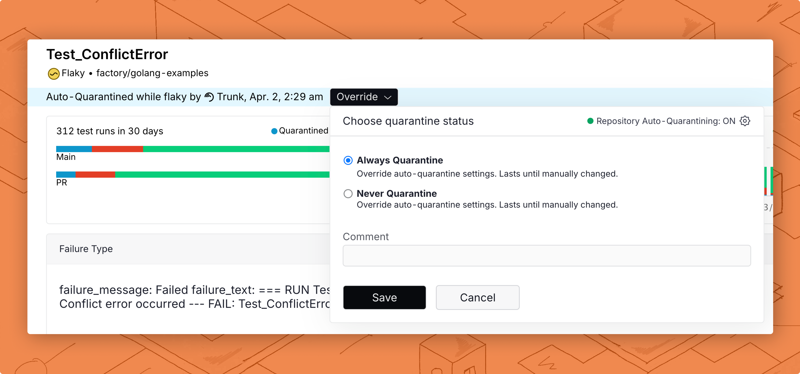

# Quarantining

Quarantining lets you isolate failures for known flaky tests so they don't fail your CI jobs, while still continuing to run them. Quarantine looks for known flaky tests and determines which tests should be isolated at runtime, so you can avoid code changes usually required to disable flaky tests.

Quarantining flaky tests lets you mitigate the negative effects of flaky tests without disabling any tests. Quarantined failures will still be uploaded to Trunk Flaky Tests and displayed in PRs through a [PR Test Summary](github-pull-request-comments.md), allowing you to easily triage failures and identify real issues surfaced by flaky tests.

### What Does Quarantined Mean?

When a test is quarantined, it will still be run in your CI jobs and results will be uploaded to Trunk Flaky Tests so you can keep track of them. What changes are the results of your CI jobs. The [Flaky Tests Uploader](uploader.md) will check if the test is a known flaky or broken test. If the test has been failing on other PRs before yours, the results will be overridden. This means, that if all failures in a CI job are overridden by quarantining because they're known flaky or broken tests, the CI job will be overridden as passing.&#x20;

### What's Affected?

When quarantining is enabled, tests that are _known_ to be flaky or broken will be quarantined. This means tests that have already been failing and not broken by your PR will be quarantined. You can see which tests are flaky or broken by seeing the tests's status in the overview dashboard, or each test's status history.

<figure><picture><source srcset="../.gitbook/assets/labelled-flaky-dark.png" media="(prefers-color-scheme: dark)"></picture><figcaption><p>Status history showing a test to be flaky.</p></figcaption></figure>

Tests that are overridden to always quarantine will also be quarantined, even if the test breaks for the first time. [Learn more about overriding.](quarantining.md#overriding-individual-tests)

### Enable Quarantining


Enabling quarantining will drastically affect the results of CI jobs. Only new test failures introduced by your PR will fail CI jobs, known **flaky and broken** tests will no longer fail CI jobs. [Learn more about the effects of quarantining](quarantining.md#whats-affected)


**Update CI Jobs**

Before tests can be quarantined on a CI job, quarantining needs to be enabled for your Analytics Uploader. There are two ways to do this, wrapping the test command and a followup step.

With quarantining enabled, the Analytics Uploader will compare failed test cases against known flaky tests.[ If a test is known to be flaky](#user-content-fn-1)[^1], it will be quarantined. If all failed tests are flaky then the exit code of the test command will be overridden to return 0 which means the CI job will pass.

#### Wrapping the command

The test command needs to be run via the Analytics Uploader through the `run: <COMMAND TO RUN TESTS>` parameter and have `quarantine: true`passed to the Analytics Uploader to enable quarantining. This will override the response code of the test command.

Here is an example of a GitHub workflow:

```yaml
name: Run Tests And Upload results
on:
  workflow_dispatch:
jobs:
  upload-test-results:
    runs-on: ubuntu-latest
    timeout-minutes: 60
    steps:
      - name: Checkout
        uses: actions/checkout@v3

      - name: Run tests and upload results
        uses: trunk-io/analytics-uploader@main
        with:
          junit-paths: <TEST OUTPUT PATH>
          run: <COMMAND TO RUN TESTS>
          token: ${{ secrets.TRUNK_API_TOKEN }}
          org-slug: my-trunk-org-slug
          quarantine: true
```

#### Quarantining as a separate step

You can also quarantine your tests as a follow-up step. If you're already uploading flaky test results as a second step, you need to enable `quarantine: true` on your Analytics Uploader step, then add `continue-on-error: true` on your test step so your CI job will continue even on failures.

Here is an example of a GitHub workflow:

<pre class="language-yaml"><code class="lang-yaml"><strong>name: Run Tests And Upload results
</strong>on:
  workflow_dispatch:
jobs:
  upload-test-results:
    runs-on: ubuntu-latest
    timeout-minutes: 60
    steps:   
<strong>    - name: Run Tests
</strong>      id: unit_tests
      shell: bash
      run: |
        bazel test --compilation_mode=opt --build_tag_filters=-docker,-manual \
          --test_tag_filters=-docker,-manual --test_env=DISABLE_JEST_RETRY=1 \
          --flaky_test_attempts=1 --cache_test_results=no //...
      continue-on-error: true
        
    - name: Upload JUnit.xml
      if: always()
      uses: trunk-io/analytics-uploader@main
      with:
        junit-paths: &#x3C;TEST OUTPUT PATH>
        org-slug: my-trunk-org-slug
        token: ${{ secrets.TRUNK_API_TOKEN }}
        quarantine: true
</code></pre>

#### Update Flaky Test Settings

You can enable quarantining by navigating to **Settings** > **Repositories** > **Flaky Tests** > **Quarantine Flaky Tests** and selecting enabled in the drop-down.

<figure><picture><source srcset="../.gitbook/assets/app.trunk-staging.io_totally-real-saas_flaky-tests_test_6675ee1f-49c5-5400-a6e1-96292a9307ec_status_repo=gewenyu99%2Freal-saas-app&#x26;intervalDays=14 (8).png" media="(prefers-color-scheme: dark)"></picture><figcaption></figcaption></figure>

After enabling quarantining on Trunk Flaky Tests, future CI jobs with quarantining enabled on the Analytics Uploader will begin quarantining failed flaky tests.

#### Overriding Individual Tests

If you have tests that should never be quarantined or should always be quarantined regardless of their current health status, you can do this by overriding individual tests.

<figure><picture><source srcset="../.gitbook/assets/override-dark.png" media="(prefers-color-scheme: dark)"></picture><figcaption><p>overriding</p></figcaption></figure>

You can update the overriding settings on each test by navigating to the details page for a specific test and clicking the Quarantining (Repo Default) selector in the top left corner.

You can choose between one of three override settings:

<table data-header-hidden><thead><tr><th width="244"></th><th></th></tr></thead><tbody><tr><td>Setting</td><td>Behavior</td></tr><tr><td>Repo Default</td><td>Quarantining behavior follows the repository settings.<br><br><a href="quarantining.md#quarantining-modes">Learn more about quarantining modes</a></td></tr><tr><td>Always Quarantine</td><td>Quarantine a test failure even if the health status is healthy.</td></tr><tr><td>Never Quarantine</td><td>Never quarantine failures, even if the health status is flaky or broken, and quarantining is enabled for the repo.</td></tr></tbody></table>

#### Audit Logs

Trunk provides audit logs for all setting changes and overwrites for individual tests. You can access the audit log by navigating to **Settings** > **Repositories** > **Flaky Tests** > **Quarantine Flaky Tests** > **Audit logs**.

You will also see a record of changes in the override settings in the **Status History** tab in each test's details screen.

[^1]: or broken
