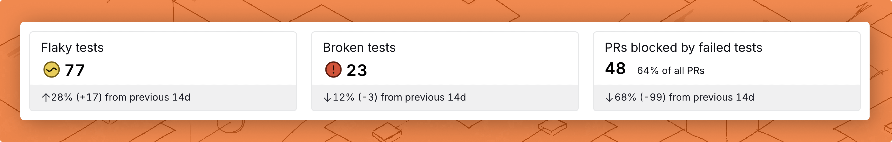
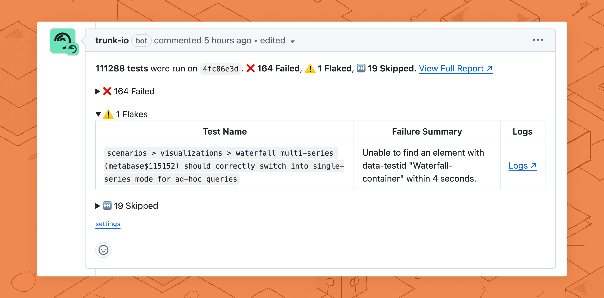

# Flaky Tests (beta)

<figure><picture><source srcset="../.gitbook/assets/dashboard-dark (1).png" media="(prefers-color-scheme: dark)"></picture><figcaption>
The Trunk Flaky Tests Web App
</figcaption></figure>

Trunk Flaky Tests lets your teams detect, track, quarantine, and fix **flaky tests** in your codebase. Flaky Tests is language, environment, and framework-agnostic.

Let's explore how Trunk Flaky Tests' features help you tackle Flaky Tests. If you can't wait to try Trunk, follow our [getting started guide](https://docs.trunk.io/flaky-tests/get-started).

You can see a tour of Trunk Flaky Tests in this video.



### Understand The Impact

Your dashboard shows a comprehensive overview of your test suite's health at a glance. It lets you see important impact metrics like the number of flaky tests, broken tests, PRs impacted by flaky tests, and PRs rescued by quarantining flaky tests.

<figure><picture><source srcset="../.gitbook/assets/key-metrics-dark.png" media="(prefers-color-scheme: dark)"></picture><figcaption>
Key repo metrics
</figcaption></figure>

To learn more, [see how Flaky Tests does detection](https://docs.trunk.io/flaky-tests/detection).

### Track Every Flaky Tests

You can find a list of known flaky tests complete with important information like their impact on PRs and if someone's working on a fix. For more granularity, you can also inspect individual tests for their execution history, results, and status changes.

<figure><picture><source srcset="../.gitbook/assets/dashboard-test-list-dark.png" media="(prefers-color-scheme: dark)"></picture><figcaption>
List of flaky tests
</figcaption></figure>

To learn more, [see how Flaky Tests does detection](https://docs.trunk.io/flaky-tests/detection).

### Stay in Sync

<figure><picture><source srcset="../.gitbook/assets/github-comment-dark.png" media="(prefers-color-scheme: dark)"></picture><figcaption>
PR comment linking to PR Test Summary
</figcaption></figure>

Flaky Tests helps everyone in your team stay in sync about flaky test failures with [GitHub PR comments](https://docs.trunk.io/flaky-tests/github-pull-request-comments), so no time is wasted debugging failures from known flaky tests.

To learn more, [see our docs about GitHub Comments and Test Summaries](github-pull-request-comments.md).

### Investigate Flaky Failures

Flaky Tests creates detailed reports for individual test failures so you can debug faster.&#x20;

<figure><picture><source srcset="../.gitbook/assets/unique-failure-reason-dark.png" media="(prefers-color-scheme: dark)"></picture><figcaption>
Summary of unique failure types.
</figcaption></figure>

Test details will summarize all the unique ways a flaky test fails and let you flip through the relevant stack traces in the Trunk app.

<figure><picture><source srcset="../.gitbook/assets/app.trunk-staging.io_totally-real-saas_flaky-tests_test_6675ee1f-49c5-5400-a6e1-96292a9307ec_status_repo=gewenyu99%2Freal-saas-app&#x26;intervalDays=14 (4).png" media="(prefers-color-scheme: dark)"></picture><figcaption>
Full failure stack traces
</figcaption></figure>

To learn more, [see our docs about the detection of flaky tests](detection.md#test-case-details).

### **Quarantine Flaky Failures**

Flaky Tests allows you to [quarantine](https://docs.trunk.io/flaky-tests/quarantining) detected flaky tests, stopping them from failing your CI jobs. This prevents failed flaky tests from impacting your CI pipelines, so you won’t have to disable tests and won’t be slowed down by flaky CI jobs.

<figure><picture><source srcset="../.gitbook/assets/override-dark.png" media="(prefers-color-scheme: dark)"></picture><figcaption>
flaky tests can be quarantined automatically or manually
</figcaption></figure>

To learn more, [see our docs about quarantining tests](quarantining.md).

### Manage Tickets

<figure><picture><source srcset="../.gitbook/assets/jira-ticket-creation-dark.png" media="(prefers-color-scheme: dark)"></picture><figcaption>
Creating a Jira ticket for a flaky test
</figcaption></figure>

Trunk enables the automation of quickly creating and assigning tickets through integrations with platforms like Jira and Linear, as well as custom workflows with webhooks. The status of tickets created will be reflected in real-time in the Trunk web app. This helps you track efforts to fix high-impact, flaky tests.

To learn more, [learn about our ticketing integrations](jira-integration.md).

### **Join Trunk Flaky Tests**

Start finding flaky tests today by [signing up for Trunk](https://app.trunk.io/) or reading our [Getting Started guides](get-started/).
