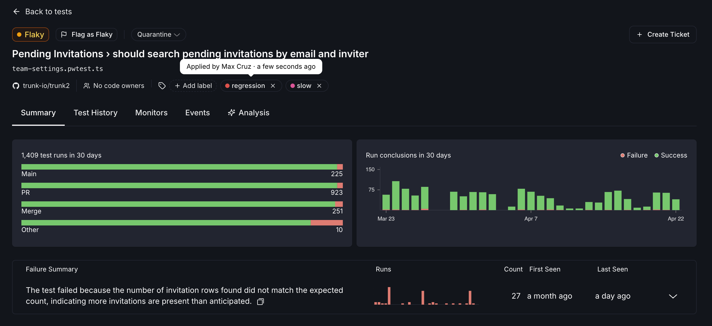
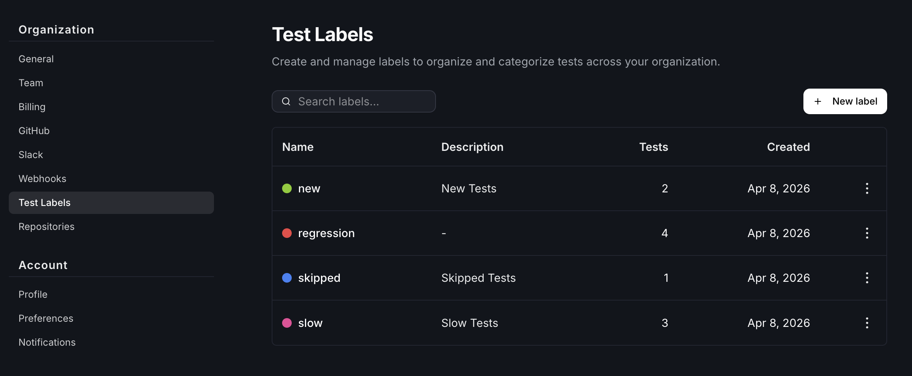
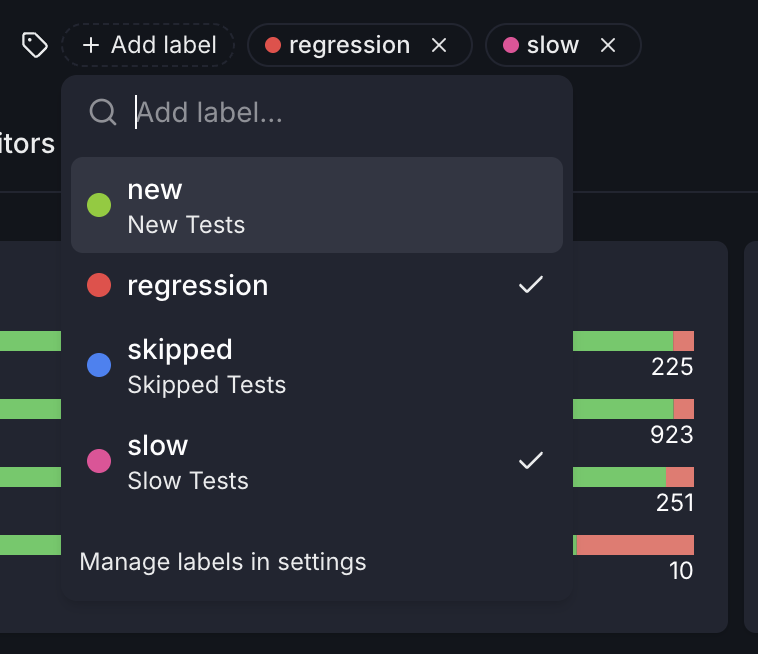
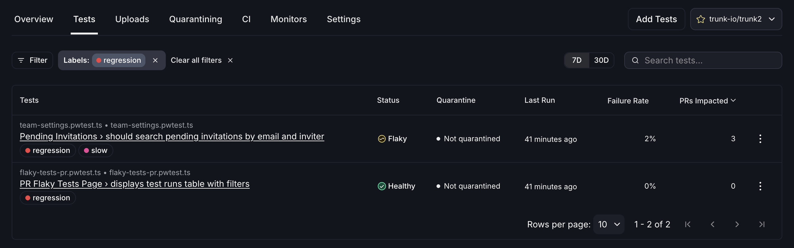

# Test Case Labels

Test case labels are organization-scoped tags — each with a name, description, and color — that you can apply to individual test cases to organize, filter, and categorize your test suite. Labels are applied manually by users today; see [Automatic labeling from monitors](#automatic-labeling-from-monitors) for what's coming.

<figure><figcaption></figcaption></figure>

### Manage labels

Labels are created, edited, and deleted at **Settings > Organization > Test Labels**. Each label has a name, an optional description, and a color used for its chip in the UI. The settings page also shows how many test cases each label is currently applied to.

Deleting a label removes it from every test case it's applied to; this cannot be undone.

<figure><figcaption></figcaption></figure>

### Apply and remove labels on a test case

You apply and remove labels from a test case using the label picker on the test case detail page. The picker lets you search existing labels, toggle them on or off, and create a new label inline if one doesn't already exist. Each assignment records the user who applied it and the time it was applied.

<figure><figcaption></figcaption></figure>

### Filter tests by label

On the tests list, you can filter the table down to test cases that have a particular label applied. This makes labels useful for slicing the view by the categories your team cares about — for example, tests owned by a specific team, tests tied to a known infrastructure issue, or any other grouping you define.

<figure><figcaption></figcaption></figure>

### Automatic labeling from monitors


**Coming soon.** Monitors will be able to automatically apply and remove labels on test cases based on test status. More details will be published when this is available.


### Related

- [Managing detected flaky tests](managing-detected-flaky-tests.md) — a step-by-step process for handling detected flaky tests
- [Flake Detection](detection/) — monitors that classify tests as flaky or broken
