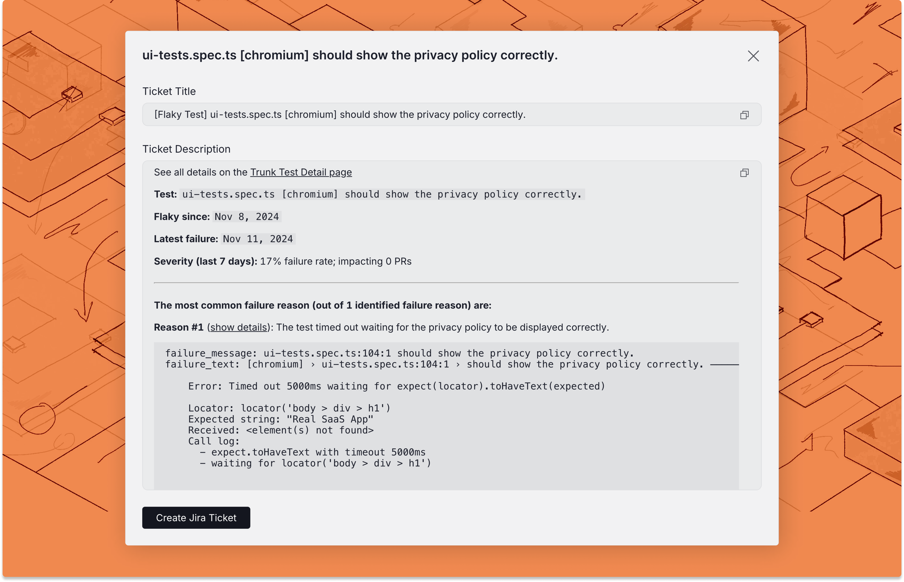

# Jira integration

When Trunk Flaky Tests [detects a broken or flaky test](../detection.md), you can create an automatically generated Jira ticket for your team to pick up and fix the test.

Webhook payloads will also contain ticket information when a Jira ticket is created with the integration or when [existing tickets are linked](jira-integration.md#link-existing-tickets-to-tests).

### Connecting to Jira

<figure><picture><source srcset="../../.gitbook/assets/jira-connect-form-dark.png" media="(prefers-color-scheme: dark)"></picture><figcaption></figcaption></figure>

To connect a Jira Cloud project, navigate to **Settings** -> **Repositories** -> **Ticketing Integration** and select **Jira** as your Ticketing System.

Then complete the form and click Connect to Jira Cloud with the following information.

<table data-full-width="false"><thead><tr><th width="176">Field Name</th><th width="266">Description</th><th>Examples</th></tr></thead><tbody><tr><td>Jira URL</td><td>The URL to your Jira Cloud project.</td><td><code>https://trunk-io.atlassian.net</code></td></tr><tr><td>Project Key</td><td>The project key for your Jira project.</td><td><code>KAN</code></td></tr><tr><td>Email</td><td>The email associated with your Jira API token.</td><td><code>johndoe@example.com</code></td></tr><tr><td><a href="jira-integration.md#api-token-permissions">Jira API token</a></td><td><a href="https://id.atlassian.com/manage-profile/security/api-tokens">Create your Jira API token here.</a></td><td><code>ATATT*****19FNY5Q</code></td></tr><tr><td>Default label(s) for new tickets</td><td>Labels applied to new Jira tickets created through Trunk Flaky Tests</td><td><code>flaky-test, debt</code></td></tr></tbody></table>

After connecting to Jira, you can specify a default issue type for new tickets and a default assignee for new tickets.

#### API Token permissions

Your Jira user account must have the following project permissions to create a Jira API token that allows Trunk to read, create, and assign tickets automatically:&#x20;

* _Create issues_
* _Assign issues_ OR _Browse users and groups_ (global permission)
* _Browse projects_
  * If issue-level security is configured, issue-level security permissions must be granted to read issues.&#x20;

You need to create an API token with the following scopes:

* Required scopes (classic)
  * `read:jira-work`
  * `write:jira-work`&#x20;
  * `read:jira-user`
* Required scopes (granular):&#x20;
  * `read:issue:jira`
  * `read:issue-meta:jira`
  * `read:issue-security-level:jira`
  * `read:issue.vote:jira`
  * `read:issue.changelog:jira`
  * `read:avatar:jira`
  * `read:status:jira`
  * `read:user:jira`
  * `read:field-configuration:jira`
  * `read:application-role:jira`
  * `read:group:jira`
  * `read:issue-type:jira`
  * `read:project:jira`
  * `read:project.property:jira`
  * `read:issue-type-hierarchy:jira`
  * `read:project-category:jira`
  * `read:project-version:jira`
  * `read:project.component:jira`
  * `read:permission:jira`
  * `write:issue:jira`
  * `write:comment:jira`
  * `write:comment.property:jira`
  * `write:attachment:jira`


Jira tokens cannot last longer than 365 days. Once the token expires, you will need to generate a new API token.


### Create a new ticket

You can create a new ticket for any test listed in Trunk Flaky Tests.&#x20;

There are 2 ways to create a new ticket in the Flaky Test dashboard:

* Click on the options menu for any test case on the repo overview dashboard

<figure><picture><source srcset="../../.gitbook/assets/create-ticket-button-dark.png" media="(prefers-color-scheme: dark)"></picture><figcaption></figcaption></figure>

* Use the Create ticket button in the top left corner of the [test case details](../detection.md#test-case-details) page.

Before you create the ticket, you will have a preview of the title and description.

<figure><picture><source srcset="../../.gitbook/assets/jira-ticket-creation-dark.png" media="(prefers-color-scheme: dark)"></picture><figcaption></figcaption></figure>

#### Create with Jira

If you are connected to Jira, you can click the **Create Jira Ticket** button at the end of the modal, which will automatically create a ticket with the configured labels and assignees.

#### Link existing tickets to tests

If you already have a ticket in Jira that you want to link to a test in the dashboard, you can use the [Link Ticket to Test Case API](../flaky-tests.md#post-flaky-tests-link-ticket-to-test-case).
