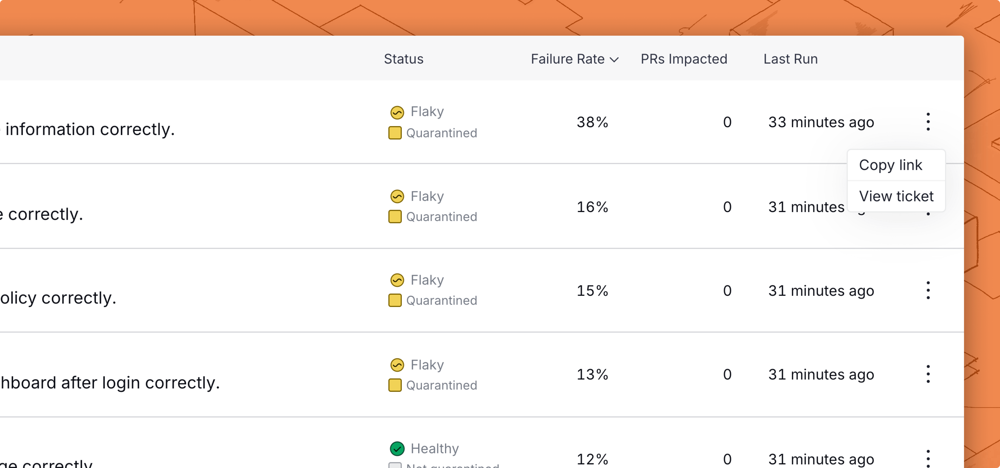

# Linear Integration

When Trunk Flaky Tests [detects a broken or flaky test](../detection.md), you can create an automatically generated Linear ticket for your team to pick up and fix the test.

Webhook payloads will also contain ticket information when a Jira ticket is created with the integration or when [existing tickets are linked](linear-integration.md#link-existing-tickets-to-tests).

### Connecting to Linear

<figure><picture><source srcset="../../.gitbook/assets/linear-integration-dark.png" media="(prefers-color-scheme: dark)"></picture><figcaption></figcaption></figure>

To connect a Linear project:

1. Navigate to **Settings** > **Repositories** > **Ticketing Integration.**
2. Select **Linear** as your Ticketing System.
3. Add a Linear API key
4. Select a Team and **Connect to Linear**.

After connecting to Linear, you can specify a default project and a default assignee for new tickets.&#x20;

### Create a New Ticket

You can create a new ticket for any test listed in Flaky Tests.&#x20;

There are 2 ways to create a new ticket in the Flaky Test dashboard:

* Click on the options menu for any test case on the repo overview dashboard

<figure><picture><source srcset="../../.gitbook/assets/create-ticket-button-dark.png" media="(prefers-color-scheme: dark)"></picture><figcaption></figcaption></figure>

* Use the Create ticket button in the top left corner of the [test case details](../detection.md#test-case-details) page.

Before you create the ticket, you get a preview of the title and description.

<figure><picture><source srcset="../../.gitbook/assets/jira-ticket-creation-dark.png" media="(prefers-color-scheme: dark)"></picture><figcaption></figcaption></figure>

#### Create with Linear

If you are connected to Linear, you can click the **Create Linear Ticket** button at the end of the modal to automatically create a ticket with the configured team and assignees.

Note: You can use [Flaky Tests webhooks](../webhooks/linear-integration.md) to automate ticket creation, or if you need more control over how tickets are created in Linear. This integration is not required when using webhooks.

#### Link existing tickets to tests

If you already have a ticket in Linear that you want to link to a test in the dashboard, you can use the [Link Ticket to Test Case API](../../references/apis/flaky-tests.md#post-flaky-tests-link-ticket-to-test-case).
