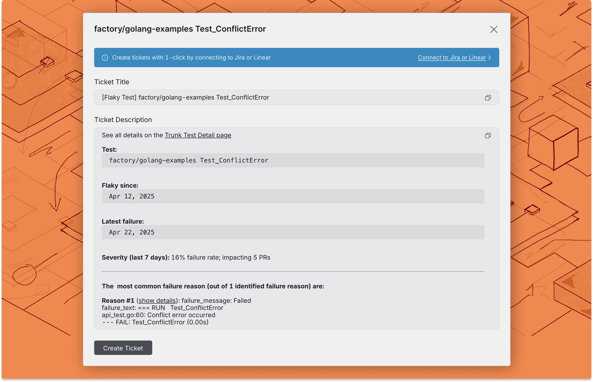

# Other Ticketing Platforms

If you have not set up an integration, Trunk Flaky Tests can still generate a ticket title and description so you can copy and paste the details into your project management software.

### Create a New Ticket

You can create a new ticket for any test listed in Trunk Flaky Tests.&#x20;

There are 2 ways to create a new ticket in the Flaky Test dashboard:

* Click on the options menu for any test case on the repo overview dashboard

<figure><picture><source srcset="../../.gitbook/assets/create-ticket-button-dark.png" media="(prefers-color-scheme: dark)"></picture><figcaption></figcaption></figure>

* Use the Create ticket button in the top left corner of the [test case details](../detection.md#test-case-details) page.

Before you create the ticket, you will have a preview of the title and description.

<figure><picture><source srcset="../../.gitbook/assets/manual-ticket-creation-dark.png" media="(prefers-color-scheme: dark)"></picture><figcaption></figcaption></figure>

Now you can copy and paste the ticket title and description into your project management or ticketing platform.
