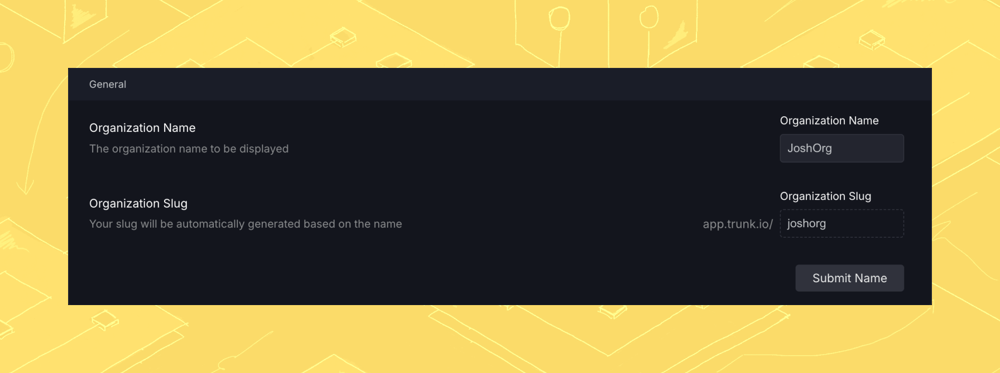
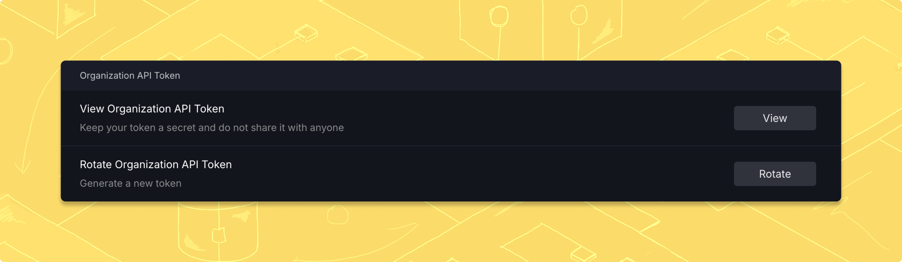

# Trunk Flaky Tests CLI

The Trunk Flaky Tests CLI is used to upload test results from your CI provider to the Trunk Flaky Tests web app.&#x20;


The Trunk Flaky Tests CLI currently only supports x86\_64 and arm64 for both Linux and macOS. If you have another use case, please get in touch with support at [https://slack.trunk.io](https://slack.trunk.io/). For the best results, you'll need to validate that your test invocation doesn't use cached test results and doesn't automatically retry failing tests.


## Installing the CLI

The CLI should be downloaded as part of your test workflow in your CI system. The details vary by [CI Provider](ci-providers/), but generally should be downloaded directly from the analytics-cli release page using curl like this:

```
curl -fsSL --retry 3 <RELEASE_URL> | tar -xvz > ./trunk-analytics-cli
```

and then invoked like this. The `trunk-analytics-cli` binary will already be marked executable.

```
./trunk-analytics-cli upload --junit-paths "test_output.xml" \
   --org-url-slug <TRUNK_ORG_SLUG> \
   --token $TRUNK_API_TOKEN
```

## Using the CLI

Run the command line with one of the following commands

| Command  | Description             |
| -------- | ----------------------- |
| `test`   | Test the upload process |
| `upload` | Really upload data      |
| `help`   | Print the help message  |

The `upload` command uses the following arguments

| Argument                                            | Description                                                                                 |
| --------------------------------------------------- | ------------------------------------------------------------------------------------------- |
| `--junit-paths <JUNIT_PATHS>`                       | a comma separated list of paths containing the test output files. File globs are supported. |
| `--org-url-slug <ORG_URL_SLUG>`                     | Trunk Org slug, from the settings page.                                                     |
| `--token <TOKEN>`                                   | Trunk Org (not repo) token, from the settings page.                                         |
| `-h, --help`                                        | Additional detailed description of the `upload` command.                                    |
| `--repo-root`                                       | Path to the repository root. Defaults to the current directory.                             |
| `--repo-url <REPO_URL>`                             | Value to override URL of repository. **Optional**.                                          |
| `--repo-head-sha` `<REPO_HEAD_SHA>`                 | Value to override SHA of repository head. **Optional**.                                     |
| `--repo-head-branch <REPO_HEAD_BRANCH>`             | Value to override branch of repository head. **Optional**.                                  |
| `--repo-head-commit-epoch <REPO_HEAD_COMMIT_EPOCH>` | Value to override commit epoch of repository head. **Optional**.                            |
| `--tags <TAGS>`                                     | Comma separated list of custom tag=value pairs. **Optional**.                               |
| `--print-files`                                     | Print files which will be uploaded to stdout.                                               |
| `--dry-run`                                         | Run metrics CLI without uploading to API. **Optional**.                                     |
| `--team` `<TEAM>`                                   | Value to tag team owner of upload. **Optional**.                                            |
| `--codeowners-path <CODEOWNERS_PATH>`               | Value to override CODEOWNERS file or directory path. **Optional**.                          |
| `--use-quarantining`                                | Run commands with the quarantining step.                                                    |


## Troubleshooting

As a general rule you should download the release on every CI run. **Do not bake the CLI into a container or VM.** This ensures your CI runs are always using the latest build.

The `trunk-analytics-cli` binary should be run from the repository root. If you need to run the binary from another location, you must provide the path to the repo root using the `--repo-root`argument. The `--junit-paths` argument accepts the xml file locations as both a list of globs or absolute paths.

### Organization not found

If you receive an error that the org slug or API token is not found, double check that the secrets stored in your CI provider are the same as the Organization settings by navigating to **Settings** -> **Manage** -> **Organization** on [app.trunk.io](http://app.trunk.io).

Make sure you are getting your _Organization Slug_, not the Organization Name.

<figure><figcaption><p>Get the Organization Slug</p></figcaption></figure>

Also make sure you are getting your O_rganization API Token_, _**not your project/repo token**_.

<figure><figcaption></figcaption></figure>


