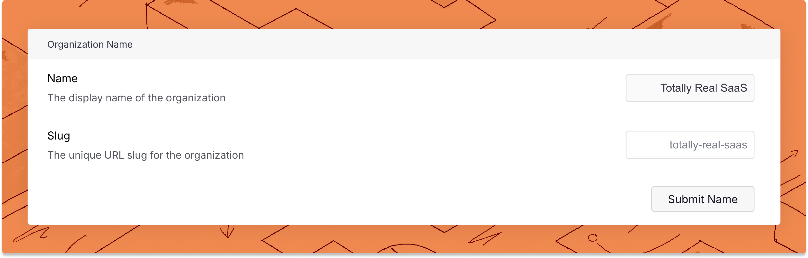
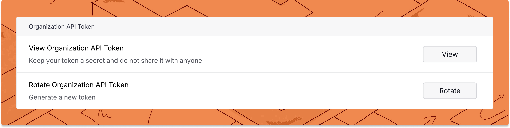

# Uploader CLI Reference

Trunk Flaky Tests detects and tracks flaky tests in your repos by receiving uploads from your test runs in CI. Trunk Flaky Tests takes the [JUnit XML format](https://github.com/testmoapp/junitxml) for uploads. These uploads happen in the CI jobs used to run tests in your nightly CI, post-commit jobs, and PR checks.

If you're setting up Trunk Flaky Tests for the first time, you can follow the guides for your CI provider and test framework.

<table data-card-size="large" data-view="cards"><thead><tr><th></th><th data-hidden></th><th data-hidden></th><th data-hidden data-card-target data-type="content-ref"></th></tr></thead><tbody><tr><td>Guides by Test Frameworks</td><td></td><td></td><td><a href="get-started/frameworks/">frameworks</a></td></tr><tr><td>Guides by CI Provider</td><td></td><td></td><td><a href="get-started/ci-providers/">ci-providers</a></td></tr></tbody></table>



### Installing the CLI

The CLI should be downloaded as part of your test workflow in your **CI** system. This can be done with the following command:

```bash
curl -fsSLO --retry 3 https://trunk.io/releases/trunk && chmod +x trunk
```

and then invoked like this. The `trunk` binary will already be marked executable.

```bash
./trunk flakytests upload --junit-paths "test_output.xml" \
   --org-url-slug <TRUNK_ORG_SLUG> \
   --token $TRUNK_API_TOKEN
```

### Uploading from the CLI


The uploaded tests are processed by Trunk periodically, not in real-time. Wait for at least an hour after the initial upload before they’re displayed in Trunk. Multiple uploads are required before a test can be accurately detected as broken or flaky.


The `trunk` command-line tool can upload and analyze test results. All of the following subcommands and arguments are to the `trunk flakytests` command.

Run the command line with one of the following commands:

| Command          | Description                                                                                                                                         |
| ---------------- | --------------------------------------------------------------------------------------------------------------------------------------------------- |
| `upload`         | Upload data to Trunk Flaky Tests.                                                                                                                   |
| `validate`       | Validates if the provided JUnit XML files and prints any errors.                                                                                    |
| `test <COMMAND>` | Runs tests using the provided command, uploads results, checks whether the failures are quarantined tests, and correct the exit code based on that. |

The `upload` command uses the following arguments:

<table><thead><tr><th width="265">Argument</th><th>Description</th></tr></thead><tbody><tr><td><code>--junit-paths &#x3C;JUNIT_PATHS></code></td><td>A comma separated list of paths containing the test output files. File globs are supported.</td></tr><tr><td><code>--org-url-slug &#x3C;ORG_URL_SLUG></code></td><td>Trunk Organization slug, from the Settings page.</td></tr><tr><td><code>--token &#x3C;TOKEN></code></td><td>Trunk Organization (not repo) token, from the Settings page. Defaults to the <code>TRUNK_API_TOKEN</code> variable.</td></tr><tr><td><code>-h, --help</code></td><td>Additional detailed description of the <code>upload</code> command.</td></tr><tr><td><code>--repo-root</code></td><td>Path to the repository root. Defaults to the current directory.</td></tr><tr><td><code>--repo-url &#x3C;REPO_URL></code></td><td>Value to override URL of repository. <strong>Optional</strong>.</td></tr><tr><td><code>--repo-head-sha</code> <code>&#x3C;REPO_HEAD_SHA></code></td><td>Value to override SHA of repository head. <strong>Optional</strong>.</td></tr><tr><td><code>--repo-head-branch &#x3C;REPO_HEAD_BRANCH></code></td><td>Value to override branch of repository head. <strong>Optional</strong>.</td></tr><tr><td><code>--repo-head-commit-epoch &#x3C;REPO_HEAD_COMMIT_EPOCH></code></td><td>Value to override commit epoch of repository head. <strong>Optional</strong>.</td></tr><tr><td><code>--tags &#x3C;TAGS></code></td><td>Comma separated list of custom tag=value pairs. <strong>Optional</strong>.</td></tr><tr><td><code>--print-files</code></td><td>Print files which will be uploaded to stdout.</td></tr><tr><td><code>--dry-run</code></td><td>Run metrics CLI without uploading to API. <strong>Optional</strong>.</td></tr><tr><td><code>--team</code> <code>&#x3C;TEAM></code></td><td>Value to tag team owner of upload. <strong>Optional</strong>.</td></tr><tr><td><code>--codeowners-path &#x3C;CODEOWNERS_PATH></code></td><td>Value to override CODEOWNERS file or directory path. <strong>Optional</strong>.</td></tr><tr><td><code>--use-quarantining</code></td><td>Quarantined tests according to repo settings. Defaults to <code>true</code>.</td></tr><tr><td><code>--allow-empty-test-results</code></td><td>Don't fail commands if test results are empty or missing. Use it when you sometimes skip all tests for certain CI jobs. Defaults to <code>true</code>.</td></tr></tbody></table>

### Upgrade

If you installed the CLI in your CI jobs following the instructions in the[#installing-the-cli](uploader.md#installing-the-cli "mention")step, the CI job will automatically install the latest version of the CLI.

If you're using the `flakytests` CLI subcommand using the Trunk CLI locally, you can upgrade with this command:

```bash
trunk flakytests --upgrade
```

### Troubleshooting

As a general rule you should download the release on every CI run. **Do not bake the CLI into a container or VM.** This ensures your CI runs are always using the latest build.

The `trunk` binary should be run from the repository root. If you need to run the binary from another location, you must provide the path to the repo root using the `--repo-root`argument. The `--junit-paths` argument accepts the XML file locations as both a list of globs or absolute paths.

#### Organization not found

If you receive an error that the org slug or API token is not found, double check that the secrets stored in your CI provider are the same as the Organization settings by navigating to **Settings** -> **Manage** -> **Organization** on [app.trunk.io](https://app.trunk.io/login/?intent=flaky+tests).

Make sure you are getting your _Organization Slug_, not the Organization Name.

<figure><picture><source srcset="../.gitbook/assets/org-slug-dark.png" media="(prefers-color-scheme: dark)"></picture><figcaption><p>Get the Organization Slug</p></figcaption></figure>

Ensure you get your _Organization API Token_, _**not your repo token**_.

<figure><picture><source srcset="../.gitbook/assets/org-token-dark.png" media="(prefers-color-scheme: dark)"></picture><figcaption></figcaption></figure>

#### Test results aren't uploading

If the test results aren't uploading from your CI system then one possible cause is malformed XML. Try modifying your job to run `./trunk flakytests validate`. Also try using `--dry-run` and `--print-files` to show which files will be uploaded.
