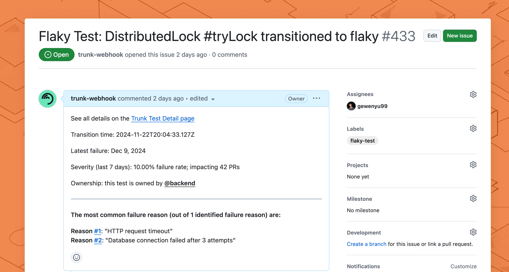
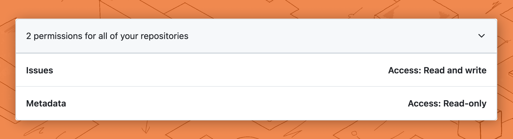

# GitHub Issues Integration

<figure><figcaption><p>GitHub Issue created automatically with webhooks.</p></figcaption></figure>

Trunk allows you to automate GitHub Issue creation through webhooks. This will allow you to create GitHub issues and auto-assign them to [CODEOWNERS](https://docs.github.com/en/repositories/managing-your-repositorys-settings-and-features/customizing-your-repository/about-code-owners) using Webhooks.

This guide will walk you through integrating Trunk Flaky Tests with GitHub Issues through webhooks. You will be able to automatically generate GitHub issues for new flaky or broken tests. This guide should take 15 minutes to complete.



### 1. Create a GitHub Token

Before you can create a webhook to automate GitHub Issue creation, you need to create an API token to authorize your requests.

1. Navigate to GitHub Developer Settings under **Settings** > **Developer settings**
2. Under **Personal access token** > **Fine-grained tokens** > Click **Generate new token**
3. Name the token something like `Trunk Flaky Tests` so you can recognize your token and set it never to expire.
4. Select the repositories you need to create issues to under **Repository access**
5.  Under **Permissions** > **Repository Permissions**, select **Read and Write** access for **Issues.**&#x20;

    <figure><picture><source srcset="../../.gitbook/assets/example-webhook-github-permissions-dark.png" media="(prefers-color-scheme: dark)"></picture><figcaption></figcaption></figure>
6. Click **Generate Token** and copy your API token.

### 2. Add a New Webhook

Trunk uses Svix to integrate with other services, such as GitHub Issues through webhooks.&#x20;

You can create a new endpoint by:

1. Login to [Trunk Flaky Tests](https://app.trunk.io/login/?intent=flaky+tests)
2. From your profile on the top right, navigate to **Settings**
3.  Under **Organization > Webhooks**, click **Automate GitHub Issue Creation**

    <figure><picture><source srcset="../../.gitbook/assets/example-webhook-connector-dark.png" media="(prefers-color-scheme: dark)"></picture><figcaption></figcaption></figure>
4. Paste your GitHub repo's Issues endpoint into **Endpoint URL.** Your **Endpoint URL** should be formatted as: `https://api.github.com/repos/{OWNER}/{REPO}/issues`.  You can verify the URL by visiting it in your browser, such as [https://api.github.com/repos/trunk-io/docs/issues](https://api.github.com/repos/trunk-io/docs/issues).
5. Review the transformation code automatically generated for GitHub issues. You can customize this transformation at any time. Learn more about [customizing transformations](github-issues-integration.md#id-5.-customize-your-transformation).
6. Create the new endpoint. You will be redirected to the endpoint configuration view.

If you're having trouble adding a new webhook endpoint with Svix, please see the [Adding Endpoint docs from Svix](https://docs.svix.com/receiving/using-app-portal/adding-endpoints).

### **3. Add Custom Headers**

The GitHub Issues API requires some custom headers. You can configure custom headers in the endpoint configuration that was set up in step 2:

1. You can add custom headers under **Webhooks > Advanced > Custom Headers.**
2. Fill in the **Key** and **Value** referencing the table below, and click the **+** button to add each header.

You'll need to configure the following headers.&#x20;

| Key                    | Value                         |
| ---------------------- | ----------------------------- |
| `Accept`               | `application/vnd.github+json` |
| `Authorization`        | `Bearer <YOUR_API_TOKEN>`     |
| `X-GitHub-Api-Version` | `2022-11-28`                  |

### 4. Customize Your Transformation

Transformations are custom code snippets you can write to customize the GitHub issues created by the webhook. A working template transformation will be added automatically for your webhook, but you can further customize the behavior of this webhook.

1. In the endpoint configuration view, navigate to the **Advanced** tab. Under **Transformation**, toggle the **Enabled** switch.
2. Click **Edit transformation** to update your transformation code, and click **Save** to update the transformation.
3. You can test the transformation by selecting the `test_case.status_changed` payload and clicking **Run Test**. This will test the transformation but not send a message. You will learn to send a test message in [step 5](github-issues-integration.md#id-5.-test-your-webhook).

The generated webhook template contains several configurable constants out of the box:

<table><thead><tr><th width="346">Constant</th><th>Description</th></tr></thead><tbody><tr><td><code>GITHUB_ISSUE_LABEL_IDS</code></td><td><strong>(Optional)</strong> GitHub labels that will be assigned to issues created by Trunk. </td></tr><tr><td><code>PRS_IMPACTED_THRESHOLD</code></td><td>Issues will be created only for flaky tests that have impacted more PRs than the <code>PRS_IMPACTED_THRESHOLD</code>. <br><br>You can adjust this value if you see many issues about low-impact flaky tests.</td></tr></tbody></table>

Here is the provided transformation for context. You can customize your GitHub Issues integration by following the [GitHub](https://docs.github.com/en/rest/issues/issues?apiVersion=2022-11-28#create-an-issue) and [Svix transformations](https://docs.svix.com/transformations#using-transformations) documentation.&#x20;


```javascript
/**
 * @param webhook the webhook object
 * @param webhook.method destination method. Allowed values: "POST", "PUT"
 * @param webhook.url current destination address
 * @param webhook.eventType current webhook Event Type
 * @param webhook.payload JSON payload
 * @param webhook.cancel whether to cancel dispatch of the given webhook
 */
// IDs of any labels you want added to the GitHub issue.
const GITHUB_ISSUE_LABEL_IDS = [];

// Below are various configs to fine-tune when an issue is created.

// At least this many PRs need to be impacted for an issue to be created.
const PRS_IMPACTED_THRESHOLD = 2;

function handler(webhook) {
  const impacted_prs = webhook.payload.test_case.pull_requests_impacted_last_7d;
  const newStatus = webhook.payload.status_change.current_status.value;

  // Filter for only flaky tests that impact more than the provided threshold
  if (newStatus !== "flaky" || impacted_prs < PRS_IMPACTED_THRESHOLD) {
    webhook.payload = "canceled";
    webhook.cancel = true;
    return webhook;
  }
  webhook.payload = {
    "title":`Flaky Test: ${webhook.payload.test_case.name.substring(0, 25)} transitioned to ${webhook.payload.status_change.current_status.value}`,
    "body": summarizeTestCase(webhook.payload),
    "labels": GITHUB_ISSUE_LABEL_IDS,
    // Uncomment this function for auto asignment
    // "assignees": webhook.payload.test_case.codeowners.map((assignee)=>{
    //     // Strip the `@` symbol from codeowners
    //     return assignee.slice(1)
    // })
  }
  return webhook
}

function summarizeTestCase(payload) {
    const {
        status_change: {
            previous_status
        },
        test_case: {
            name,
            file_path,
            status,
            quarantine,
            repository,
            codeowners,
            failure_rate_last_7d,
            most_common_failures,
            pull_requests_impacted_last_7d,
            ticket,
            html_url
        }
    } = payload;
    // Construct a comprehensive issue body with key details
    const issueBody = `See all details on the [Trunk Test Detail page](${html_url})
 
Transition time: ${status.timestamp}
 
Latest failure: Dec 9, 2024
 
Severity (last 7 days): ${(failure_rate_last_7d * 100).toFixed(2)}% failure rate; impacting ${pull_requests_impacted_last_7d} PRs
 
Ownership: this test is owned by ${(codeowners || ['@unassigned']).join(', ')}

___
__The  most common failure reason (out of ${most_common_failures.length} identified failure reason) are:__

${
  most_common_failures.map((failure, index) => {
    return `**Reason #${index + 1}**: "${failure.summary}" \n`
  })
}
    `
    return issueBody
}
```


#### Automatically Assign Issues with CODEOWNERS

If you have [CODEOWNERS](https://docs.github.com/en/repositories/managing-your-repositorys-settings-and-features/customizing-your-repository/about-code-owners) configured for your GitHub repo, you can create issues with assignees using CODEOWNERS. \
\
You can uncomment the code block on lines 31-35 or use a snippet similar to:

```javascript
"assignees": webhook.payload.test_case.codeowners.map((assignee)=>{
         // Strip the `@` symbol from codeowners
         return assignee.slice(1)
     })
```

#### Limitations of CODEOWNERS

1. CODEOWNERS supports assigning files to teams, but GitHub doesn't support assigning issues to teams. **If you have team owners in your CODEOWNERS file, the requests will fail**.
2. If your code owners do not map 1:1 with GitHub users, you will need to provide your own mapping, or webhooks will fail.
3. The example payload provided for testing has the CODEOWNERS assigned to `@backend`. If you're testing following the instructions in [step 5](github-issues-integration.md#id-5.-test-your-webhook), the delivery attempt can fail.

### 5. Test Your Webhook

You can create test issues by delivering a mock webhook. You can do this by:

1. In the endpoint configuration view, navigate to the **Testing** tab and select a **Send event**
2. Under **Subscribed events,** select `test_case.status_changed`as the event type to send.
3. Click **Send Example** to test your webhook

### 6. Monitoring Webhooks



### Congratulations!

A GitHub Issue will now be created when a test's health status changes. You can further modify your transformation script to customize your issues.&#x20;

[See the Trunk webhook event catalog](https://www.svix.com/event-types/us/org_2eQPL41Ew5XSHxiXZIamIUIXg8H/#test_case.status_changed)

[Learn more about consuming webhooks in the Svix docs](https://docs.svix.com/receiving/introduction)

[Learn more about the GitHub Issues API](https://docs.github.com/en/rest/issues/issues?apiVersion=2022-11-28#create-an-issue)
