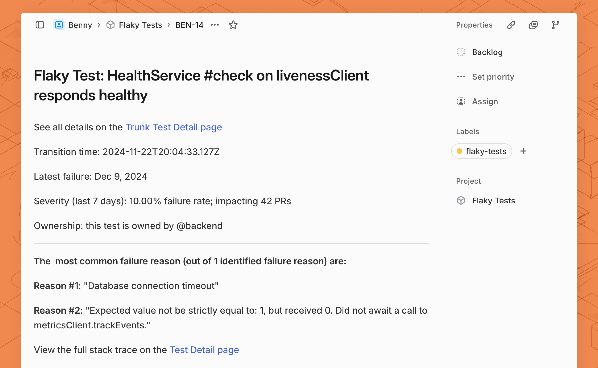

# Linear Integration

Trunk allows you to automate Linear Issue creation through webhooks. This will allow you to create Linear issues and auto-assign according to [CODEOWNERS](https://docs.github.com/en/repositories/managing-your-repositorys-settings-and-features/customizing-your-repository/about-code-owners).

<figure><picture><source srcset="../../.gitbook/assets/example-webhook-linear-dark.png" media="(prefers-color-scheme: dark)"></picture><figcaption></figcaption></figure>

This guide will walk you through integrating Trunk Flaky Tests with Linear Issues through webhooks. You will be able to automatically generate Linear issues for **new flaky tests** found in your repo that **impact more than 2 PRs**. This guide should take 15 minutes to complete.

### 1. Create a Linear Personal Access Token

Before you can create a webhook to automate GitHub Issue creation, you need to create an API token to authorize your requests.

1. In the Linear app, navigate to settings by holding `G` and pressing `S`, or by clicking on your profile on the top left and clicking **Settings**.
2. Under **Account** > **Security & Access** > **Personal API Keys**, Click **New API Key** to create a new access token.
3. Copy the new API key and save it in a secure location. You'll need to use this later.

### 2. Add a New Webhook In Trunk <a href="#id-2.-add-a-webhook-url-to-the-github-issues-api-in-trunk" id="id-2.-add-a-webhook-url-to-the-github-issues-api-in-trunk"></a>

Trunk uses Svix to integrate with other services, such as creating Linear Issues through webhooks.

You can create a new endpoint by:

1. Login to [Trunk Flaky Tests](https://app.trunk.io/login/?intent=flaky+tests)
2. From your profile on the top right, navigate to **Settings**
3.  Under **Organization > Webhooks**, click **Automate Linear Issues Creation.**&#x20;

    <figure><picture><source srcset="../../.gitbook/assets/example-webhook-connector-dark.png" media="(prefers-color-scheme: dark)"></picture><figcaption></figcaption></figure>
4. Paste the Linear GraphQL API endpoint into **Endpoint URL**, which is: `https://api.linear.app/graphql`.
5. Review the transformation code automatically generated for Linear issues, you can customize this transformation at any time. Learn more about [customizing transformations](linear-integration.md#id-5.-customize-your-transformation).
6. Create the new endpoint. You will be redirected to the endpoint configuration view.

If you're having trouble adding a new webhook endpoint with Svix, please see the [Adding Endpoint docs from Svix](https://docs.svix.com/receiving/using-app-portal/adding-endpoints).

### **3. Add Custom Headers**

The Linear GraphQL API requires some custom headers. You can configure custom headers in the endpoint configuration:

1. You can add custom headers under **Webhooks > Advanced > Custom Headers.**&#x20;
2. Fill in the **Key** and **Value** referencing the table below, and click the **+** button to add each header.

You'll need to configure the following headers.&#x20;

| Key             | Value              |
| --------------- | ------------------ |
| `Authorization` | `<YOUR_API_TOKEN>` |

### 4. Find Your Linear Team, Project, and Label IDs

You need to find your Linear team, project, and label IDs to create issues with the appropriate labeling. You can do this by querying your Linear project using cURL.

#### Team ID

First, you'll need to find your team ID so you can create Linear issues under the correct team. You can make a request in your terminal using cURL, or a similar tool.&#x20;

You'll need your Linear API key from [step 1](linear-integration.md#id-1.-create-a-linear-personal-access-token).

```bash
curl \
  -X POST \
  -H "Content-Type: application/json" \
  -H "Authorization: <LINEAR_API_KEY>" \
  --data '{
    "query": "query Teams { teams { nodes { id name } }}"
  }' \
  https://api.linear.app/graphql
```

You will receive a response that contains your team UID, for example:

```json
{
  "data": {
    "teams": {
      "nodes": [
        {
          "id": "9bd0672b-7766-4a7c-3233-8ce37fdbb790",
          "name": "Your Linear Team"
        }
      ]
    }
  }
}
```

#### Project ID

If you want to create issues under a specific project, you'll need to find its project ID. You can use a query like this:

```bash
curl \
  -X POST \
  -H "Content-Type: application/json" \
  -H "Authorization: lin_api_vw3gMdb2NJN9TQ66JCgBKLqNSNY6I8cH5qxwM6EW" \
  --data '{
    "query": "query Projects { projects { nodes { id name } }}"
  }' \
  https://api.linear.app/graphql
```

You'll receive a response that contains your projects and their IDs, for example:

```json
{
  "data": {
    "projects": {
      "nodes": [
        {
          "id": "ef19b35e-ce4f-4132-9705-811d4d6c8c08",
          "name": "Flaky Tests"
        }
      ]
    }
  }
}
```

#### Label ID

If you want to create issues with a specific label, you'll need to find its label ID. You can use a query like this:

```bash
curl \
  -X POST \
  -H "Content-Type: application/json" \
  -H "Authorization: lin_api_vw3gMdb2NJN9TQ66JCgBKLqNSNY6I8cH5qxwM6EW" \
  --data '{
    "query": "query OrgLabels { organization { labels { nodes { id name } } }}"
  }' \
  https://api.linear.app/graphql
```

You'll receive a response that contains your labels and their IDs, for example:

```json
{
  "data": {
    "organization": {
      "labels": {
        "nodes": [
          {
            "id": "e0e9f98e-c90c-40cd-939e-06ff7bd57b45",
            "name": "Feature"
          },
          {
            "id": "ce07d3bd-dee8-4bf6-979e-778dd94f15af",
            "name": "Bug"
          },
          {
            "id": "536dd774-dc33-4e70-aecc-8b00d1f04a9d",
            "name": "Improvement"
          },
          ...
        ]
      }
    }
  }
}
```

### 5. Customize Your Transformation

Transformations are custom code snippets you can write to customize the Linear issues created by the webhook. A working template transformation will be added automatically for your webhook, but you can further customize the behavior of this webhook.

1. In the endpoint configuration view, navigate to the **Advanced** tab. Under **Transformation**, toggle the **Enabled** switch.
2. Click **Edit transformation** to update your transformation code, and click **Save** to update the transformation.
3. You can test the transformation by selecting the `test_case.status_changed` payload and clicking **Run Test**. This will test the transformation but not send a message. You will learn to send a test message[ in step 6](linear-integration.md#id-6.-test-your-webhook).

The generated webhook template contains several configurable constants out of the box:

<table><thead><tr><th width="346">Constant</th><th>Description</th></tr></thead><tbody><tr><td><code>LINEAR_TEAM_ID</code></td><td>(<strong>Required)</strong> Your Linear team ID. <a href="linear-integration.md#team-id">Learn about finding your team ID</a>.</td></tr><tr><td><code>LINEAR_PROJECT_ID</code></td><td><strong>(Optional)</strong> The Linear project ID assigned to new issues. <a href="linear-integration.md#project-id">Learn more about finding your project ID</a>.</td></tr><tr><td><code>LINEAR_LABEL_IDS</code></td><td>(<strong>Optional)</strong> Array of label IDs assigned to new issues. <a href="linear-integration.md#team-id">Learn about finding your l</a><a href="linear-integration.md#label-id">abel IDs</a>.</td></tr><tr><td><code>PRS_IMPACTED_THRESHOLD</code></td><td>Issues will be created only for flaky tests that have impacted more PRs than the <code>PRS_IMPACTED_THRESHOLD</code>. <br><br>You can adjust this value if you see many issues about low-impact flaky tests.</td></tr></tbody></table>

Here is the provided transformation for context. You can customize your Linear Issues integration by following the[ Linear API](https://studio.apollographql.com/public/Linear-API/variant/current/schema/reference) and [Svix transformations](https://docs.svix.com/transformations#using-transformations) documentation.&#x20;

```javascript
/**
 * @param webhook the webhook object
 * @param webhook.method destination method. Allowed values: "POST", "PUT"
 * @param webhook.url current destination address
 * @param webhook.eventType current webhook Event Type
 * @param webhook.payload JSON payload
 * @param webhook.cancel whether to cancel dispatch of the given webhook
 */

// Your Linear Team ID from step 3 above. This is required!
const LINEAR_TEAM_ID = "";
// The Linear project ID you want issues assigned to from step 3 above. Optional.
const LINEAR_PROJECT_ID = "";
// IDs of any labels you want added to the linear issue. Optional.
const LINEAR_LABEL_IDS = [];

// Below are various configs to fine-tune when an issue is created.

// At least many PRs need to be impacted for an issue to be created.
const PRS_IMPACTED_THRESHOLD = 2;

function handler(webhook) {
  const impacted_prs = webhook.payload.test_case.pull_requests_impacted_last_7d;
  const newStatus = webhook.payload.status_change.current_status.value;

  const resolvedProjectId = LINEAR_PROJECT_ID ? `"${LINEAR_PROJECT_ID}"` : undefined;
  const resolvedLinearLabels = LINEAR_LABEL_IDS.map((id) => `"${id}"`).join(",");

  // Filter for only flaky tests that impact more than the provided threshold
  if (newStatus !== "flaky" || impacted_prs < PRS_IMPACTED_THRESHOLD) {
    webhook.payload = "canceled";
    webhook.cancel = true;
    return webhook;
  }

  const description = summarizeTestCase(webhook.payload);

  // modify the webhook object...
  webhook.payload = {query: `mutation IssueCreate {
    issueCreate(
      input: {
        title: "Flaky Test: ${webhook.payload.test_case.name}"
        description: """${description}"""
        teamId: "${LINEAR_TEAM_ID}"
        projectId: ${resolvedProjectId}
        labelIds: [${resolvedLinearLabels}]
      }
    ) {
      success
      issue {
        id
        title
      }
    }
  } ` };
  return webhook;
}

function summarizeTestCase(payload) {
    const {
        status_change: {
            previous_status
        },
        test_case: {
            name,
            file_path,
            status,
            quarantine,
            repository,
            codeowners,
            failure_rate_last_7d,
            most_common_failures,
            pull_requests_impacted_last_7d,
            ticket,
            html_url
        }
    } = payload;
    // Construct a comprehensive issue body with key details
    const issueBody = `See all details on the [Trunk Test Detail page](${html_url})
 
Transition time: ${status.timestamp}
 
Latest failure: Dec 9, 2024
 
Severity (last 7 days): ${(failure_rate_last_7d * 100).toFixed(2)}% failure rate; impacting ${pull_requests_impacted_last_7d} PRs
 
Ownership: this test is owned by ${(codeowners || ['@unassigned']).join(', ')}

___
__The  most common failure reason (out of ${most_common_failures.length} identified failure reason) are:__

${
  most_common_failures.map((failure, index) => {
    return `**Reason #${index + 1}**: "${failure.summary}" \n`
  })
}

View the full stack trace on the [Test Detail page](${html_url})
    `
    return issueBody
}
```

#### (Optional) Automatic Issue Assignment

If you have CODEOWNERS configured in your repo, it will be reported by Trunk in the webhook payload. You can use this to map different CODEOWNERS to Linear assignees. You can access CODEOWNERS in the payload like this: `webhook.payload.test_case.codeowners`.

Since the way your owners map to your Linear user is unique to your team, you'll need to provide your own mapping to convert code owners to their **Linear ID**.

You can modify your issue create payload like this to include an assignee:

```javascript
webhook.payload = {query: `mutation IssueCreate {
    issueCreate(
      input: {
        title: "Flaky Test: ${webhook.payload.test_case.name}"
        description: """${description}"""
        teamId: "<YOUR_TEAM_ID>"
        projectId: "<YOUR_PROJECT_ID>"
        labelIds: ["<YOUR_LABEL_ID>"]
        // Add you assignee here:
        assigneeId: "<ASSIGNEE_ID>"
      }
    ) {
      success
      issue {
        id
        title
      }
    }
  } ` };
```

### 6. Test Your Webhook

You can create test issues by delivering a mock webhook. You can do this by:

1. In the endpoint configuration view, navigate to the **Testing** tab and select a **Send event**
2. Under **Subscribed events,** select `test_case.status_changed`as the event type to send
3. Click **Send Example** to test your webhook

### 7. Monitoring Webhooks



### Congratulations!

A Linear Issue will now be created when a test's health status changes to **flaky** and **impacts more than 2 PRs**. You can further modify your transformation script to customize your issues.&#x20;

[See the Trunk webhook event catalog](https://www.svix.com/event-types/us/org_2eQPL41Ew5XSHxiXZIamIUIXg8H/#test_case.status_changed)

[Learn more about consuming webhooks in the Svix docs](https://docs.svix.com/receiving/introduction)

[Learn more about Linear's API](https://developers.linear.app/docs/graphql/working-with-the-graphql-api)
