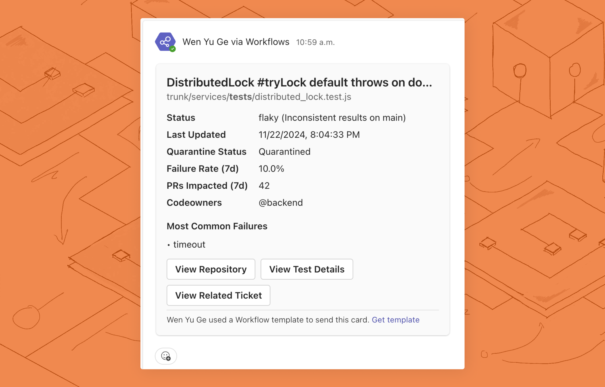
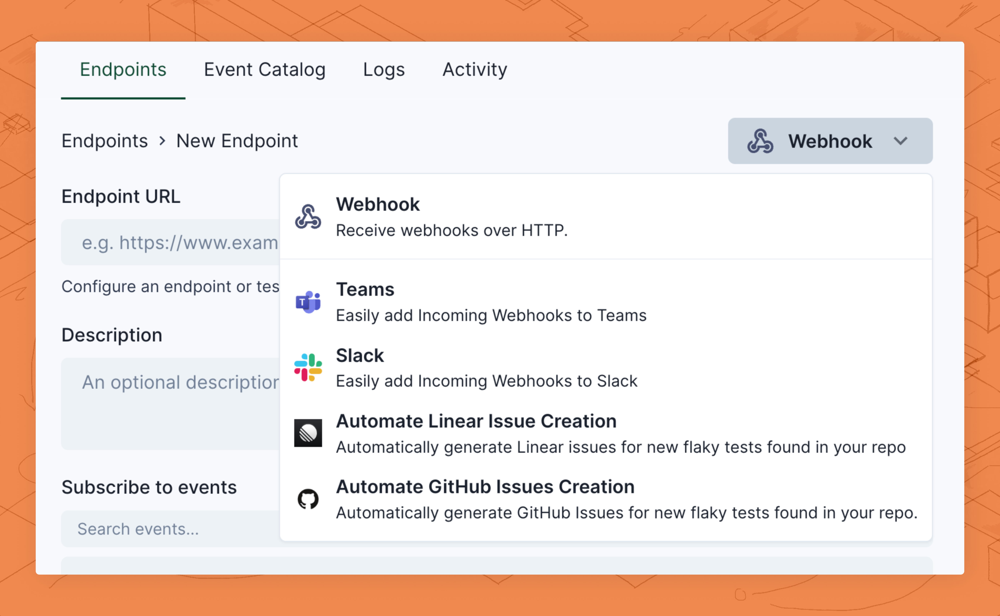

# Microsoft Teams Integration

Trunk allows you to create custom workflows to send customized messages to Microsoft Teams channels through webhooks.&#x20;

<figure><picture><source srcset="../../.gitbook/assets/example-slack-message-dark.png" media="(prefers-color-scheme: dark)"></picture><figcaption></figcaption></figure>

This guide will walk you through sending Microsoft Teams messages using event-triggered webhooks. By the end of this tutorial, you'll receive Microsoft Teams messages for test status changes. This guide should take 10 minutes to complete.

### 1. Configure Incoming Webhooks For Your Team

Microsoft has two different concepts for accepting incoming webhooks. **Connectors** that are being deprecated and **Workflows** that are for newly created teams. This guide is for the newer **Workflows**. The workflow for configuring webhooks is similar, but you may see small differences. You can find more about the soon to be deprecated connectors in [Microsoft's documentation](https://learn.microsoft.com/en-us/microsoftteams/platform/webhooks-and-connectors/how-to/add-incoming-webhook?tabs=newteams%2Cdotnet).

1. Open the team in which you want to add the webhook and select the kebab menu (•••) from the upper-right corner.
2. Select **Workflows** from the dropdown menu.
3. Search for `Post to a channel when a webhook request is received`, select the workflow, then click **Next**.&#x20;
4. Configure the workflow's **Microsoft Teams Team** and **Microsoft Teams Channel**, then click **Add workflow**.&#x20;
5. When the workflow is added correctly, you can copy the URL displayed, then click **Done.**

### 2. Add a New Webhook

Trunk uses Svix to integrate with other services, such as Microsoft Teams messages through webhooks.&#x20;

You can create a new endpoint by:

1. Login to [Trunk Flaky Tests](https://app.trunk.io/login?intent=flaky%20tests)
2. From your profile on the top right, navigate to **Settings**
3.  Under **Organization > Webhooks**, click **Teams**

    <figure><picture><source srcset="../../.gitbook/assets/example-webhook-connector-dark.png" media="(prefers-color-scheme: dark)"></picture><figcaption></figcaption></figure>
4. Paste your Microsoft Teams Workflow URL from [the previous step ](microsoft-teams-integration.md#id-1.-configure-incoming-webhooks-for-your-team)into **Endpoint URL**.
5. Review the transformation code automatically generated for Teams messages. You can customize this transformation at any time. Learn more about [customizing transformations](microsoft-teams-integration.md#id-3.-customize-your-transformation).
6. Create the new endpoint. You will be redirected to the endpoint configuration view.

### 3. Customize Your Transformation

Transformations are custom code snippets you can write to customize the Microsoft Teams messages created by the webhook. A working template transformation will be added automatically for your webhook, but you can further customize the behavior of this webhook.

1. In the endpoint configuration view, navigate to the **Advanced** tab. Under **Transformation**, toggle the **Enabled** switch.
2. Click **Edit transformation** to update your transformation code, and click **Save** to update the transformation.
3. You can test the transformation by selecting the `test_case.status_changed` payload and clicking **Run Test**. This will test the transformation but not send a message. You will learn to send a test message in [step 4](microsoft-teams-integration.md#id-4.-test-your-webhook).

Below is an example of a webhook transformation to format the messages as [Actionable Messages](https://learn.microsoft.com/en-us/microsoftteams/platform/webhooks-and-connectors/how-to/connectors-using?tabs=cURL%2Ctext1). If you're having trouble adding a new webhook endpoint with Svix, please see the [Adding Endpoint docs from Svix](https://docs.svix.com/receiving/using-app-portal/adding-endpoints).

```javascript
/**
 * @param webhook the webhook object
 * @param webhook.method destination method. Allowed values: "POST", "PUT"
 * @param webhook.url current destination address
 * @param webhook.eventType current webhook Event Type
 * @param webhook.payload JSON payload
 * @param webhook.cancel whether to cancel dispatch of the given webhook
 */
function handler(webhook) {
  // See https://learn.microsoft.com/en-us/microsoftteams/platform/webhooks-and-connectors/how-to/connectors-using#send-adaptive-cards-using-an-incoming-webhook
  webhook.payload = summarizeTestCase(webhook.payload);

  return webhook;
}

function summarizeTestCase(payload) {
    if (!payload || typeof payload !== 'object' || !payload.test_case) {
        return {
            type: "message",
            attachments: [{
                contentType: "application/vnd.microsoft.card.adaptive",
                contentUrl: null,
                content: {
                    $schema: "http://adaptivecards.io/schemas/adaptive-card.json",
                    type: "AdaptiveCard",
                    version: "1.2",
                    body: [{
                        type: "TextBlock",
                        text: "Error: Invalid or missing payload received by Trunk Flaky Test Webhook Transformation.",
                        color: "attention"
                    }]
                }
            }]
        };
    }

    const {
        test_case: {
            name = "N/A",
            file_path = "N/A",
            status = {},
            quarantine = false,
            repository = {},
            codeowners = [],
            failure_rate_last_7d = 0,
            most_common_failures = [],
            pull_requests_impacted_last_7d = 0,
            ticket = {},
            html_url = "N/A"
        }
    } = payload;

    const statusTimestamp = status.timestamp 
        ? new Date(status.timestamp).toLocaleString()
        : "Unknown";

    const failureBlocks = most_common_failures.map(failure => ({
        type: "TextBlock",
        text: `• ${failure.summary}`,
        wrap: true,
        spacing: "small"
    }));

    return {
        type: "message",
        attachments: [{
            contentType: "application/vnd.microsoft.card.adaptive",
            contentUrl: null,
            content: {
                $schema: "http://adaptivecards.io/schemas/adaptive-card.json",
                type: "AdaptiveCard",
                version: "1.2",
                body: [
                    {
                        type: "TextBlock",
                        text: name,
                        size: "large",
                        weight: "bolder"
                    },
                    {
                        type: "TextBlock",
                        text: file_path,
                        isSubtle: true,
                        spacing: "none"
                    },
                    {
                        type: "FactSet",
                        facts: [
                            {
                                title: "Status",
                                value: `${status.value || "Unknown"} (${status.reason?.trim() || "N/A"})`
                            },
                            {
                                title: "Last Updated",
                                value: statusTimestamp
                            },
                            {
                                title: "Quarantine Status",
                                value: quarantine ? "Quarantined" : "Not Quarantined"
                            },
                            {
                                title: "Failure Rate (7d)",
                                value: `${(failure_rate_last_7d * 100).toFixed(1)}%`
                            },
                            {
                                title: "PRs Impacted (7d)",
                                value: pull_requests_impacted_last_7d.toString()
                            },
                            {
                                title: "Codeowners",
                                value: codeowners.join(", ") || "None"
                            }
                        ]
                    },
                    {
                        type: "TextBlock",
                        text: "Most Common Failures",
                        weight: "bolder",
                        spacing: "medium"
                    },
                    ...failureBlocks,
                    {
                        type: "ActionSet",
                        actions: [
                            {
                                type: "Action.OpenUrl",
                                title: "View Repository",
                                url: repository.html_url || "#"
                            },
                            {
                                type: "Action.OpenUrl",
                                title: "View Test Details",
                                url: html_url || "#"
                            },
                            {
                                type: "Action.OpenUrl",
                                title: "View Related Ticket",
                                url: ticket.html_url || "#"
                            }
                        ]
                    }
                ]
            }
        }]
    };
}
```

### 4. Test Your Webhook

You can send test messages to your Microsoft Teams channels as you make updates. You can do this by:

1. In the endpoint configuration view, navigate to the **Testing** tab and select a **Send event**
2. Under **Subscribed events,** select `test_case.status_changed`as the event type to send.
3. Click **Send Example** to test your webhook

### 5. Monitoring Webhooks



### Congratulations!

You should now receive notifications in your Teams channel when a test's status changes. You can further modify your transformation script to customize your messages.&#x20;

<figure><picture><source srcset="../../.gitbook/assets/example-slack-message-dark.png" media="(prefers-color-scheme: dark)"></picture><figcaption></figcaption></figure>

[See the Trunk webhook event catalog](https://www.svix.com/event-types/us/org_2eQPL41Ew5XSHxiXZIamIUIXg8H/#test_case.status_changed)

[Learn more about consuming webhooks in the Svix docs](https://docs.svix.com/receiving/introduction)

[Learn more about Microsoft Teams Workflow Webhooks](https://support.microsoft.com/en-us/office/create-incoming-webhooks-with-workflows-for-microsoft-teams-8ae491c7-0394-4861-ba59-055e33f75498)
