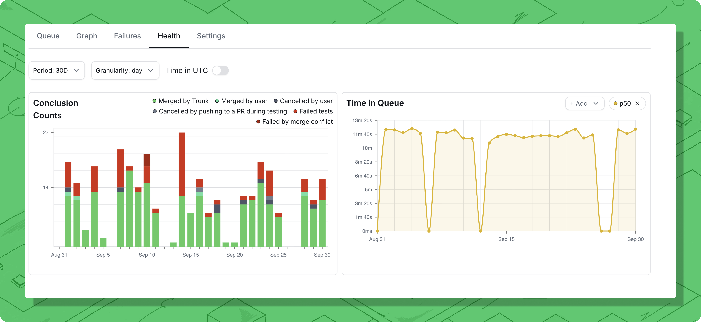

# Metrics and monitoring

The Metrics and Monitoring dashboard provides deep analytics on your merge queue's performance, helping you identify bottlenecks, measure improvements, and optimize your workflow.

Your merge experience directly impacts the velocity and productivity of your development team. Merge Queue Metrics provides observability for the **health** of your Trunk Merge Queue, so you can discover issues early and make informed optimizations.

<figure><figcaption>
The Health tab showing metrics in the Trunk Web App.
</figcaption></figure>

### Access metrics

You can access the metrics in your Trunk Merge Queue by navigating to the **Merge Queue** > **Health** tab.


CI Time and CI Jobs Triggered charts are only available for **GitHub Actions**.


### Filter Metrics by Impacted Targets

When running in Parallel Mode, you can filter your merge queue health metrics by impacted targets to analyze performance for specific parts of your codebase.

<figure><figcaption></figcaption></figure>

#### Why Filter by Impacted Targets?

In repositories with multiple teams or distinct components (like a TypeScript/Python monorepo), different parts of your codebase may have different merge characteristics. Filtering by impacted targets helps you:

* **Analyze team-specific performance** - See how PRs from different teams move through the queue
* **Identify bottlenecks by component** - Determine if certain targets have slower merge times
* **Optimize strategically** - Focus queue configuration improvements on your highest-priority code paths
* **Demonstrate value** - Show engineering leadership how parallel mode benefits specific teams or projects
* **Ensure fairness** - Verify that all teams experience similar queue performance

#### How to Use the Filter

1. Navigate to **Merge Queue** > your repository > **Health** tab in the Trunk web app
2. Locate the **Impacted Targets** filter dropdown at the top of the metrics dashboard
3. Select one or more targets to filter by:
   * **All Targets** (default) - Shows aggregate metrics across all PRs
   * **Specific target names** - Shows metrics only for PRs affecting that target (e.g., `frontend`, `backend`, `//services/api`)
4. All charts and metrics on the page will update to reflect only PRs impacting the selected targets

#### Understanding the Data

**Impacted targets are set when a PR enters the queue**

Each PR's impacted targets are calculated based on which files changed and which parts of your codebase are affected. For details on how impacted targets are computed, see [Parallel Queues - Impacted Targets](../optimizations/parallel-queues/#posting-impacted-targets-from-your-pull-requests).

**PRs can affect multiple targets**

A PR that changes both frontend and backend code will be counted in metrics when filtering by either `frontend` OR `backend`. This means the numbers may not sum to 100% when viewing multiple target filters separately.

**"All Targets" shows aggregate performance**

Selecting "All Targets" displays metrics for every PR, regardless of which targets it impacts. This is the default view and shows overall queue health.

#### Requirements

**Parallel Mode must be enabled**

Impacted target filtering is only available when your merge queue is running in Parallel Mode. Repositories in Single Mode do not track impacted targets.

**Impacted targets must be uploaded**

Your CI workflow must calculate and upload impacted targets for each PR. See the Parallel Queues documentation for setup instructions using:

* Bazel
* Nx
* Custom build systems

### Time buckets

The date ranges selector at the top left of the dashboard allows you to filter the data displayed by date and time. You can display time buckets by the day or hour in the day/hour dropdown.

The metrics displayed only include data that have **completed within the time range**, jobs started but not completed during the selected time **will not be displayed**.


When working across multiple time zones, enable **Time in UTC** to ensure everyone sees the same data.


### Conclusion bount

Conclusion count displays the number of pull requests that exited the merge queue during each time bucket. This includes passes, failures, and cancellations. Passes and failures signal a PR that was tested in the queue to completion, while canceled signals that the request to merge terminated before testing finished or before testing began.

Conclusion counts are an important signal to potential bottlenecks or underlying issues with your merging process, as a failure or cancellation in the merge queue can force other PRs to **restart their testing**. A spike in the number of failures or passes can indicate a potential problem to investigate.

Conclusions are tagged with a reason to give further insights into how merges pass or fail in the queue. You can show or hide conclusions of a particular reason by using the **+ Add** button.

<table><thead><tr><th width="167">Category</th><th width="248">Reason</th><th>Description</th></tr></thead><tbody><tr><td>✅ Pass</td><td>Merged by Trunk</td><td>Passed all tests in Merge Queue and merged by Trunk</td></tr><tr><td>✅ Pass</td><td>Merged manually</td><td>User manually merged the PR in Git</td></tr><tr><td>❌ Failure</td><td>Test run timeout</td><td>User-defined timeout for tests exceeded</td></tr><tr><td>❌ Failure</td><td>Failed Tests</td><td>Required test failed while testing the PR in the merge queue</td></tr><tr><td>❌ Failure</td><td>Merge conflict</td><td>A (git) merge conflict encountered</td></tr><tr><td>❌ Failure</td><td>Config parsing failure</td><td>Malformed <code>trunk.yaml</code> that couldn't be parsed</td></tr><tr><td>❌ Failure</td><td>Config bad version</td><td>Invalid version field in <code>trunk.yaml</code></td></tr><tr><td>❌ Failure</td><td>Config bad required statuses</td><td>Failed to parse required statuses in <code>trunk.yaml</code></td></tr><tr><td>❌ Failure</td><td>No required statuses</td><td>No source for required tests was found in <code>trunk.yaml</code> or branch protection settings</td></tr><tr><td>❌ Failure</td><td>GitHub API Failed</td><td>GitHub returned an error to us that could not be resolved while processing the PR</td></tr><tr><td>❌ Failure</td><td>PR updated at merge time</td><td>PR updated as Trunk was attempting to merge it</td></tr><tr><td>🚫 Cancel</td><td>Canceled by user</td><td>PR explicitly canceled by user</td></tr><tr><td>🚫 Cancel</td><td>PR closed</td><td>PR closed (not merged)</td></tr><tr><td>🚫 Cancel</td><td>PR pushed to</td><td>New commits pushed to the PR branch while in the merge queue</td></tr><tr><td>🚫 Cancel</td><td>PR draft</td><td>PR was converted to a draft, which cannot be merged</td></tr><tr><td>🚫 Cancel</td><td>PR base branch changed</td><td>Base branch of PR in the merge queue changed</td></tr><tr><td>🚫 Cancel</td><td>Admin requested</td><td>Trunk employee canceled PR during a support session (extreme cases)</td></tr></tbody></table>

### Time in queue

Time in queue shows how long each PR spends in the Merge Queue from the moment the PR enters the queue to the moment when it exits the queue, either from merging, failing, or being canceled.

Understanding the amount of time a pull request spends in the queue is important for ensuring your merge process continues to ship code quickly. A spike in the time to merge indicates a slowdown somewhere that's impacting all developers. For example, it's taking longer to run tests on PRs, PRs are waiting too long to start testing, or constant failures in the queue are causing PRs to take longer to merge

The time in queue can be displayed as different statistical measures. You can show or hide them by using the **+ Add** button.

| Measure | Explanation                                         |
| ------- | --------------------------------------------------- |
| Average | Average of all time in queue during the time bucket |
| Minimum | The shortest time in queue in the time bucket.      |
| Maximum | The longest time in queue in the time bucket.       |
| Sum     | The total of all time in queue added together.      |
| P50     | The value below 50% of the time in queue falls.     |
| P95     | The value below 95% of the time in queue falls.     |
| P99     | The value below 99% of the time in queue falls.     |
