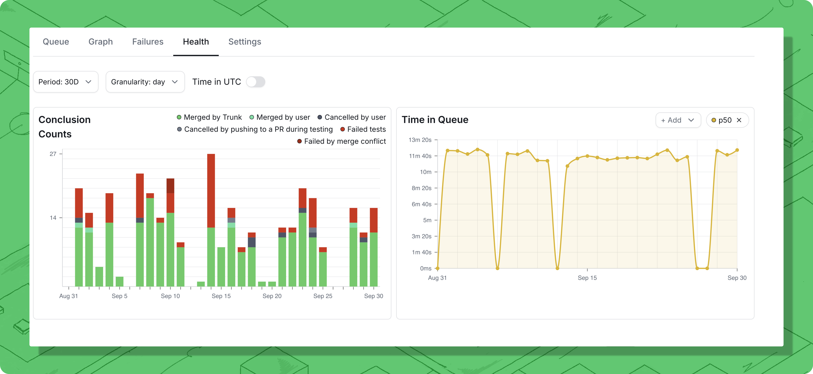
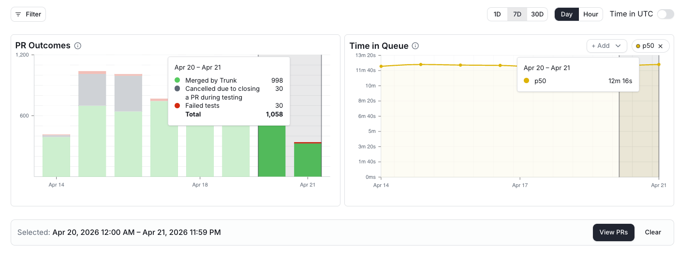
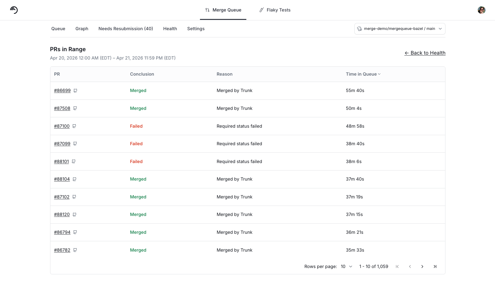

# Metrics and monitoring

The Metrics and Monitoring dashboard provides deep analytics on your merge queue's performance, helping you identify bottlenecks, measure improvements, and optimize your workflow.

Your merge experience directly impacts the velocity and productivity of your development team. Merge Queue Metrics provides observability for the **health** of your Trunk Merge Queue, so you can discover issues early and make informed optimizations.

<figure><figcaption><p>The Health tab showing metrics in the Trunk Web App.</p></figcaption></figure>

### Access metrics

You can access the metrics in your Trunk Merge Queue by navigating to the **Merge Queue** > **Health** tab.


CI Time and CI Jobs Triggered charts are only available for **GitHub Actions**.


### Filter Metrics by Impacted Targets

When running in Parallel Mode, you can filter your merge queue health metrics by impacted targets to analyze performance for specific parts of your codebase.

<figure><figcaption></figcaption></figure>

#### Why Filter by Impacted Targets?

In repositories with multiple teams or distinct components (like a TypeScript/Python monorepo), different parts of your codebase may have different merge characteristics. Filtering by impacted targets helps you:

* **Analyze team-specific performance** - See how PRs from different teams move through the queue
* **Identify bottlenecks by component** - Determine if certain targets have slower merge times
* **Optimize strategically** - Focus queue configuration improvements on your highest-priority code paths
* **Demonstrate value** - Show engineering leadership how parallel mode benefits specific teams or projects
* **Check fairness** - Verify that all teams experience similar queue performance

#### How to Use the Filter

1. Navigate to **Merge Queue** > your repository > **Health** tab in the Trunk web app
2. Locate the **Impacted Targets** filter dropdown at the top of the metrics dashboard
3. Select one or more targets to filter by:
   * **All Targets** (default) - Shows aggregate metrics across all PRs
   * **Specific target names** - Shows metrics only for PRs affecting that target (e.g., `frontend`, `backend`, `//services/api`)
4. All charts and metrics on the page will update to reflect only PRs impacting the selected targets

#### Understanding the Data

**Impacted targets are set when a PR enters the queue**

Each PR's impacted targets are calculated based on which files changed and which parts of your codebase are affected. For details on how impacted targets are computed, see [Parallel Queues - Impacted Targets](../optimizations/parallel-queues/#posting-impacted-targets-from-your-pull-requests).

**PRs can affect multiple targets**

A PR that changes both frontend and backend code will be counted in metrics when filtering by either `frontend` OR `backend`. This means the numbers may not sum to 100% when viewing multiple target filters separately.

**"All Targets" shows aggregate performance**

Selecting "All Targets" displays metrics for every PR, regardless of which targets it impacts. This is the default view and shows overall queue health.

#### Requirements

**Parallel Mode must be enabled**

Impacted target filtering is only available when your merge queue is running in Parallel Mode. Repositories in Single Mode do not track impacted targets.

**Impacted targets must be uploaded**

Your CI workflow must calculate and upload impacted targets for each PR. See the Parallel Queues documentation for setup instructions using:

* Bazel
* Nx
* Custom build systems

### Time buckets

The date ranges selector at the top left of the dashboard allows you to filter the data displayed by date and time. You can display time buckets by the day or hour in the day/hour dropdown.

The metrics displayed only include data that have **completed within the time range**, jobs started but not completed during the selected time **will not be displayed**.


When working across multiple time zones, enable **Time in UTC** so everyone sees the same data.


### Conclusion count

Conclusion count displays the number of pull requests that exited the merge queue during each time bucket. This includes passes, failures, and cancellations. Passes and failures signal a PR that was tested in the queue to completion, while canceled signals that the request to merge terminated before testing finished or before testing began.

Conclusion counts are an important signal to potential bottlenecks or underlying issues with your merging process, as a failure or cancellation in the merge queue can force other PRs to **restart their testing**. A spike in the number of failures or passes can indicate a potential problem to investigate.

Conclusions are tagged with a reason to give further insights into how merges pass or fail in the queue. You can show or hide conclusions of a particular reason by using the **+ Add** button.

<table><thead><tr><th width="167">Category</th><th width="248">Reason</th><th>Description</th></tr></thead><tbody><tr><td>✅ Pass</td><td>Merged by Trunk</td><td>Passed all tests in Merge Queue and merged by Trunk</td></tr><tr><td>✅ Pass</td><td>Merged manually</td><td>User manually merged the PR in Git</td></tr><tr><td>❌ Failure</td><td>Test run timeout</td><td>User-defined timeout for tests exceeded</td></tr><tr><td>❌ Failure</td><td>Failed Tests</td><td>Required test failed while testing the PR in the merge queue</td></tr><tr><td>❌ Failure</td><td>Merge conflict</td><td>A (git) merge conflict encountered</td></tr><tr><td>❌ Failure</td><td>Config parsing failure</td><td>Malformed <code>trunk.yaml</code> that couldn't be parsed</td></tr><tr><td>❌ Failure</td><td>Config bad version</td><td>Invalid version field in <code>trunk.yaml</code></td></tr><tr><td>❌ Failure</td><td>Config bad required statuses</td><td>Failed to parse required statuses in <code>trunk.yaml</code></td></tr><tr><td>❌ Failure</td><td>No required statuses</td><td>No source for required tests was found in <code>trunk.yaml</code> or branch protection settings</td></tr><tr><td>❌ Failure</td><td>GitHub API Failed</td><td>GitHub returned an error to us that could not be resolved while processing the PR</td></tr><tr><td>❌ Failure</td><td>PR updated at merge time</td><td>PR updated as Trunk was attempting to merge it</td></tr><tr><td>🚫 Cancel</td><td>Canceled by user</td><td>PR explicitly canceled by user</td></tr><tr><td>🚫 Cancel</td><td>PR closed</td><td>PR closed (not merged)</td></tr><tr><td>🚫 Cancel</td><td>PR pushed to</td><td>New commits pushed to the PR branch while in the merge queue</td></tr><tr><td>🚫 Cancel</td><td>PR draft</td><td>PR was converted to a draft, which cannot be merged</td></tr><tr><td>🚫 Cancel</td><td>PR base branch changed</td><td>Base branch of PR in the merge queue changed</td></tr><tr><td>🚫 Cancel</td><td>Admin requested</td><td>Trunk employee canceled PR during a support session (extreme cases)</td></tr><tr><td>🚫 Cancel</td><td>A PR in the stack had its base branch changed</td><td>A member of the PR stack had its base branch changed while in the queue (stacked PRs only)</td></tr><tr><td>🚫 Cancel</td><td>A PR in a PR stack was closed</td><td>A member of the PR stack was closed while in the queue (stacked PRs only)</td></tr><tr><td>🚫 Cancel</td><td>PR was merged as part of a different stack</td><td>The PR was already merged through a different stack (stacked PRs only)</td></tr><tr><td>🚫 Cancel</td><td>Part of this PR's stack was pushed to</td><td>New commits were pushed to a PR in the stack while in the queue (stacked PRs only)</td></tr></tbody></table>

### Time in queue

Time in queue shows how long each PR spends in the Merge Queue from the moment the PR enters the queue to the moment when it exits the queue, either from merging, failing, or being canceled.

Understanding the amount of time a pull request spends in the queue is important for ensuring your merge process continues to ship code quickly. A spike in the time to merge indicates a slowdown somewhere that's impacting all developers. For example, it's taking longer to run tests on PRs, PRs are waiting too long to start testing, or constant failures in the queue are causing PRs to take longer to merge

The time in queue can be displayed as different statistical measures. You can show or hide them by using the **+ Add** button.

| Measure | Explanation                                         |
| ------- | --------------------------------------------------- |
| Average | Average of all time in queue during the time bucket |
| Minimum | The shortest time in queue in the time bucket.      |
| Maximum | The longest time in queue in the time bucket.       |
| Sum     | The total of all time in queue added together.      |
| P50     | The value below 50% of the time in queue falls.     |
| P95     | The value below 95% of the time in queue falls.     |
| P99     | The value below 99% of the time in queue falls.     |

### Drill Down Into Metrics

From the **Conclusion count** and **Time in queue** charts, you can drill into any point or window on the graph to see the exact pull requests that made up those numbers.

#### Why Drill Down?

Aggregated charts tell you _that_ something happened — drilling down tells you _which PRs_ caused it. This makes it easy to:

* **Track down outliers** — if the P99 on Time in queue spikes, drill into that bucket to find the specific PR that dragged the tail out.
* **Investigate failure spikes** — click a bar on Conclusion count where failures jumped and see exactly which PRs failed and why.
* **Audit a time window** — pull the full list of PRs merged, failed, or canceled during an incident window or release cut.
* **Answer one-off questions** — "which PRs merged between 2pm and 4pm yesterday?" without writing a query against the Prometheus endpoint.

#### Select Data Points

You have two ways to select:

* **Click a single data point** to see the PRs in that time bucket.
* **Click and drag across the chart** to select a range of data points spanning multiple time buckets.

Once a selection is made, a **View PRs** button appears. Click it to open the list of PRs that make up the selection.

<figure><figcaption><p>The View PRs button appears after selecting a data point or range.</p></figcaption></figure>

#### Review the PR List

The PR list page shows every PR included in your selection, along with:

* **Conclusion** — whether the PR merged, failed, or was cancelled.
* **Reason** — the specific cause behind the conclusion (for example, Merged by Trunk, Required status failed, PR closed). See the [Conclusion count](#conclusion-count) table for the full list.
* **Time in queue** — how long the PR spent in the merge queue from entry to exit.

Both columns are sortable, so you can quickly surface the longest-running PRs in a window or group all failures of the same type together.

<figure><figcaption><p>The drill-down PR list, sortable by conclusion and time in queue.</p></figcaption></figure>


Drill down is currently available on the Conclusion count and Time in queue charts. Additional Health charts will support the same interaction as they land in the UI.


***

### Prometheus metrics endpoint

Trunk exposes merge queue metrics in [Prometheus text exposition format](https://prometheus.io/docs/instrumenting/exposition_formats/) via a scrapable API endpoint. Use this to build custom Grafana dashboards, set up alerts, or integrate merge queue health into your existing observability stack.


The Prometheus metrics endpoint is available to all Merge Queue users.


#### Endpoint

```
GET https://api.trunk.io/v1/getMergeQueueMetrics
```

Authenticate with your [Trunk API token](../../setup-and-administration/apis/#authentication) using the `x-api-token` header.

**Query parameters:**

| Parameter | Required | Description |
| --- | --- | --- |
| `repo` | No | Repository in `owner/name` format (e.g., `my-org/my-repo`). If omitted, returns metrics for all repositories in the organization. Must be provided together with `repoHost`. |
| `repoHost` | Conditional | Repository host (e.g., `github.com`). Required if `repo` is specified. |

The response uses content type `text/plain; version=0.0.4; charset=utf-8` (standard Prometheus format).

#### Available metrics

All metrics include these labels:

| Label | Description | Example values |
| --- | --- | --- |
| `repo` | Repository name | `my-org/my-repo` |
| `branch` | Base branch name | `main`, `develop` |
| `queue_type` | Queue type | `main` or `bisection` |

##### Point-in-time gauges

These metrics reflect the current state of your merge queue.

| Metric | Type | Description |
| --- | --- | --- |
| `mq_depth_current` | Gauge | Number of PRs currently in the queue (excludes PRs that are waiting to be mergeable before being admitted to the queue) |
| `mq_awaiting_mergeability` | Gauge | Number of PRs waiting for prerequisites like required reviews or status checks |
| `mq_testing_slots_active` | Gauge | Number of PRs currently in TESTING state (active CI slots in use) |

##### Rolling 1-hour window metrics

These metrics summarize activity over a sliding 1-hour window. They update continuously as the window advances.

| Metric | Type | Extra labels | Description |
| --- | --- | --- | --- |
| `mq_pr_conclusions_1h_total` | Gauge | `conclusion` (merged, failed, cancelled) | PRs that exited the queue in the last hour |
| `mq_pr_restarts_1h_total` | Gauge | — | PR restarts (TESTING to PENDING transitions) in the last hour |
| `mq_pr_wait_duration_1h_seconds` | Histogram | `le` (bucket boundary) | Distribution of time PRs spent waiting before testing starts |
| `mq_pr_test_duration_1h_seconds` | Histogram | `le` (bucket boundary) | Distribution of time PRs spent in the testing phase |
Each histogram emits `_bucket{le="..."}`, `_sum`, and `_count` series. Bucket boundaries (in seconds): 60, 300, 600, 900, 1800, 3600, 5400, 7200, +Inf.


Rolling window metrics use **gauge semantics**, not true Prometheus counters. They represent a snapshot of the last hour, not cumulative totals. PromQL functions like `rate()` and `increase()` are **not meaningful** on these metrics. Use the values directly instead.


#### Scrape configuration

Configure your Prometheus instance to scrape the Trunk metrics endpoint:

```yaml
scrape_configs:
  - job_name: trunk-merge-queue
    scrape_interval: 60s
    scheme: https
    static_configs:
      - targets: ['api.trunk.io']
    metrics_path: /v1/getMergeQueueMetrics
    params:
      repo: ['my-org/my-repo']
      repoHost: ['github.com']
    http_headers:
      x-api-token:
        values: ['<your-trunk-api-token>']
```

To scrape metrics for all repositories in your organization, omit both the `repo` and `repoHost` parameters.

#### Datadog Agent configuration

You can ingest Trunk merge queue metrics into Datadog using the Datadog Agent's built-in [OpenMetrics integration](https://docs.datadoghq.com/integrations/openmetrics/). This lets Datadog scrape the Prometheus endpoint directly without requiring a separate Prometheus server.

**1. Enable the OpenMetrics integration**

Create or edit `/etc/datadog-agent/conf.d/openmetrics.d/conf.yaml`:

```yaml
instances:
  - openmetrics_endpoint: https://api.trunk.io/v1/getMergeQueueMetrics?repo=my-org/my-repo&repoHost=github.com
    namespace: trunk_merge_queue
    metrics:
      - mq_.*
    headers:
      x-api-token: <your-trunk-api-token>
    min_collection_interval: 60
    send_distribution_buckets: true
```

To collect metrics for all repositories in your organization, omit the query parameters:

```yaml
    openmetrics_endpoint: https://api.trunk.io/v1/getMergeQueueMetrics
```

**2. Restart the Datadog Agent**

```bash
sudo systemctl restart datadog-agent
```

**3. Validate**

```bash
sudo -u dd-agent -- datadog-agent check openmetrics
```


All metrics are prefixed with your configured `namespace` value. For example, `mq_depth_current` becomes `trunk_merge_queue.mq_depth_current` in Datadog.


#### Example queries

**Queue health alerts:**

```promql
# Alert when queue depth exceeds threshold
mq_depth_current{branch="main"} > 10

# Max queue depth over the last hour
max_over_time(mq_depth_current{branch="main"}[1h])

# CI utilization (if you have 8 concurrency slots)
mq_testing_slots_active{branch="main",queue_type="main"} / 8
```

**Failure analysis:**

```promql
# Failure rate over the last hour
mq_pr_conclusions_1h_total{conclusion="failed"}
  /
ignoring(conclusion) sum(mq_pr_conclusions_1h_total)

# Alert on high failure count
mq_pr_conclusions_1h_total{conclusion="failed"} > 5
```

**Duration analysis:**

```promql
# P90 wait time (time before testing starts)
histogram_quantile(0.90, sum(mq_pr_wait_duration_1h_seconds_bucket) by (le))

# Average wait time
mq_pr_wait_duration_1h_seconds_sum / mq_pr_wait_duration_1h_seconds_count

# Restart ratio (restarts per merge)
mq_pr_restarts_1h_total / mq_pr_conclusions_1h_total{conclusion="merged"}
```

#### Sample output

```
# HELP mq_depth_current PRs currently in the queue
# TYPE mq_depth_current gauge
mq_depth_current{repo="my-org/my-repo",branch="main",queue_type="main"} 4

# HELP mq_awaiting_mergeability Number of PRs currently awaiting mergeability
# TYPE mq_awaiting_mergeability gauge
mq_awaiting_mergeability{repo="my-org/my-repo",branch="main",queue_type="main"} 1

# HELP mq_testing_slots_active PRs currently in TESTING state
# TYPE mq_testing_slots_active gauge
mq_testing_slots_active{repo="my-org/my-repo",branch="main",queue_type="main"} 3

# HELP mq_pr_conclusions_1h_total PRs exiting the queue in last hour
# TYPE mq_pr_conclusions_1h_total gauge
mq_pr_conclusions_1h_total{repo="my-org/my-repo",branch="main",queue_type="main",conclusion="merged"} 12
mq_pr_conclusions_1h_total{repo="my-org/my-repo",branch="main",queue_type="main",conclusion="failed"} 1
mq_pr_conclusions_1h_total{repo="my-org/my-repo",branch="main",queue_type="main",conclusion="cancelled"} 0

# HELP mq_pr_restarts_1h_total PR restarts in last hour
# TYPE mq_pr_restarts_1h_total gauge
mq_pr_restarts_1h_total{repo="my-org/my-repo",branch="main",queue_type="main"} 2
```
