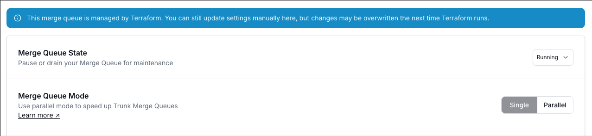
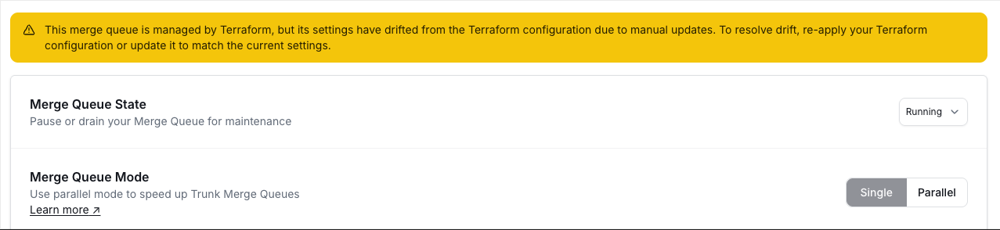

# Terraform Provider

The [trunk-io/trunk](https://registry.terraform.io/providers/trunk-io/trunk/latest) Terraform provider lets you manage merge queue configuration as infrastructure as code. Define your queue settings in Terraform, track changes in version control, and apply them consistently across repositories.

The provider currently supports the `trunk_merge_queue` resource for creating, updating, importing, and deleting merge queues.

**Current version:** `0.1.3`

## Prerequisites

* [Terraform](https://developer.hashicorp.com/terraform/install) >= 1.0
* An org-level API token from your Trunk organization. See [Organization slug and token](../../setup-and-administration/managing-your-organization.md#organization-slug-and-token) for how to generate one.
* A repository connected to Trunk

## Authentication

Set your org-level API token using the `TRUNK_API_KEY` environment variable:

```bash
export TRUNK_API_KEY="your-org-api-token"
```

Alternatively, you can pass it directly in the provider block:

```hcl
provider "trunk" {
  api_key = var.trunk_api_key
}
```


Never commit your API key to version control. Use environment variables or a secrets manager to supply the `TRUNK_API_KEY` value.


***

## Quick Start

```hcl
terraform {
  required_version = ">= 1.0"

  required_providers {
    trunk = {
      source  = "trunk-io/trunk"
      version = "0.1.3"
    }
  }
}

provider "trunk" {}

resource "trunk_merge_queue" "main" {
  repo = {
    host  = "github.com"
    owner = "my-org"
    name  = "my-repo"
  }
  target_branch = "main"
  concurrency   = 5
}
```

Run `terraform plan` to preview changes and `terraform apply` to apply them. If a merge queue already exists for the specified repository and branch, the provider will import it automatically rather than creating a duplicate.

***

## Importing Existing Queues

Merge queues created through the UI or API can be imported into Terraform. This lets you start managing an existing queue as code without recreating it.

```bash
terraform import trunk_merge_queue.main github.com/my-org/my-repo/main
```

The import ID format is `{host}/{owner}/{name}/{target_branch}`.

After importing, run `terraform plan` to compare the Terraform configuration against the current queue settings. Resolve any differences before running `terraform apply`.

***

## Resource Reference: `trunk_merge_queue`

### Required Attributes

| Attribute | Type | Description |
| --- | --- | --- |
| `repo.host` | string | Repository host (e.g., `github.com`). Changing this forces a new resource. |
| `repo.owner` | string | Repository owner or organization. Changing this forces a new resource. |
| `repo.name` | string | Repository name. Changing this forces a new resource. |
| `target_branch` | string | Branch the merge queue targets (e.g., `main`). Changing this forces a new resource. |


The `repo` and `target_branch` attributes are immutable. Changing any of them will destroy the existing queue and create a new one.


### Optional Attributes With API Defaults

These attributes are computed by the API if not specified. You only need to set them if you want to override the defaults.

| Attribute | Type | Default | Description |
| --- | --- | --- | --- |
| `mode` | string | `"single"` | Queue mode: `"single"` or `"parallel"`. See [Merge Queue mode](advanced-settings.md#merge-queue-mode). |
| `concurrency` | integer | API default | Number of PRs that can test simultaneously (minimum 1). See [Testing concurrency](advanced-settings.md#testing-concurrency). |
| `state` | string | `"RUNNING"` | Queue state: `"RUNNING"`, `"PAUSED"`, or `"DRAINING"`. See [Merge Queue state](advanced-settings.md#merge-queue-state). |

### Other Optional Attributes

| Attribute | Type | Description |
| --- | --- | --- |
| `testing_timeout_minutes` | integer | Maximum minutes to wait for tests before auto-cancellation. See [Timeout for tests to complete](advanced-settings.md#timeout-for-tests-to-complete). |
| `pending_failure_depth` | integer | Number of PRs behind a failure allowed to test before eviction. See [Pending failure depth](../optimizations/pending-failure-depth.md). |
| `can_optimistically_merge` | Boolean | Enable [optimistic merging](../optimizations/optimistic-merging.md). |
| `batch` | Boolean | Enable [batching](../optimizations/batching.md). |
| `batching_max_wait_time_minutes` | integer | Maximum minutes to wait for a batch to fill. |
| `batching_min_size` | integer | Minimum number of PRs in a batch before testing begins. |
| `merge_method` | string | How PRs are merged: `"MERGE_COMMIT"`, `"SQUASH"`, or `"REBASE"`. See [Merge Method](advanced-settings.md#merge-method). |
| `comments_enabled` | Boolean | Whether Trunk posts status comments on PRs. See [GitHub comments](advanced-settings.md#github-comments). |
| `commands_enabled` | Boolean | Whether `/trunk` slash commands are enabled. See [GitHub commands](advanced-settings.md#github-commands). |
| `create_prs_for_testing_branches` | Boolean | Create draft PRs for testing branches. See [Draft pull request creation](advanced-settings.md#draft-pull-request-creation). |
| `status_check_enabled` | Boolean | Whether Trunk posts a status check on PRs. |
| `direct_merge_mode` | string | `"OFF"` or `"ALWAYS"`. See [Direct merge to main](../optimizations/direct-merge-to-main.md). |
| `optimization_mode` | string | `"OFF"` or `"BISECTION_SKIP_REDUNDANT_TESTS"`. |
| `bisection_concurrency` | integer | Concurrency for bisection testing during batch failure isolation. See [Bisection Testing Concurrency](advanced-settings.md#bisection-testing-concurrency). |
| `required_statuses` | list(string) | CI status checks that must pass. Set to `null` to use branch protection defaults. Set to `[]` to explicitly require no statuses. See [Required Status Checks](advanced-settings.md#required-status-checks). |

***

## Managing Drift

When a merge queue is managed by Terraform, the Trunk UI displays a banner indicating that the queue is under Terraform management.

<figure><figcaption>Banner for Merge Queue settings showing that the Merge Queue is managed by Terraform.</figcaption></figure>

Users can still adjust merge queue settings through the UI. However, any changes made in the UI will cause **drift** between the live configuration and your Terraform state. The UI highlights when drift exists so your team is aware of the discrepancy.

<figure><figcaption>Banner for Merge Queue settings showing that the Merge Queue is managed by Terraform but has since drifted due to settings being changed manually in the UI.</figcaption></figure>

To detect drift, run:

```bash
terraform plan
```

This shows any differences between your Terraform configuration and the current queue state. Run `terraform apply` to reconcile the configuration back to what is defined in Terraform, or update your `.tf` files to match the desired state.


If your team adjusts settings through the UI, run `terraform plan` periodically to detect drift. Apply to reconcile, or update your Terraform configuration to match the desired state.


***

## Deleting a Queue

A merge queue must be empty before it can be deleted. If the queue still has PRs in it, `terraform destroy` will fail.

To empty a queue, you can set `state = "DRAINING"` and wait for all in-flight PRs to finish testing and merge. Once the queue is empty, run `terraform destroy` or remove the resource from your configuration and apply.


Terraform will fail to delete a queue that still has PRs in it. Ensure the queue is empty before destroying the resource.


***

## Examples

### High-Throughput Queue With Batching

```hcl
resource "trunk_merge_queue" "main" {
  repo = {
    host  = "github.com"
    owner = "my-org"
    name  = "my-repo"
  }
  target_branch                  = "main"
  mode                           = "parallel"
  concurrency                    = 20
  batch                          = true
  batching_min_size              = 4
  batching_max_wait_time_minutes = 5
  can_optimistically_merge       = true
}
```

### Queue With Explicit Required Statuses

```hcl
resource "trunk_merge_queue" "main" {
  repo = {
    host  = "github.com"
    owner = "my-org"
    name  = "my-repo"
  }
  target_branch    = "main"
  concurrency      = 3
  merge_method     = "SQUASH"
  commands_enabled = true
  comments_enabled = true
  required_statuses = [
    "ci/build",
    "ci/test",
    "ci/lint",
  ]
}
```
