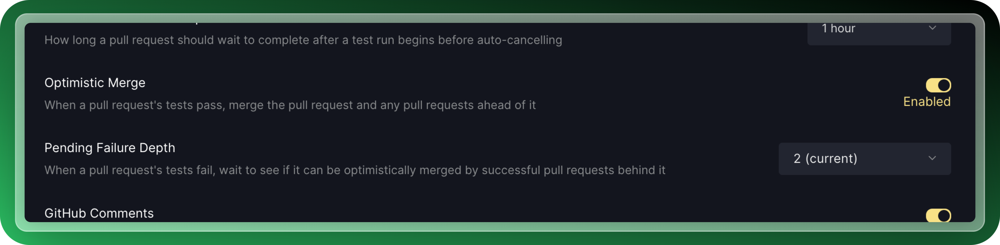

# Optimistic Merging

The foundation of our merge queue starts with [predictive testing](predictive-testing.md). When a predictive test is being run, concurrent tests sometimes finish before the work ahead of it. This creates a situation where the system knows that all code ahead of it collectively `passes` tests, and it is safe to merge all those changes into your protected branch (`main)`.\
\
With optimistic merging enabled we can leverage results from pull requests later in the queue to merge faster. In the illustration below you can see that pull request 'c' includes the verified testing results of pull requests 'b' and 'a'. As soon as 'c' passes testing - we can safely merge 'a', 'b' and 'c' and know they will all work correctly together.


optimistic merging to merge faster


You can enable optimistic merging through the [Merge UI](../managing-merge-queue/using-the-webapp.md) settings as shown below:

<figure><figcaption>
setting to enable anti-flake protection
</figcaption></figure>

**What are the risks of optimistic merging?**

The downsides here are very limited. You essentially give up the proof that every pull request in complete isolation can safely be merged into your protected branch. In the unlikely case that you have to revert a change from your protected branch, you will need to retest that revert or submit it to the queue to ensure nothing has broken. In practice, this re-testing is required in almost any case, regardless of how it was originally merged, and the downsides are fairly limited.
