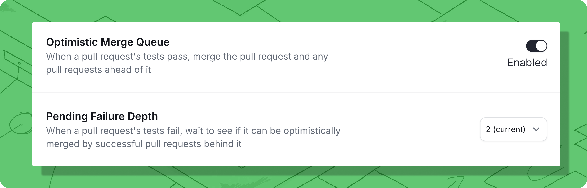

# Anti-Flake Protection

Some CI jobs fail for reasons unrelated to a PR's code change, such as due to [flaky tests](https://trunk.io/blog/the-ultimate-guide-to-flaky-tests) or a CI runner disconnecting. These failures are usually cleared when the CI job is rerun. If a second PR that depends on the first **does** pass, it is very likely that the first PR was good and simply experienced a transient failure. Trunk Merge Queue can use the combination of [**Optimistic Merging** ](optimistic-merging.md)and [**Pending Failure Depth**](anti-flake-protection.md#pending-failure-depth) to merge pull requests that would otherwise be rejected from the queue.&#x20;


If you have a lot of flaky tests in your projects, you should track and fix them with [Trunk Flaky Tests](../../flaky-tests/overview.md). Anti-flake protection helps reduce the impact of flaky tests but doesn't help you detect, track, and eliminate them.


In the video below, you can see an example of this anti-flake protection:


Anti-flake protection with optimistic merging + pending failure depth


<table><thead><tr><th width="331">what's happening?</th><th>queue</th></tr></thead><tbody><tr><td><strong>A</strong>, <strong>B</strong>, <strong>C</strong> begin predictive testing</td><td><code>main</code> &#x3C;- <strong>A</strong> &#x3C;- <strong>B</strong>+a &#x3C;- <strong>C</strong>+ba</td></tr><tr><td><strong>B</strong> fails testing</td><td><code>main</code> &#x3C;- <strong>A</strong> &#x3C;- <mark style="color:red;"><strong>B</strong>+a</mark> &#x3C;- <strong>C</strong>+ba</td></tr><tr><td>predictive failure depth keeps <strong>B</strong> from being evicted while <strong>C</strong> tests</td><td><code>main</code> &#x3C;- <strong>A</strong> &#x3C;- <mark style="color:red;"><strong>B</strong>+a</mark> (hold) &#x3C;- <strong>C</strong>+ba</td></tr><tr><td><strong>C</strong> passes</td><td><code>main</code> &#x3C;- <strong>A</strong> &#x3C;- <mark style="color:red;"><strong>B</strong>+a</mark> &#x3C;- <mark style="color:green;"><strong>C</strong>+ba</mark></td></tr><tr><td>optimistic merging allows <strong>A</strong>, <strong>B</strong>, <strong>C</strong> to merge</td><td><code>merge</code> <strong>A B C</strong></td></tr></tbody></table>


Optimistic Merging only works when the [Pending Failure Depth](anti-flake-protection.md#pending-failure-depth) is set to **a value greater than zero**. When zero or disabled, Merge will not hold any failed tests in the queue.


#### Enabling anti-flake protection

To protect your merge queue from flakes, enable anti-flake protection by enabling [**Optimistic Merge**](optimistic-merging.md) and setting [**Pending Failure Depth**](pending-failure-depth.md) to an integer greater than 0 in the [Merge UI](../managing-merge-queue/using-the-webapp.md) settings:

<figure><figcaption>
Settings to enable anti-flake protection.
</figcaption></figure>

#### What are the tradeoffs?

When optimistic merging is used, there is a small tradeoff to be made. You can get into a situation where an actually broken test in, say, change 'B' is corrected by a change in 'C'. In this case, if you later reverted to 'C', your build would be broken.
