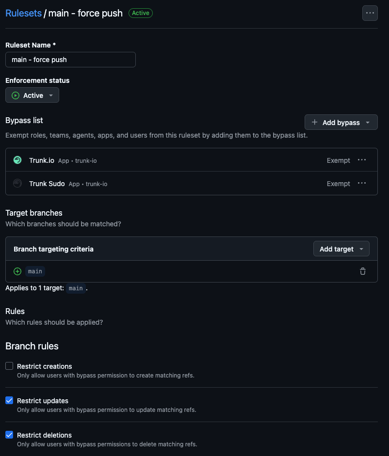
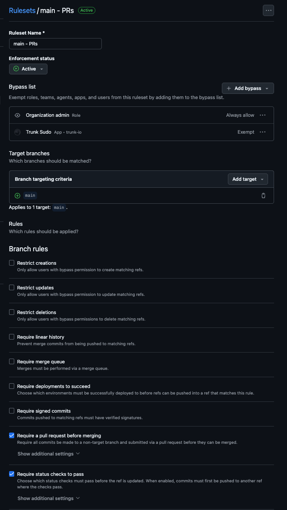
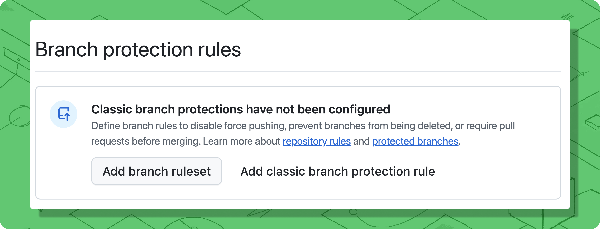

# Configure branch protection

### Prerequisites

Before configuring branch protection:

* [ ] Trunk GitHub App installed and queue created (previous step)
* [ ] Repository has CI/CD configured (GitHub Actions, CircleCI, etc.)
* [ ] CI runs on pull requests and reports status checks to GitHub
* [ ] You have admin access to repository settings

### How Branch Protection Affects the Queue

Trunk Merge Queue respects GitHub's branch protection rules and works with both Classic branch protection rules and Rulesets. Branch protection plays two distinct roles in how the queue operates:

* **Admission into the queue** — Trunk doesn't admit a submitted PR for testing until GitHub considers it ready to merge. Branch protection (required reviews, required status checks, conversation resolution, etc.) is what determines when GitHub marks a PR as ready to merge, so it directly controls when a PR enters the queue.
* **Required checks during testing (optional)** — By default, Trunk waits on the same required status checks defined in your branch protection rules while testing a PR in the queue. You can override this with the Trunk UI or `.trunk/trunk.yaml` if you want a different set of checks required during queue testing. See [Required Status Checks](../administration/advanced-settings.md#required-status-checks).

The configurations on this page (push restrictions for the `trunk-io` bot, and excluding `trunk-temp/*` and `trunk-merge/*` from protection) ensure branch protection doesn't *block* Trunk from doing its job. They don't change either of the roles above.

### Choose your testing approach

Trunk Merge Queue can test pull requests in two ways. Choose the approach that fits your CI setup:

#### Draft PR mode (Recommended - Default) 


**Best for:** Most teams who want the simplest setup with no additional configuration.


When a pull request enters the queue, Trunk creates a draft pull request to test the changes. This automatically triggers your existing pull request-based CI workflows, the same checks that run when you open a regular pull request.

**Advantages:**

* No additional CI configuration required
* Works immediately with your existing workflows
* Simple to set up and maintain

Things to look out for:

* This mode also creates a `trunk-merge/` branch
* Trunk automatically closes the draft PRs and merge the original PRs

**When to use a different approach:** If you have expensive preview deployments, review-only workflows, or security scans that you don't want running during merge queue testing, consider Push-triggered mode instead.

#### Push-Triggered mode (Advanced) 


**Best for:** Teams who need different CI behavior for merge queue testing versus pull request review.


When a pull request enters the queue, Trunk creates a `trunk-merge/*` branch and pushes to it. You configure specific CI jobs to run on these branches.

**Advantages:**

* Complete control over which jobs run during queue testing
* Avoid triggering expensive preview environments or review-only workflows
* Can optimize for faster merge queue throughput

**Requirements:**

* Configure push-triggered workflows in your CI provider for `trunk-merge/**` branches (see [Configure CI status checks](configure-ci-status-checks.md#if-using-push-triggered-mode))

**To enable:** Go to **Settings** > **Repositories** > repository > **Merge Queue** > toggle **off** **Trunk Draft PR Creation**.

### Configure Branch Protection Rules

#### Rulesets vs. Classic branch protection 

GitHub offers two systems for branch protection: [Rulesets](https://docs.github.com/en/repositories/configuring-branches-and-merges-in-your-repository/managing-rulesets/about-rulesets) and Classic branch protection rules. Both can coexist on the same branch.

The Trunk Merge Queue GitHub App is fully supported on both systems. **Rulesets are recommended:** their bypass model lets Trunk merge through your protected branch cleanly, while Classic branch protection has rules that no GitHub App can bypass (notably required status checks and "Require branches to be up to date").

#### Option A — GitHub Rulesets (recommended) 

Trunk Merge Queue requires **at least two rulesets** on your protected branch:

* **Ruleset #1** restricts who can update the branch and lists Trunk on its bypass list as **Exempt** so Trunk can push merges through the queue.
* **Ruleset #2** holds your mergeability requirements (required reviews, required status checks, conversation resolution, etc.) and does **not** bypass Trunk. The queue uses these rules to decide when GitHub considers a PR ready, which is what gates [admission into the queue](#how-branch-protection-affects-the-queue).

Splitting them keeps Trunk's bypass scope minimal: GitHub bypass permissions apply to the whole ruleset, so a single combined ruleset would force Trunk to bypass review and status checks too — the opposite of what you want.

##### Ruleset #1 — Branch update (Trunk bypasses this) 

This ruleset lets the Trunk GitHub App update your protected branch when merging from the queue, while still preventing direct pushes from anyone else.

1. In GitHub, go to **Settings → Rules → Rulesets** and create a new ruleset (e.g., name it `main - force push`).
2. Under **Target branches**, target the protected branch only (e.g., `main`). No exclude pattern is needed — Trunk's `trunk-temp/*` and `trunk-merge/*` branches are not in the include list, so they aren't matched.
3. Under **Rules → Branch rules**, enable **Restrict updates** ("Only allow users with bypass permission to update matching refs"). You can optionally co-locate **Restrict deletions** and **Restrict creations** in the same ruleset; the bypass list applies to the entire ruleset.
4. Under **Bypass list**, add the Trunk GitHub App (`trunk-io`) and set its bypass mode to **Exempt**.
5. If you also use [Trunk Sudo](../../setup-and-administration/trunk-sudo-app.md), add **Trunk Sudo** to the bypass list as **Exempt** as well.
6. Save.

<figure><figcaption>Ruleset #1: Trunk on the bypass list as <strong>Exempt</strong> so it can update <code>main</code>.</figcaption></figure>


**Bypass mode defaults to Always — change it to Exempt.** When you add an actor to a ruleset's bypass list, GitHub defaults its bypass mode to **Always**, which sounds permissive but does not cover branch updates from a GitHub App. Trunk must be set to **Exempt**. If Trunk isn't Exempt, merges will fail with permission errors on the protected branch.


##### Ruleset #2 — Mergeability requirements (Trunk does NOT bypass this) 

This ruleset encodes the rules that determine when a PR is ready to merge. Trunk reads these to decide when to admit a PR into the queue.

1. Create a second ruleset (e.g., name it `main - PRs`).
2. Target the same protected branch (e.g., `main`) with the same single-include targeting.
3. Under **Rules → Branch rules**, add the rules that gate mergeability — typically **Require a pull request before merging** and **Require status checks to pass**. Add others (signed commits, linear history, etc.) as your team requires.
4. **Do not** add the Trunk GitHub App (`trunk-io`) to the bypass list. The queue relies on GitHub reporting the PR as not-yet-ready until these rules pass.
5. Optionally, add **Trunk Sudo** to the bypass list as **Exempt** if you use [Force merge](../using-the-queue/force-merge.md) or stacked PRs. See the [Trunk Sudo page](../../setup-and-administration/trunk-sudo-app.md) for the full guidance.
6. Save.

<figure><figcaption>Ruleset #2: Trunk is <em>not</em> on the bypass list, so the queue respects these requirements when admitting PRs.</figcaption></figure>

See [Required Status Checks](../administration/advanced-settings.md#required-status-checks) for how the queue uses required status checks while testing PRs already in the queue.

#### Migrating from Classic rules to Rulesets 

If you already use Classic branch protection, GitHub provides an **Import a ruleset** action on the [Rulesets](https://docs.github.com/en/repositories/configuring-branches-and-merges-in-your-repository/managing-rulesets/about-rulesets) page that converts an existing Classic rule into a single ruleset. Use it as a starting point, then split the imported ruleset into the two-ruleset structure above: move **Restrict updates** into Ruleset #1 with Trunk on the bypass list as Exempt, and leave the rest in Ruleset #2 with no bypass on Trunk.


Don't delete the original Classic rule until both rulesets are saved and verified — otherwise the branch will be temporarily unprotected.


#### Option B — Classic branch protection 

Classic branch protection still works with Trunk Merge Queue, but is no longer the recommended path. Some Classic rules (required status checks and "Require branches to be up to date") cannot be bypassed by any GitHub App, which limits features like [Force merge](../using-the-queue/force-merge.md). Use Rulesets when you can.

**Configure push restrictions (required)**

Trunk Merge Queue needs permission to push to your protected branch. Configure these settings using Classic branch protection rules:

<figure><figcaption></figcaption></figure>

1. Go to **Settings → Branches** in your repository on GitHub.
2. Edit or create a Classic branch protection rule for your target branch (e.g., `main`).
3. Under "Rules applied to everyone including administrators," select:
   * **Restrict who can push to matching branches**
   * **Restrict pushes that create matching branches**
4. Add the `trunk-io` bot to the list of allowed actors.
5. Optionally, add Organization admins and repository admins who need emergency merge access.
6. Save your changes.


**Important:** Regular users should use [pull request prioritization](../optimizations/priority-merging.md) with `--priority=urgent` or `--priority=high` to fast-track pull requests through the queue while maintaining validation. Direct push access is only needed for rare emergencies where the queue itself must be bypassed.


**Exclude Trunk's temporary branches (critical)**

Trunk Merge Queue creates temporary branches to test pull requests before merging them:

* `trunk-temp/*` — temporary testing branches
* `trunk-merge/*` — merge testing branches


**Trunk needs unrestricted access** to create, push to, and delete these branches. If your branch protection rules apply to these branches, Merge Queue cannot function.


To verify and fix:

1. Go to **Settings → Branches** in your repository.
2. Review all Classic branch protection rules.
3. Check for wildcard patterns like `*/*`, `**/*`, or similar that would match `trunk-temp/*` or `trunk-merge/*`.
4. If you find matching rules, either:
   * Remove the wildcard rules and create more specific rules for your actual branches, or
   * Add the `trunk-io` bot to the bypass list for those rules.

**Example of a problematic rule:** a branch protection rule with pattern `*/*` would protect all branches including `trunk-temp/*` and `trunk-merge/*`.

**What happens if these branches are protected:** Merge Queue encounters GitHub permission errors and displays messages like "Permission denied on trunk-merge/\* branch."


**Using Force merge or other bypass-dependent features?** Features like [Force merge](../using-the-queue/force-merge.md) require the separate [Trunk Sudo GitHub App](../../setup-and-administration/trunk-sudo-app.md), plus additional branch protection configuration to list Trunk Sudo as a bypass actor. That's documented on the Trunk Sudo page.


### Next Steps

→ [**Configure CI status checks**](configure-ci-status-checks.md) **-** Configure CI status checks for your branch.

_Having trouble?_ See our [Troubleshooting guide](../reference/troubleshooting.md) for common installation issues.
