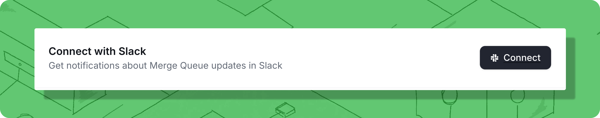
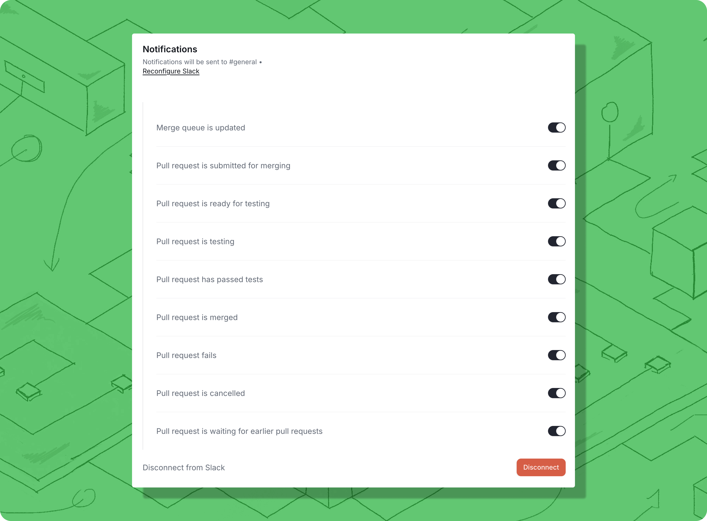
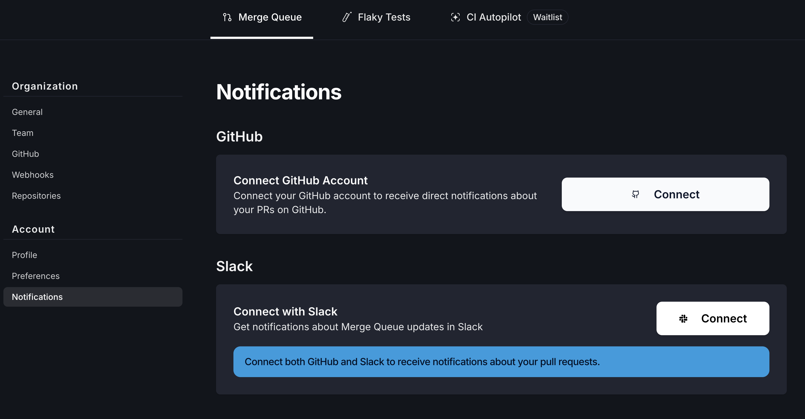
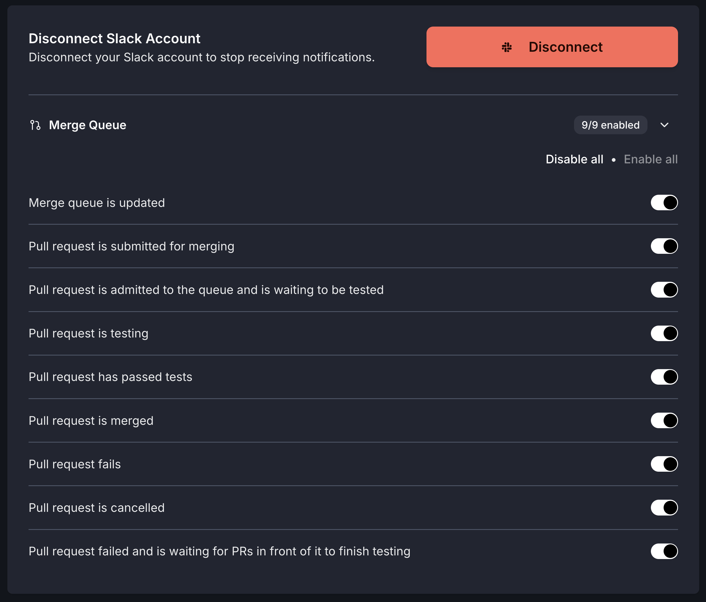

# Slack Integration

Trunk Merge Queue integrates with Slack to send real-time notifications about queue activity and pull request state changes to a designated channel or directly to you as personal notifications.

<figure><figcaption></figcaption></figure>

After you have Merge Queue set up and running in your repository, you can configure Slack notifications to receive alerts for various queue events.

## Channel Notifications

Send merge queue updates to a shared team Slack channel to keep everyone informed about queue activity.

### Enable Merge Queue Notifications

After you have Merge set up and running in your repository, you can set up your integration with Slack under **Merge Queue** tab **>** repository **> Settings >** **Connect with Slack**.

<figure><figcaption></figcaption></figure>

1. Navigate to `Settings > Repositories > [your repository] > Merge Queue`
2. Find the **Connect with Slack** setting and click **Connect** to install the Trunk Slack application
3. Authorize the app to post to your desired channel
4. You'll be redirected back to your settings page once authorization is complete

### Configuring Channel Notification Preferences

After connecting to a Slack channel, you can customize which notifications you want to receive. By default, all Merge Queue notifications are enabled.

<figure><figcaption></figcaption></figure>

You can toggle individual notification types on or off. See Available Notification Topics below for descriptions of each notification type.


**Tip:** Want to receive these notifications as personal DMs instead of in a shared channel? Check out our [Personal Slack Notifications](integration-for-slack.md#personal-slack-notifications) setup guide.


## Personal Slack Notifications

Get direct messages in Slack about your PRs in the merge queue, keeping you informed without adding noise to team channels.

Personal Slack notifications allow you to receive personalized Slack DMs when your PRs are queued, start testing, pass tests, get merged, or encounter issues. This keeps you up-to-date on the progress of your code through the merge queue without needing to check the web UI or monitor shared channels.

### Setting up Personal Notifications

To receive personal Slack notifications, you'll need to connect both your GitHub and Slack accounts to Trunk and configure your notification preferences.


**Note:** If your organization isn't already using merge queue Slack notifications to a shared channel, a Slack workspace admin may need to approve the Trunk Slack app before you can connect your personal account. See [Enable Merge Queue Notifications](integration-for-slack.md#enable-merge-queue-notifications) for details on setting up the initial Slack integration.


#### **Steps to Enable Personal Notifications**

1. **Navigate to User Settings**
   * Go to **User Settings > Notifications** in the Trunk web app
   * These settings are specific to you, so you can customize them however you prefer
2. **Connect GitHub Account**
   * Click **Connect GitHub** to begin the OAuth flow
   * This verifies that you own your GitHub account and allows Trunk to link your PRs to your user profile
3.  **Connect Slack Account**

    * Click **Connect to Slack** to authorize the Trunk Slack app to send you direct messages

    > **Important:** If your organization hasn't already installed the Trunk Slack app for channel notifications, a Slack workspace admin may need to approve the app before you can receive personal notifications.
4. **Configure Notification Preferences**
   * Enable the specific notifications you want to receive via Slack DM
   * See Available Personal Notification Topics below for descriptions of each notification type
5. **Manage Connections**
   * You can disconnect your GitHub or Slack accounts at any time by clicking the respective **Disconnect** buttons in User Settings


**Tip:** Want to receive these same notifications in a shared Slack channel instead? Check out our team [Channel Slack Notifications](integration-for-slack.md#channel-notifications) setup guide.


<figure><figcaption></figcaption></figure>

## Frequently Asked Questions

<strong>Do I need both GitHub and Slack connected to receive personal notifications?</strong>

Yes, both connections are required. The GitHub connection links your PRs to your Trunk user account, and the Slack connection enables direct messaging.

<strong>What's the difference between personal notifications and channel notifications?</strong>

[Personal notifications](integration-for-slack.md#personal-slack-notifications) are sent directly to you via Slack DM and only include updates about your own PRs.&#x20;

[Channel notifications](integration-for-slack.md#channel-notifications) are sent to a shared team channel and include updates about all PRs in the merge queue.&#x20;

You can use both simultaneously to stay informed personally while keeping your team updated. Learn more about setting up channel notifications.

<strong>Can I customize which notifications I receive?</strong>

Yes, in **Settings** > **Account** > **Notifications**, you can toggle individual notification topics on or off based on your preferences. For example, you might only want to be notified when your PR fails or gets merged, rather than at every stage.

<strong>What happens if I disconnect my GitHub or Slack account?</strong>

Disconnecting either account will stop personal Slack notifications. You can reconnect at any time through **Settings** > **Account** > **Notifications**.

## Available Notification Topics

Both channel and personal Slack notifications use the same notification topics. You can customize which events trigger notifications based on your preferences.

<figure><figcaption></figcaption></figure>

| Notification                                                                | Description                                                                                                                                                                                                                                                                                                                                                                                                                                                                   |
| --------------------------------------------------------------------------- | ----------------------------------------------------------------------------------------------------------------------------------------------------------------------------------------------------------------------------------------------------------------------------------------------------------------------------------------------------------------------------------------------------------------------------------------------------------------------------- |
| Merge is updated                                                            | The merge queue's configuration was changed. This covers anything that changes how the queue acts, including: pausing or draining the queue, changing its mode, changing testing concurrency, and so on.                                                                                                                                                                                                                                                                      |
| Pull request is submitted for merging                                       | A pull request has been [submitted to the queue](https://docs.trunk.io/merge-queue/set-up-trunk-merge#submit-pull-requests)                                                                                                                                                                                                                                                                                                                                                   |
| Pull request is admitted to the queue and is waiting to be tested           | A pull request has been admitted to the queue and will begin testing as soon as it can                                                                                                                                                                                                                                                                                                                                                                                        |
| Pull request is testing                                                     | Trunk merge has begun testing a pull request                                                                                                                                                                                                                                                                                                                                                                                                                                  |
| Pull request has passed tests                                               | Testing has passed on a pull request. The PR will be merged when it reached the top of the queue                                                                                                                                                                                                                                                                                                                                                                              |
| Pull request is merged                                                      | A pull request submitted to the queue has successfully been merged into its target branch                                                                                                                                                                                                                                                                                                                                                                                     |
| Pull request fails                                                          | Testing failed on a pull request and it was removed from the queue or Trunk failed to merge the PR into its target branch                                                                                                                                                                                                                                                                                                                                                     |
| Pull request is canceled                                                    | A pull request has been canceled, either manually or due to it [reaching a configured testing timeout](https://docs.trunk.io/merge-queue/set-up-trunk-merge/advanced-settings#timeout-for-tests-to-complete)                                                                                                                                                                                                                                                                  |
| Pull request failed and is waiting for PRs in front of it to finish testing | 
A pull request failed testing, but the pull request is currently waiting before being kicked. This can happen for one of two reasons: 1. The pull request is not at the head of the queue, so it is waiting to determine if it is the source of the failure or if a PR it depends on is 2. <a href="https://docs.trunk.io/merge-queue/pending-failure-depth">Pending Failure Depth is enabled</a> and the PR is waiting for other PRs below it to finish testing
 |

