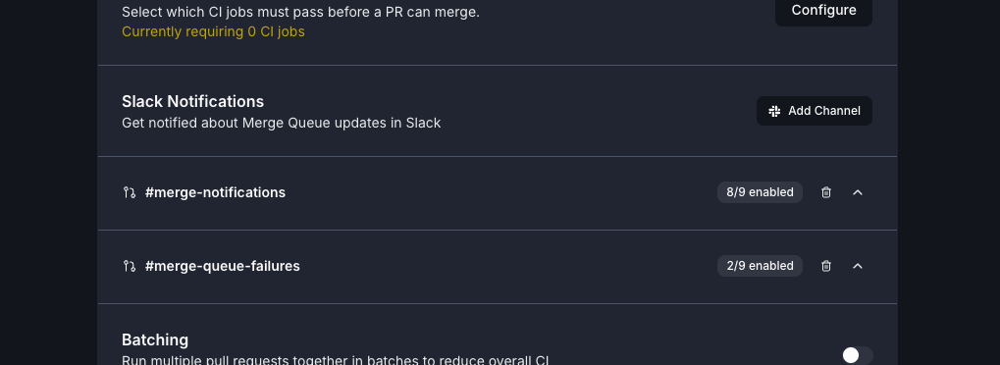
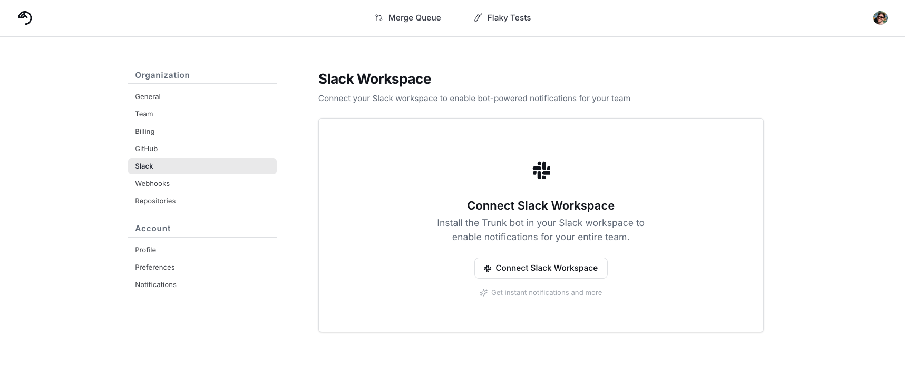
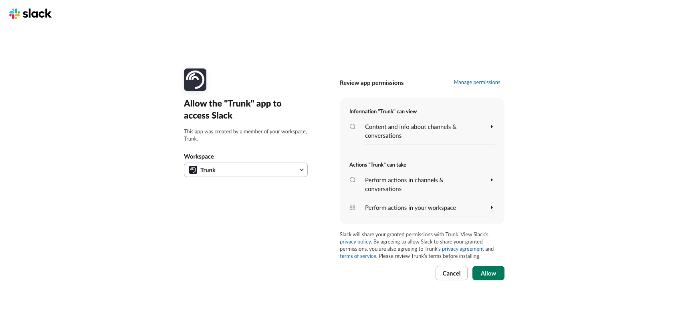
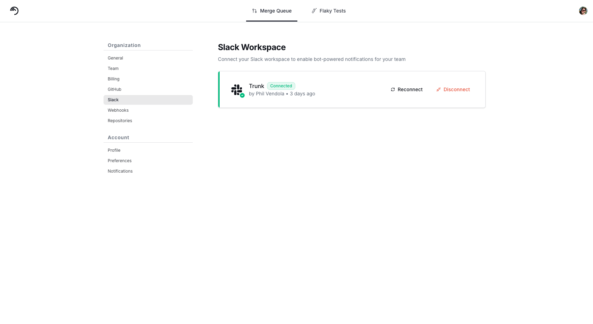
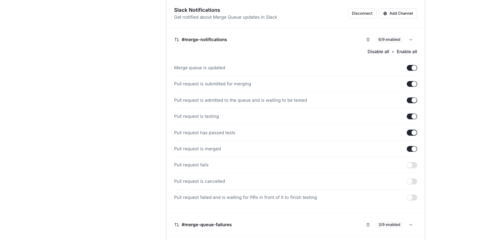
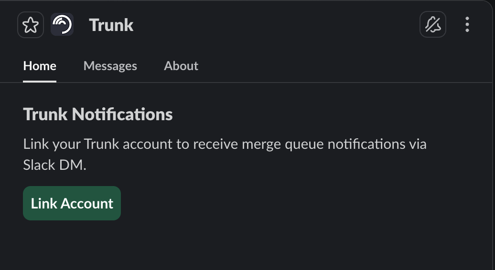
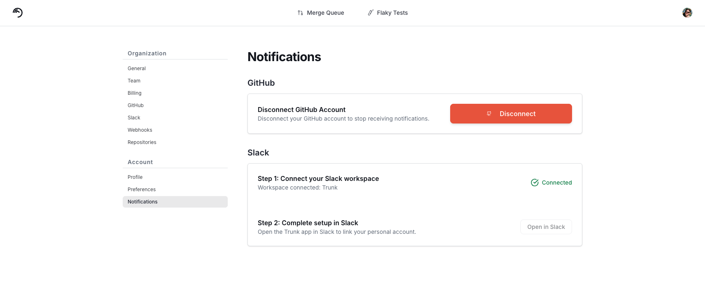
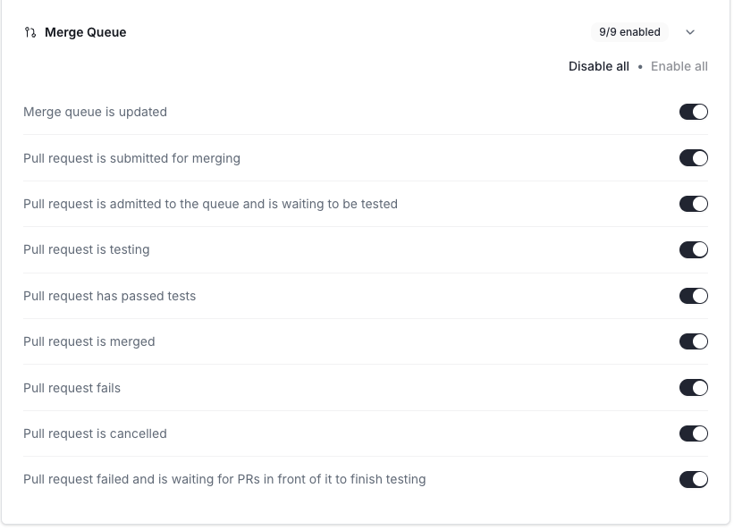

# Slack Integration

Trunk Merge Queue integrates with Slack to send real-time notifications about queue activity and pull request state changes. You can route notifications to **multiple Slack channels** per repository, each with its own set of enabled topics, and receive **personal DMs** about your own PRs directly in Slack.

<figure><figcaption></figcaption></figure>

## Installing the Trunk Slack App

Before you can set up channel notifications or personal DMs, a Slack workspace admin must install the Trunk Slack app for your organization. This is a one-time setup that enables all Slack integration features.

### Steps to Install

1. In the Trunk web app, navigate to **Settings > Organization > Slack**.
2. Click **Add to Slack**.
3. Review and approve the requested permissions on the Slack OAuth screen.
4. You'll be redirected back to Trunk. The page will show your workspace as **Connected** along with the workspace name.

<figure><figcaption>What the screen to connect Slack to your workspace will look like</figcaption></figure>

<figure><figcaption>What Slack's screen to install our Slack app will look like</figcaption></figure>

<figure><figcaption>What you will see when the Slack app has been connected</figcaption></figure>

### Managing the Connection

Once connected, you can **Reconnect** (to reauthorize) or **Disconnect** the workspace from the same settings page.


**Migrating from legacy Slack integration?** If your organization previously connected Slack through the per-repo "Connect with Slack" flow, you still need to complete this new workspace-level installation to access multi-channel notifications and the new personal DM features. After installing, you can set up channel connections and personal notifications using the new workflows described below.


## Channel Notifications

Send merge queue updates to one or more shared Slack channels to keep your team informed about queue activity. Each channel can have its own set of enabled notification topics.

### Connecting Slack Channels


**Prerequisite:** The Trunk Slack app must be [installed for your organization](integration-for-slack.md#installing-the-trunk-slack-app) before you can connect channels.


1. Navigate to **Settings > Repositories > \[your repository] > Merge Queue**.
2. Under **Slack Notifications**, click **Add Channel**.
3. In the **Add Slack Channel** modal, select a channel from the dropdown.
4. Toggle the notification topics you want enabled for that channel.
5. Click **Connect**.

You can connect **multiple channels**, each with a different set of enabled topics. For example, you might send all notifications to a `#merge-notifications` channel while only sending failure alerts to a `#merge-queue-failures` channel.

<figure><figcaption>An example where regular Merge Queue notifications are being sent to one channel, and failures to a specific channel to make them clear.</figcaption></figure>

The channel list displays each connected channel along with a summary of how many notification topics are enabled (e.g., "6/9 enabled"). To remove an individual channel, click the trash icon next to it. To remove all channel connections for the repository, click **Disconnect**.

### Managing Channel Notification Preferences

Each connected channel has its own independent set of notification topics. You can expand any channel in the list to view and toggle its topics on or off. Changes take effect immediately.

See [Available Notification Topics](integration-for-slack.md#available-notification-topics) below for descriptions of each notification type.


**Tip:** Want to receive notifications about your own PRs as personal DMs instead of in a shared channel? Check out the [Personal Slack Notifications](integration-for-slack.md#personal-slack-notifications) setup guide.


## Personal Slack Notifications

Get direct messages in Slack about your PRs as they move through the merge queue — queued, testing, merged, failed, and more — without adding noise to team channels.

### Setting up Personal Notifications


**Prerequisite:** The Trunk Slack app must be [installed for your organization](integration-for-slack.md#installing-the-trunk-slack-app) before personal notifications can be configured. If the app hasn't been installed yet, the Home tab will display a warning directing a Slack admin to complete the installation.


Personal notification setup is done from the **Trunk Slack app's Home tab** in Slack:

1. Open the **Trunk** app in Slack. If you don't see it in your sidebar, add it via **Apps > Manage > Browse Apps** and search for "Trunk."
2. Go to the **Home** tab.
3. Click **Link Account** to connect your Trunk account to Slack.
4. Connect your **GitHub account** from the Home tab. This is required for PR tracking and most notifications.
5. Configure your notification preferences using the toggles on the Home tab.

<figure><figcaption></figcaption></figure>

### Using the Trunk Web UI

You can also start setup from the Trunk web app, which will redirect you to Slack to complete the process:

1. Navigate to **Settings > Account > Notifications** in Trunk.
2. Under **Connect your Slack workspace**, verify your workspace is connected. If not, click **Go to Slack settings** to install the app first.
3. Click **Open in Slack** to jump to the Trunk app's Home tab, where you'll link your account and configure notifications.

<figure><figcaption></figcaption></figure>


**Tip:** Want to send notifications to a shared team channel instead? Check out the [Channel Notifications](integration-for-slack.md#channel-notifications) setup guide.


## Slack App Home Dashboard

The Trunk Slack app's **Home** tab provides a personal merge queue dashboard directly in Slack. Open the Trunk app in Slack and click the **Home** tab to see an overview of your merge queue activity across all repositories.

### What You'll See

The Home tab displays the following sections:

* **Refresh** — A button at the top of the Home tab to update the view with the latest queue data, along with a "Last refreshed" timestamp.
* **Account connection status** — Shows your connected identity (e.g., "Connected as **Your Name**"), an **Unlink Account** button, and your GitHub account connection status. You can connect your GitHub account directly from the Home tab if it isn't linked yet.
* **Not Ready** — PRs you've submitted that are waiting for prerequisites (e.g., GitHub mergeability) before entering the queue.
* **PRs in Queue** — Your PRs that are currently in the queue, with real-time status indicators (e.g., "Testing").
* **Recently Merged PRs** — Your most recently merged PRs, with merge dates.
* **Failed PRs** — Your PRs that failed in the queue.
* **Notification Preferences** — Toggle buttons for all notification topics. You can enable or disable individual notifications directly from Slack without visiting the web UI.

All PR sections are grouped by repository and branch. Each PR entry shows the title, PR number, and a link to the GitHub PR. Data is shown across **all merge queues** you submit to, scoped to your PRs via your linked GitHub account.

### Linking Your Account

To use the Home tab, you need to link your Trunk and GitHub accounts. Follow the steps in [Setting up Personal Notifications](integration-for-slack.md#setting-up-personal-notifications) — the same account linking process powers both the dashboard and personal DMs.

### Managing Notification Preferences

You can toggle notification topics on or off directly from the Home tab — no need to visit the Trunk web UI. Changes take effect immediately. The available topics are the same as those listed in [Available Notification Topics](integration-for-slack.md#available-notification-topics).

## Frequently Asked Questions

<strong>Do I need both GitHub and Slack connected to receive personal notifications?</strong>

Yes, both connections are required. Link your Trunk account from the Slack app's **Home** tab to establish the Slack connection, then connect your GitHub account from the same tab to link your PRs to your Trunk profile.  

<strong>What's the difference between personal notifications and channel notifications?</strong>

[Personal notifications](integration-for-slack.md#personal-slack-notifications) are sent directly to you via Slack DM and only include updates about your own PRs. They are set up from the Trunk Slack app's Home tab.

[Channel notifications](integration-for-slack.md#channel-notifications) are sent to one or more shared team channels and include updates about all PRs in the merge queue. You can connect multiple channels per repository, each with different notification topics.

You can use both simultaneously to stay informed personally while keeping your team updated.

<strong>Can I customize which notifications I receive?</strong>

Yes. For personal notifications, toggle topics on or off from the Trunk Slack app's **Home** tab. For channel notifications, configure topics per channel under **Settings > Repositories > \[your repository] > Merge Queue** in the Trunk web app.

<strong>What happens if I disconnect my Slack account from my Trunk account?</strong>

You can unlink your account from the Trunk Slack app's Home tab using the **Unlink Account** button. Disconnecting stops personal Slack notifications. You can reconnect at any time by returning to the Home tab and clicking **Link Account**.

<strong>I don't see the Trunk app in my Slack sidebar. How do I add it?</strong>

The Trunk app must first be [installed at the organization level](integration-for-slack.md#installing-the-trunk-slack-app) by a Slack workspace admin. After that, individual users can add it to their sidebar: in Slack, go to **Apps > Manage > Browse Apps**, search for "Trunk," and click **Add**.

## Available Notification Topics

Both channel and personal Slack notifications support the same notification topics. You can customize which events trigger notifications for each channel or for your personal DMs.

<figure><figcaption></figcaption></figure>

| Notification                                                                | Description                                                                                                                                                                                                                                                                                                                                                                                                                                                                   |
| --------------------------------------------------------------------------- | ----------------------------------------------------------------------------------------------------------------------------------------------------------------------------------------------------------------------------------------------------------------------------------------------------------------------------------------------------------------------------------------------------------------------------------------------------------------------------- |
| Merge is updated                                                            | The merge queue's configuration was changed. This covers anything that changes how the queue acts, including: pausing or draining the queue, changing its mode, changing testing concurrency, and so on.                                                                                                                                                                                                                                                                      |
| Pull request is submitted for merging                                       | A pull request has been [submitted to the queue](https://docs.trunk.io/merge-queue/set-up-trunk-merge#submit-pull-requests)                                                                                                                                                                                                                                                                                                                                                   |
| Pull request is admitted to the queue and is waiting to be tested           | A pull request has been admitted to the queue and will begin testing as soon as it can                                                                                                                                                                                                                                                                                                                                                                                        |
| Pull request is testing                                                     | Trunk merge has begun testing a pull request                                                                                                                                                                                                                                                                                                                                                                                                                                  |
| Pull request has passed tests                                               | Testing has passed on a pull request. The PR will be merged when it reaches the top of the queue                                                                                                                                                                                                                                                                                                                                                                              |
| Pull request is merged                                                      | A pull request submitted to the queue has successfully been merged into its target branch                                                                                                                                                                                                                                                                                                                                                                                     |
| Pull request fails                                                          | Testing failed on a pull request and it was removed from the queue or Trunk failed to merge the PR into its target branch                                                                                                                                                                                                                                                                                                                                                     |
| Pull request is canceled                                                    | A pull request has been canceled, either manually or due to it [reaching a configured testing timeout](https://docs.trunk.io/merge-queue/set-up-trunk-merge/advanced-settings#timeout-for-tests-to-complete)                                                                                                                                                                                                                                                                  |
| Pull request failed and is waiting for PRs in front of it to finish testing | 
A pull request failed testing, but the pull request is currently waiting before being kicked. This can happen for one of two reasons: 1. The pull request is not at the head of the queue, so it is waiting to determine if it is the source of the failure or if a PR it depends on is the cause 2. <a href="https://docs.trunk.io/merge-queue/pending-failure-depth">Pending Failure Depth is enabled</a> and the PR is waiting for other PRs below it to finish testing
 |
