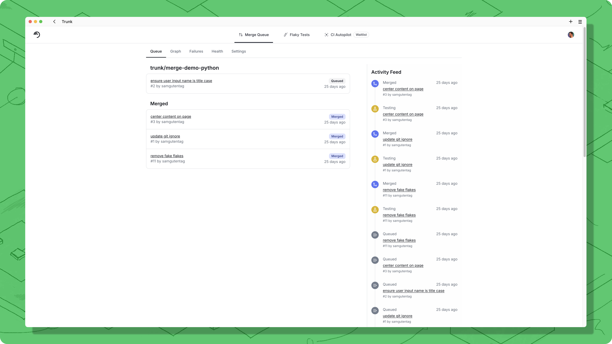

# Using the Merge UI

The web app can be found at [app.trunk.io](https://app.trunk.io/login?intent=merge%20queue).

## Queue Overview

The queue tab provides an overview of the work done by Merge and the work queued to be merged.

&#x20;Merged, testing, and pending PRs should all appear here.&#x20;

Clicking on an item will show the history to get a better understanding of the item.

<figure><figcaption>
Clicking on a queue item navigates you to the details page.
</figcaption></figure>

## Pull Request Details

The PR details show information about a PR, including a link to the PR in GitHub, the history of the PR within Trunk Merge Queue, and what must be done before a PR can be admitted to the queue for PRs that have not entered the queue yet.

When a PR has not been admitted to the queue yet, Trunk Merge Queue waits for:

1. Impacted targets to be uploaded for the PRs current SHA (`Parallel` mode only)
2. The PR to be mergeable according to GitHub. If the PR is not mergeable yet, this most likely means that the PR is not meeting all branch protection rules you have set (for example, not all required status checks have passed yet) or has a merge conflict with the target branch
3. The target branch of the pull request to match the branch that merge queue merges into

<figure><figcaption>
PR readiness details for a PR that has been submitted but has not yet entered the merge queue.
</figcaption></figure>

In the screenshot above, the PR has been submitted to Merge but has not yet been added to the queue. It will be added once all of the branch protection rules pass and there are no merge conflics with the target branch.

The PR Details panel has a dropdown "**Actions"** menu, where you can:

1. **Restart tests.** Use this to manually restart testing of this PR.
2. **Remove from queue**. If the PR is "Not Ready", then it will cancel it, preventing it from going into the queue until it is re-queued. If the PR is currently in the queue, it will be removed from the queue, which will restart all PRs that depended on it.
3. **Retry.** Re-queue a PR if it is currently not in the queue that has failed or been cancelled.
4. **Download impacted targets**. that have been uploaded for the PR (uploading impacted targets is only required for [Parallel](../concepts-and-optimizations/parallel-queues/) mode, but this option will still show regardless of mode if impacted targets have been uploaded for the PR)

## Failures

A tabulated view of all the items that have failed in the Merge Queue, e.g. due to testing.

<figure><figcaption></figcaption></figure>

## Manually Restarting Failed PRs

Trunk Merge Queue will automatically restart failed PRs when it can under certain conditions (see PR states). Since the restart is usually from a failed PR being removed from the queue, other PRs behind it will also be restarted. If you want to manually restart a PR, you can restart it _**in place**_ using the **Restart tests** option of the PR dropdown (labeled "...")

<figure><figcaption>
PR actions menu
</figcaption></figure>

There are a couple of reasons you might want to manually restart a PR. First, if a PR ends up in the PENDING\_FAILURE state because of something transient like a CI runner disconnecting or flakey tests, you can restart the PR right away instead of waiting for PRs in front of it to pass or fail.

Another reason to restart a PR is if the proper tests don't get kicked off due to a failure in the CI system. For example, if GitHub has an outage and is not triggering workflows or actions properly.

## Queue Visualization

The view of all current PRs being tested by Trunk Merge Queue and their respective queues. Each node shown is a pull request, and each edge indicates that the pull request is testing with the item above and depends on it. All edges point towards the target branch; as items merge, the affected queues restructure. If running in `Single` mode, this will be a single line showing the testing and merging process.

<figure><figcaption></figcaption></figure>

You can click on any shown PR to navigate to the details page for that PR.
